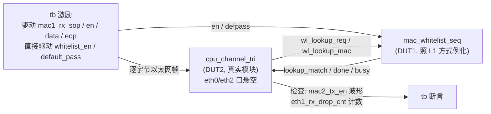

# MAC 白名单查找引擎实现指南 · 模式 0 —— BRAM 顺序查找（从零实现）

> 文档编号：ED003R02-A
> 日期：2026-08-29
> 适用工程：`fpga_webserver-whitelist_dev`（whitelist_dev 分支）
> 平台：Xilinx XC7A35T-FGG484-2（ACX750 开发板）
> 性质：**从零实现指南（作业指导书）**。仓库中已有的 `rtl/mac_whitelist_seq.v` 是本模式的**参考答案**（已上板验证跑通），本文按"假设它不存在"的完整流程编写，每步末尾附「参考答案对照」，适合边写边对照自查。
> 姐妹篇（**主线后继**）：《MAC白名单查找引擎实现指南_模式2_布谷鸟哈希.md》（前置条件：本文档全部完成）；备选路线：《MAC白名单查找引擎实现指南_模式1_二分查找.md》（同样以本文为前置，与模式 2 无先后依赖）
> 本文可直接交给 AI 模型或工程师逐步执行；执行前必读 0.4 节「执行须知」。

---

## 修订记录

| 日期 | 版本 | 修改描述 | 作者 |
|------|------|---------|------|
| 2026-08-28 | R01（ED003R01-A） | 初稿 | Claude |
| 2026-08-29 | R02（ED003R02-A） | 重排为作业指导书格式：统一步骤六段模板、全局连续步骤编号（模式0-步骤N.M）、融入 Wavedrom 时序图与 doc-lld 信号表规范、修正仿真文件路径（`../ip_common/rtl/`）与仿真宏定义方案（`sim/define_sim.sv`） | Claude |
| 2026-08-29 | R02a（ED003R02-A） | 主线调整：项目实施主线定为 模式 0 → 模式 2（布谷鸟哈希），模式 1 降为备选路线；0.2 路线图改为三阶段、头部指引/步骤 1.6/10.6/里程碑/已知问题 2/页脚同步更新；修复步骤 10.6 的"5.4 节"失效引用 | Claude |

## 目录

- 第 0 章 文档定位与总路线（0.1 覆盖范围 / 0.2 路线图 / 0.3 整机位置 / 0.4 执行须知）
- 第 1 章 现有框架关键机制（1.1 数据通路 / 1.2 配置通路 / 1.3 时钟复位 / 1.4 存储结构 / 1.5 寄存器表 / 1.6 C 驱动 / 1.7 构建链）
- 第 2 章 从零实现十步（步骤 1 规格 ~ 步骤 10 上板，含参考答案对照表）
- 第 3 章 常见错误与排查速查
- 第 4 章 验收清单与里程碑
- 第 5 章 仿真分层、上板门禁（Gate）与已知问题
- 附录 A 寄存器速查 / B 文件索引 / C 时序图来源索引

---

## 第 0 章 文档定位与总路线

### 0.1 本文档覆盖什么

在现有 fpga_webserver 框架上，**从零实现** MAC 白名单查找引擎的模式 0（顺序查找）：

- RTL：新建 `rtl/mac_whitelist_seq.v`（存储 + 配置译码 + 查找 FSM）
- 集成：`mac_whitelist_top.v` 模式分发、`webserver_wrapper.v` 例化（集成层工程已就位，本文教你确认每一根连线）
- 软件：`c/whitelist.c` C 驱动（影子表 + SubBus 操作）
- 验证：单元仿真（8 用例）→ 集成仿真（6 用例）→ 板级验证（管理面 + 数据面）

### 0.2 三阶段路线图（项目主线：模式 0 → 模式 2）

| 阶段 | 内容 | 交付物 | 验收 | 定位 |
|------|------|--------|------|------|
| **本文：阶段一** | 模式 0 顺序查找 | `mac_whitelist_seq.v` + C 驱动 + tb | 仿真 8+6 用例过；板上 Web 增删 MAC，过滤行为正确；tag `mode0-verified` | **主线第一站（必须）** |
| **阶段二（主线）** | 模式 2 布谷鸟哈希 | `mac_whitelist_cuckoo.v` + C 哈希化 + tb | 查找恒 2 拍、容量 96 条、eviction 并发窗口可接受；tag `mode2-verified` | **主线第二站**，面向 >64 条目 |
| 阶段三（备选） | 模式 1 二分查找 | `mac_whitelist_bin.v` + C 有序化改造 + 对拍 tb | 查找 ≤10 拍；与模式 0 对拍全过；tag `mode1-verified` | 备选路线（软硬协同范式，教学价值为主） |

**为什么必须先做模式 0**：模式 2 与模式 1 都完全复用模式 0 的配置通路、存储结构、寄存器表和上层集成，只换查找算法核心；且后继模式的仿真验证需要模式 0 作为对照基准。跳过模式 0 直接做任何后继模式 = 没有地基也没有参照。

### 0.3 白名单在整机中的位置（先建立全局图）

```
                        ┌──────────────────────── FPGA ────────────────────────┐
  eth0 RGMII(管理口)    │                                                       │
  ─────────────────────► rgmii2gmii ─► gmii2mac ─┐                             │
  ◄─────────────────────                (125MHz) │ mac0 口                      │
                                                 ▼                             │
                                    ┌─────────────────────┐                    │
                                    │  cpu_channel_tri     │                    │
                    eth1 SFP(LAN)   │                     │    eth2 SFP(WAN)   │
  用户PC ──────► SFP1 ──────────────►│ mac1 RX──►提取SrcMAC │                    │
  (白名单过滤方向)                   │    │                │──► mac2 TX 转发    │
  ◄────────────── SFP2 ◄────────────│    ▼                │   (过滤后的包)      │
                    (回程透传)       │ whitelist_lookup ○──┼──► mac1 TX (透传)  │
                                    │  结果门控 wpkt_push  │                    │
                                    └──────────┬──────────┘                    │
                                               │ cfg 口 (50MHz)                │
                          ┌────────────────────▼───────────────────┐           │
                          │ mac_whitelist_top (LOOKUP_MODE=0)       │           │
                          │   ├─ 查找FSM (125MHz, 读BRAM)           │           │
                          │   └─ 配置译码 (50MHz, SubBus寄存器)      │           │
                          └────────────────────▲───────────────────┘           │
                                               │ RAMIF (12bit addr)            │
                          ┌────────────────────┴───────────────────┐           │
                          │ reg_webserver: SubBus 0x5000~0x5FFF     │           │
                          │   wl_ctrl(0x300) enable/default_pass    │           │
                          └────────────────────▲───────────────────┘           │
                                               │ LCPU 总线 (0x80005000)        │
                                     RISC-V 固件 whitelist.c (sw 影子表)        │
                                               │                              │
                                     SPI Flash 0xC20000 (持久化) ◄─────────────┘
```

**一句话数据流**：eth1 收到包 → 硬件提取源 MAC（帧字节 6~13）→ 发 `lookup_req` → 查找引擎查 BRAM → `lookup_match` 回来 → `cpu_channel_tri` 用它门控这个包的 `wpkt_push`（放行=转发到 eth2，拦截=丢弃并计数）。**CPU 不参与逐包过滤**，只在网页操作时通过 SubBus 配置白名单表。

### 0.4 执行须知（作业指导书使用规则，执行前必读）

1. **步骤编号体系**：全部步骤按「模式0-步骤N.M」全局连续编号（N=步骤号，M=子步骤号），可被本文其他位置、姐妹篇或其他文档直接引用，例如"见 模式0-步骤4.2"。
2. **每步固定六段结构**：
   - **目的**——这一步要达成什么、为什么这么做（设计原理收在这里，不与操作混杂）；
   - **前置条件**——开始前必须已满足的条件（多为前序步骤的完成判据）；
   - **操作步骤**——编号子步骤，命令、代码、验证方法全部在这里；
   - **产出物**——本步完成后磁盘上多了什么/改了什么；
   - **完成判据**——可客观检查的通过标准；**判据不过，不得进入下一步**；
   - **常见错误**——本步特有的踩坑点。
3. **执行顺序强约束**：步骤 1→10 顺序执行。唯一的并行项：步骤 9.4 的 C 驱动核对可与 RTL 步骤（2~6）并行，但其验证依赖步骤 10 上板。
4. **门禁规则**：第 5.2 节定义 G1~G5 五道门禁。**G1~G3 全绿之前，禁止执行 `build_fpga.sh`**（半小时起步的构建不用于调试 RTL）。
5. **参考答案**：`rtl/mac_whitelist_seq.v`（315 行）是已验证的参考实现。本文按它不存在来教写法，每步的「参考答案对照」给出对应行号，写完即对照。**先自己写，再对照**；对照不等抄——变量命名、注释、组织方式可以不同，语义必须一致。
6. **图表规范**：本文时序图用 Wavedrom（HTML 发布后可渲染；纯文本下读 JSON 亦可还原波形），结构图保留 ASCII（对 AI 执行器与 diff 更友好）。时序图来源见附录 C。

---

## 第 1 章 现有框架关键机制（动笔前必须吃透）

> 本章的机制**已经存在于工程中**，你不需要重写，但每一条都直接影响你 RTL 代码的写法。实现前逐节确认理解；第 2 章各步骤会在需要处回引本章编号（如"见 1.2 特性 1"）。

### 1.1 数据通路：查找在哪里被触发、结果如何生效

文件：`rtl/cpu_channel_tri.v`（三端口 L2 桥接通道，125MHz 域）。摘录关键逻辑（174~248、306~307 行）：

```text
① 提取源 MAC（每包一次）：
   mac1_rx_en && !mac1_header_done 期间逐字节移位收集字节 6~11
   → mac1_src_mac[47:0]；收到字节 13 时 mac1_header_done=1
   （帧格式：字节 0~5 目的 MAC，6~11 源 MAC，12~13 类型）

② 触发查找：
   if (mac1_header_done && !wl_lookup_pending && !wl_lookup_busy)
       → wl_lookup_req 拉高一拍，wl_lookup_mac ← mac1_src_mac

③ 结果捕获：
   if (wl_lookup_done) → wl_result_match ← wl_lookup_match
   （新包 SOP 到来时 wl_result_valid 清零）

④ 门控转发（过滤的真正执行点，306 行）：
   assign eth1_fwd_wpkt_push = eth1_fwd_wpkt_push_raw &&
       (wl_result_match || (!whitelist_en && default_pass));
```

**四个关键理解**：

1. 包数据在查找进行期间（144ns）**已经整包写入 ram2pktfifo_int 缓冲**——查表不会丢字节，只推迟转发决策；
2. 过滤的实现方式是"**push 门控**"：不 push 的包留在缓冲里自然作废，同时 `eth1_rx_drop_cnt++`（→ `debug_ro_1`，地址 0x21）；
3. `eth2 → eth1` 回程**完全不经过白名单**（无条件透传）；
4. `whitelist_en=0` 时查找结果被无视，由 `default_pass` 决定全断(0)/全放(1)——这个兜底逻辑在 `cpu_channel_tri` 的门控表达式里，你的 RTL 里也要实现同样语义（见 模式0-步骤6.4）。

### 1.2 配置通路：CPU 怎么读写白名单寄存器

**链路结构**：

```text
C 固件 (50MHz)                       RTL (50MHz cfg_clk 域)
──────────────                       ─────────────────────
LCPU_REG32_WRITE(0x5000+off, data)   reg_webserver.v (1197~1207 行)：
  即 CPU 写物理地址                      address∈[0x5000,0x5FFF] 段命中
  0x80000000 + (0x5000+off)*4            → SUBBUS_mac_whitelist_* 打拍寄存
      │                              ramintf #(.AddrBits(12)) RAMIF_mac_whitelist：
      ▼                                  Ram_RlWh = !rhwl（SubBus 写时=1）
webserver_wrapper (518/1033/1152 行)：     Ram_Addr = address[11:0]
  wl_ram_rlwh / wl_ram_addr / wl_ram_rddata ─► mac_whitelist_top.cfg_rlwh / cfg_addr / cfg_wdata / cfg_rdata
```

**上游协议时序**（LCPU 总线写事务，图 1；白名单的 cfg 口是它在 ramintf 直通段的下游延伸）：

```wavedrom
{ "signal": [
	{ "name": "CLK", "wave": "10P......" },
	{ "name": "RH_WL", "wave": "xx0x....." },
	{ "name": "REQ", "wave": "0.10....." },
	{ "name": "ACK", "wave": "0....10.." },
	{ "name": "ADDR", "wave": "x.3x.....",
		"data": [ "Addr" ] },
	{ "name": "WDATA", "wave": "x.3x.....",
		"data": [ "wdata" ] },
	{ "name": "RDATA", "wave": "x.......x",
		"data": [ "rdata" ] }
]}
```
> **图 1** LCPU 写寄存器时序（Master 视角）。**来源**：`ip_common/doc/常用LRIP接口时序.md`「LCPU写寄存器时序(Master)」，信号名未改。

**读事务**（C 侧回读 0x06/07/08、flush 读 0x500A 走的就是它，图 2）：

```wavedrom
{ "signal": [
	{ "name": "CLK", "wave": "10P......" },
	{ "name": "RH_WL", "wave": "xx1x....." },
	{ "name": "REQ", "wave": "0.10....." },
	{ "name": "ACK", "wave": "0......10" },
	{ "name": "ADDR", "wave": "x.3x.....",
		"data": [
			"Addr"
		]
	},
	{ "name": "RDATA", "wave": "x......3x",
		"data": [
			"rdata"
		]
	},
	{ "name": "WDATA", "wave": "x........",
		"data": [
			"wdata"
		]
	}
]}
```
> **图 2** LCPU 读寄存器时序（Master 视角）。**来源**：`ip_common/doc/常用LRIP接口时序.md`「LCPU读寄存器时序(Master)」，信号名未改。读数据在 ACK 拍有效；白名单侧的读是组合 mux（`cfg_rdata` 零延迟，模式0-步骤5.3），比上游协议更快收敛——C 侧 flush 读 0x500A 顺带起到"等前一笔写落地"的间隔作用（特性 2）。

**下游（你的 cfg 口）看到的写事务形态**（图 3，自设计）：经 ramintf 直通后，**没有 REQ/ACK 握手**——SubBus 写事务期间 `cfg_rlwh=1` 电平持续约 3 拍，你的译码逻辑会被同一笔写命中多次：

```wavedrom
{ "signal": [
    { "name": "cfg_clk",        "wave": "10P......" },
    { "name": "cfg_rlwh",       "wave": "01...0.." },
    { "name": "cfg_addr[11:0]", "wave": "x.3...x.", "data": [ "0x003(WR)" ] },
    { "name": "cfg_wdata[31:0]","wave": "x.3...x.", "data": [ "任意" ] },
    {},
    { "name": "bram_wr_en_r（译码加载）", "wave": "001110..." },
    { "name": "BRAM+shadow 实际写口",     "wave": "001110..." }
], "head": { "text": "白名单 cfg 口电平敏感写：rlwh 持续约 3 拍，同一笔写被译码 3 次" },
   "foot": { "text": "写内容恒定 → 重复执行无害（幂等）。禁止在此通路用边沿检测/计数式逻辑" } }
```
> **图 3** 白名单 cfg 口电平敏感写采样（自设计）。`*_r` 脉冲寄存器结构见 模式0-步骤4。

**三个必须遵守的特性**（违反任何一条都会出诡异 bug）：

| # | 特性 | 原因 | 对你代码的要求 |
|---|------|------|--------------|
| 1 | **电平敏感写、无 req/ack 握手** | ramintf 直通，SubBus 写事务期间 `cfg_rlwh=1` 持续约 3 拍，同一笔写会被译码多次 | 所有写动作必须**幂等**：寄存器加载重复无害；WR/DEL 触发用"`*_r` 暂存寄存器 1 拍脉冲"结构（见 模式0-步骤4），不要设计边沿检测 |
| 2 | **C 侧每笔写后必须 flush** | SubBus 打拍链路上前一笔可能未落地，连续写会互相覆盖 | `subbus_write()` 写后读一次 `0x500A`（MAX_ENTRIES，恒定的安全地址）再返回；C 驱动所有 HW 写必须走它 |
| 3 | **BRAM 与 shadow_rf 双副本同步写** | BRAM 同步读 1 拍延迟，而 ramintf 读采样窗口只有 3 拍，容不下 → CPU 回读必须走组合逻辑的 shadow_rf | 每条写路径都要**同时**写 BRAM（给 125MHz 查找用）和 shadow_rf（给 CPU 回读用），漏一边就会出现"查找生效但网页回读不对"（或反之） |

### 1.3 时钟域与复位

| 时钟 | 频率 | 域内逻辑 | 跨域手段 |
|------|------|---------|---------|
| `clk` | 125MHz | 查找 FSM、BRAM 读口 | 查找请求/结果不出域（cpu_channel_tri 与白名单同域直连） |
| `cfg_clk` | 50MHz | 配置译码、BRAM 写口、shadow_rf | SubBus 链路天然同步；ramintf 已处理握手 |
| — | — | `whitelist_en / default_pass`（wl_ctrl 2bit，reg_webserver 0x300） | wrapper 里 `cdc_bus_sync`（972~982 行，已存在，输出 `wl_ctrl_125m`） |
| — | — | 手动触发 `debug_wc_0_ind` 脉冲 | wrapper 里 `pulse_clock_region_pass`（1039 行起，已存在） |

手动调试触发的跨域脉冲传递（图 4）：50MHz 域的 `debug_wc_0` 单拍脉冲经 `pulse_clock_region_pass` 变成 125MHz 域单拍脉冲，并入 `lookup_req`——这是已知问题 5 的"免打流单次查表"调试通道：

```wavedrom
{ "signal": [
    { "name": "clk_50M", "wave": "10P.........." },
    { "name": "debug_wc_0（50M域脉冲）", "wave": "0...10......" },
    {},
    { "name": "clk_125M", "wave": "10P.........." },
    { "name": "手动lookup_req（125M域脉冲）", "wave": "0.........10" }
], "head": { "text": "pulse_clock_region_pass 跨时钟域脉冲传递" },
   "foot": { "text": "延迟约 3~4 个目的域周期；两次脉冲间隔须大于 4~5 个目的域周期" } }
```
> **图 4** 脉冲跨域传递。**来源**：`ip_common/doc/常用LRIP接口时序.md`「pulse_clock_region_pass跨时钟域脉冲传递时序」，仅改信号名。

复位：`reset_l` 低有效、异步 assert；125MHz 域用它，50MHz 域用 `cfg_reset_l`（wrapper 里同源）。**BRAM 和 shadow_rf 不做复位**（BRAM 无法异步复位；FPGA 上电存储器即零）。

### 1.4 存储结构：49-bit 条目 + 双副本 + 辅助位

```
每条目 49 bit：{ valid[48], mac[47:0] }
                    │
    ┌───────────────┴───────────────┐
    ▼                               ▼
主存储 BRAM                      副本 shadow_rf
dual_clock_simple_dual_port_ram   16×49 寄存器阵列
  A口: cfg_clk 写（CPU 配置）       组合逻辑读（零延迟）
  B口: clk 读（查找，1拍延迟）       仅服务 CPU 回读 0x06/07/08
    │
    └─ valid_bits[15:0] 独立寄存器
         ├─ free_idx：generate 优先编码器链（首个空闲槽）
         └─ used_cnt：generate 加法器链（popcount）
```

BRAM 用 ip_common 的 `dual_clock_simple_dual_port_ram`，参数 `data_width(49), addr_width(4), depth(16), block_ram_size(32), ram_type(`LARGER_RAM), vendor(`DEVICE_VENDOR)`——宏来自 `define.sv`，Xilinx 下综合为 BlockRAM。仿真时宏由 `sim/define_sim.sv` 提供（vendor 置空，走行为级分支，见 模式0-步骤3.5）。

### 1.5 寄存器表（SubBus 基址 0x5000，偏移 = cfg_addr[3:0]）

| 偏移 | 名称 | 类型 | 位宽 | 写入行为 / 读出内容 |
|-----|------|------|------|---------------------|
| 0x00 | INDEX | RW | [3:0] | 写：加载 cfg_idx；**wdata[31]=1 时附带删除该索引条目**（本工程扩展，省一笔写） |
| 0x01 | MAC_H | RW | [31:0] | 写：暂存 cfg_mac[47:16]；读：返回 cfg_mac[47:16] |
| 0x02 | MAC_L | RW | [15:0] | 写：暂存 cfg_mac[15:0]；读：返回 cfg_mac[15:0] |
| 0x03 | WR | WC | — | 触发：{1'b1, cfg_mac} 写入 BRAM[cfg_idx] + shadow_rf[cfg_idx]，valid 置 1 |
| 0x04 | DEL | WC | — | 触发：49'b0 写入两存储，valid 清 0 |
| 0x05 | CLEAR | WC | — | 启动清除序列器（16 拍逐条清全表） |
| 0x06 | RD_MAC_H | RO | [31:0] | 读 shadow_rf[cfg_idx][47:16] |
| 0x07 | RD_MAC_L | RO | [15:0] | 读 shadow_rf[cfg_idx][15:0] |
| 0x08 | RD_VALID | RO | [0] | 读 shadow_rf[cfg_idx][48] |
| 0x09 | FREE_IDX | RO | [3:0] | 首个空闲索引（全满 = 4'hF） |
| 0x0A | MAX_ENTRIES | RO | [7:0] | 恒 = 16（**C 侧 flush 读固定用这个地址**） |
| 0x0B | USED_CNT | RO | [7:0] | 有效条目数 |

> 与设计文档 V4（`doc/MAC_Whitelist_Design_Plan.md`）的差异：V4 规划的 0x0C~0x0F 命中/丢弃 64bit 计数**未实现**。丢弃计数已由 `cpu_channel_tri` 统计并映射到 `debug_ro_1`(0x21)。可作为完成后的扩展练习。

### 1.6 C 驱动现状（`c/whitelist.c`，346 行）

| 函数 | 职责 |
|------|------|
| `subbus_write(base, off, data)` | 写 + 读 0x500A flush（1.2 特性 2 的落实，**所有 HW 写必须走它**） |
| `sw_wl_valid[16] / sw_wl_mac[16][6] / sw_wl_count` | 软件影子表——Web 显示、Flash 持久化的权威数据源 |
| `whitelist_add/delete/clear_all` | 影子表 + HW SubBus 双写 |
| `whitelist_hw_read_entry(i)` | 经 0x06/07/08 读 HW 真实内容（`/api/wl/list`、`/api/wl/hwlist` 用） |
| `whitelist_hw_diag(buf,size)` | 硬件诊断 JSON（寄存器快照 + 删除功能自测） |
| `whitelist_get/apply_snapshot` | 与 `flash_cfg.c`（0xC20000 持久化）的保存/恢复接口 |

### 1.7 构建与烧录链（改完代码怎么验证）

```bash
# C 改动 → 固件（约 1 分钟）：
cd c_build && make PLATFORM=xilinx riscv_reset_addr=0xf TCL_BASE=0x8000

# RTL 改动 → bitstream（约 20~60 分钟）：
cd build_xilinx_xc7a35tfgg484 && ./build_fpga.sh <版本号4位hex>

# 烧录 bitstream（JTAG）：
openFPGALoader -c digilent_hs2 webserver_xilinx_xc7a35tfgg484_v<版本>_<时间戳>/webserver_xilinx_xc7a35tfgg484_v<版本>_<时间戳>.bit

# 加载 RISC-V 固件到 RAM（仓库已有脚本）：
vivado -mode batch -source scripts/load_firmware_vivado.tcl

# （可选）固化网页到 SPI Flash：
vivado -mode batch -source scripts/flash_web_vivado.tcl

# 板级连通验证（板 ACX750=192.168.1.88，PC eno1=192.168.1.100，开机自动配好）：
ping 192.168.1.88 && curl http://192.168.1.88/     # 期望 HTTP 200
```

说明：`build_fpga.sh` 会新建 `webserver_xilinx_xc7a35tfgg484_v<版本>_<时间戳>/` 工程目录，`.bit` 在其内同名；固件加载脚本每次 make 后重新生成固定名 `tcl/InstructRAM.tcl` 并由 `scripts/load_firmware_vivado.tcl` 调用（**永远用这个固定名**，勿拿 `tcl/` 下带时间戳的历史副本，见 5.3 已知问题 4）。Vivado 路径：`/home/haitaoz/Xilinx/2024.1/Vivado/2024.1/bin/vivado`（若 shell 已在 PATH 则直接 `vivado`）。

**调试黄金法则**：只改 C → 重跑 make + `scripts/load_firmware_vivado.tcl`（1 分钟）；改了 RTL → 必须重编 bitstream（半小时起）。所以 RTL 阶段尽量用仿真把问题清干净，别靠上板试错。

---

## 第 2 章 从零实现十步

> 步骤依赖链：**1 规格 → 2 接口 → 3 骨架 → 4 配置通路 → 5 辅助逻辑 → 6 查找FSM → 7 L1仿真 → 8 L2仿真 → 9 集成核对 → 10 上板**。每步六段：目的/前置条件/操作步骤/产出物/完成判据/常见错误。判据不过不进下一步。

### 步骤 1：需求与规格定义

**目的**：把需求翻译成可实现、可验证的规格。重点是时序可行性论证——顺序查找之所以可行，是因为 18 拍（144ns）远小于千兆网最小帧间隔（672ns），这个推导必须能口算复述，它是后续所有周期数断言的依据。

**前置条件**：无（起始步骤）。

**操作步骤**：

**1.1** 建立文件 `rtl/mac_whitelist_seq.v`，先写模块头部注释块，把以下 5 条规格固化进去（参考答案 1~7 行即是此形态）。

**1.2** 容量与地址宽度：`ENTRY_NUM=16`，`ADDR_WIDTH=$clog2(16)=4`。

**1.3** 条目格式：49bit = `{valid, mac[47:0]}`。

**1.4** 时序预算推导（写入注释，作为周期数断言的理论值）：

```
千兆网最小帧间隔 = (64B 最小帧 + 8B 前导 + 12B IFG) × 8ns/字节
                 = 84 × 8 = 672ns

顺序查找全表耗时 = IDLE(1拍) + COMPARE(16拍) + DONE(1拍) = 18 拍
                 = 18 × 8ns(125MHz) = 144ns

144ns ≪ 672ns  →  查完一条包的间隙里下一个请求还没到
且触发条件有 !wl_lookup_busy 兜底  →  线速不丢包 ✓
```

**1.5** 关闭行为：`whitelist_en=0` → 不查表，match 输出恒为 `default_pass`。

**1.6** 表项语义：index 是**物理槽位**（无顺序要求）——后继模式会改变这一语义（主线模式 2 = 7bit 哈希槽位号 {bank,row}；备选模式 1 = 有序排名）。

**产出物**：`rtl/mac_whitelist_seq.v` 头部注释块。

**完成判据**：5 条规格全部成文；时序推导（1.4）能不看文档口算复述。

**常见错误**：只写"实现顺序查找"一句话开工，不落时序推导——后面 tb 的 18 拍断言就没有依据，FSM 写错时无从发现。

### 步骤 2：接口与寄存器表设计

**目的**：定对外契约。端口一旦定下，模式 1 原样沿用；寄存器表采用 1.5 节已定稿版本，不自创。

**前置条件**：模式0-步骤1 完成。

**操作步骤**：

**2.1** 在 `rtl/mac_whitelist_seq.v` 写入完整端口框架（四组端口，可直接照抄）：

```verilog
module mac_whitelist_seq #(
    parameter int ENTRY_NUM  = 16,
    parameter int ADDR_WIDTH = 4      // $clog2(ENTRY_NUM)
) (
    input  clk,                        // 125MHz 查找域
    input  reset_l,
    // ── 查找口（与 cpu_channel_tri 直连，同域）──
    input             lookup_req,      // 1 拍脉冲
    input      [47:0] lookup_mac,
    output reg        lookup_match,    // done 拍有效
    output reg        lookup_done,     // 1 拍脉冲
    output            lookup_busy,     // 电平：state != IDLE
    // ── 配置口（50MHz，接 ramintf，电平敏感无握手）──
    input             cfg_clk,
    input             cfg_reset_l,
    input             cfg_rlwh,        // 1=写 0=读
    input      [11:0] cfg_addr,        // 译码用 [3:0]
    input      [31:0] cfg_wdata,
    output     [31:0] cfg_rdata,       // 组合读 mux，无延迟
    // ── 全局控制（125MHz 域，上游 CDC 已做）──
    input             whitelist_en,
    input             default_pass
);
```

**2.2** 建立接口信号表（doc-lld 四列格式，作为 2.4 核对清单；宽度列只写位数）：

| 信号名 | 位宽（Bits） | IO | 说明 |
|--------|-------------|----|------|
| **查找接口（125MHz 域，与 cpu_channel_tri 直连）** |
| clk | 1 | I | 查找域时钟 125MHz |
| lookup_req | 1 | I | 查找请求，1 拍脉冲 |
| lookup_mac | 48 | I | 待查目标 MAC |
| lookup_match | 1 | O | 匹配结果，`lookup_done` 拍有效 |
| lookup_done | 1 | O | 查找完成，1 拍脉冲 |
| lookup_busy | 1 | O | 电平信号，state != IDLE 时为 1 |
| **配置接口（50MHz 域，接 ramintf/RAMIF_mac_whitelist）** |
| cfg_clk | 1 | I | 配置域时钟 50MHz |
| cfg_reset_l | 1 | I | 配置域复位，低有效 |
| cfg_rlwh | 1 | I | 1=写 0=读（电平敏感，无握手） |
| cfg_addr | 12 | I | SubBus 字节地址，译码只看 [3:0] |
| cfg_wdata | 32 | I | 写数据 |
| cfg_rdata | 32 | O | 读数据（组合 mux，零延迟） |
| **全局控制（125MHz 域，上游 CDC 已由 wrapper 完成）** |
| reset_l | 1 | I | 查找域复位，低有效、异步 assert |
| whitelist_en | 1 | I | 白名单使能（`wl_ctrl_125m[0]`） |
| default_pass | 1 | I | 关闭时默认放行（`wl_ctrl_125m[1]`） |
| **模块控制参数** |
| ENTRY_NUM | parameter | 16 | 表容量 |
| ADDR_WIDTH | parameter | 4 | $clog2(ENTRY_NUM) |

**2.3** 寄存器表：采用 1.5 节定稿，偏移、位宽、写入行为逐条与 1.5 表格核对，不增不改。

**2.4** 对照 `webserver_wrapper.v` 1139~1157 行的 `u_mac_wl` 例化（`.LOOKUP_MODE(0)` 在 1139 行）：四组端口逐根说出连到哪——查找口 ↔ `cpu_channel_tri` 的 `wl_lookup_*`，cfg 口 ← `wl_ram_rlwh`（518 行驱动）/`wl_ram_addr`/`wl_ram_wdata`，`cfg_rdata` → `wl_ram_rddata`（1033 行回收），en/defpass ← `wl_ctrl_125m[1:0]`（972~982 行 CDC 输出）。

**产出物**：带端口框架与规格注释的 `rtl/mac_whitelist_seq.v`；接口信号表。

**完成判据**：对照 wrapper 1139~1157 行例化，四组端口**逐根**能说出对端信号名与方向。

**常见错误**：把 `lookup_match` 写成 wire（它要被 FSM 时序锁存，必须是 reg）；把 `cfg_rdata` 写成时序输出（读是组合的，1.2 特性 1）；`cfg_addr` 只留 4 位（上游给 12 位，进模块后取 [3:0] 译码）。

### 步骤 3：模块骨架与存储实例化

**目的**：让文件立起来、存储结构就位（不含查找逻辑），先保证编译干净。本步同时确定**写仲裁约定**——普通写与 CLEAR 序列器共用 BRAM/shadow 写口时的让位规则。

**前置条件**：模式0-步骤2 完成。

**操作步骤**：

**3.1** 声明内部信号（按功能分组，直接照抄）：

```verilog
// 查找 FSM
reg [1:0]               state;         // S_IDLE/S_COMPARE/S_DONE
reg [ADDR_WIDTH-1:0]    cmp_index;
reg                     match_found;
// 配置暂存
reg [ADDR_WIDTH-1:0]    cfg_idx;
reg [47:0]              cfg_mac;
// 辅助
reg [ENTRY_NUM-1:0]     valid_bits;
reg                     clear_active;
reg [ADDR_WIDTH-1:0]    clear_cnt;
// 写请求暂存（1 拍脉冲语义，见 1.2 特性 1）
reg                     bram_wr_en_r;   reg [ADDR_WIDTH-1:0] bram_wr_addr_r;  reg [48:0] bram_wr_data_r;
reg                     sh_wr_en_r;     reg [ADDR_WIDTH-1:0] sh_wr_addr_r;    reg [48:0] sh_wr_data_r;
// shadow_rf 副本
reg [48:0]              shadow_rf [0:ENTRY_NUM-1];
```

**3.2** 实例化 BRAM（写口 A=cfg_clk，读口 B=clk）：

```verilog
dual_clock_simple_dual_port_ram #(
    .data_width(49), .addr_width(ADDR_WIDTH), .depth(ENTRY_NUM),
    .block_ram_size(32), .ram_type(`LARGER_RAM), .vendor(`DEVICE_VENDOR)
) u_bram (
    .clock_a(cfg_clk), .wren_a(bram_wr_en), .data_a(bram_wr_data), .address_a(bram_wr_addr),
    .clock_b(clk),     .address_b(bram_rd_addr), .q_b(bram_rd_data)
);
```

**3.3** 写仲裁约定——普通写先打入 `*_r` 暂存寄存器（下一拍有效），再与 CLEAR 序列器输出 OR-mux 后接 BRAM/shadow 写口，CLEAR 期间普通写让位且不冲突：

```verilog
assign bram_wr_en   = clear_active ? 1'b1        : bram_wr_en_r;
assign bram_wr_addr = clear_active ? clear_cnt   : bram_wr_addr_r;
assign bram_wr_data = clear_active ? 49'b0       : bram_wr_data_r;
// shadow 侧三行同理（sh_wr_en/sh_wr_addr/sh_wr_data）
```

**3.4** shadow_rf 写读（写时序、读组合）：

```verilog
always @(posedge cfg_clk) if (sh_wr_en) shadow_rf[sh_wr_addr] <= sh_wr_data;
assign sh_rd_data = shadow_rf[sh_rd_addr];   // 组合读，零延迟
```

**3.5** 创建仿真宏文件 `sim/define_sim.sv`（**内容照抄如下**）。为什么需要它：真实共享库 `../ip_common/rtl/define.sv` 定义 `DEVICE_VENDOR="xilinx"`，会把 BRAM 模型编到 Xilinx XPM 原语 `xpm_memory_sdpram`，iverilog 没有 XPM 仿真库必然编译失败；把 vendor 置空串，RAM 模型走行为级推断分支（`gen_inferred_ram`），仿真可用。**此文件只用于仿真命令行，不进 filelist.cfg、不改共享库**：

```verilog
// sim/define_sim.sv — 仿真专用宏（代替 ../ip_common/rtl/define.sv）
// 目的：DEVICE_VENDOR 置空 → dual/simple_clock_simple_dual_port_ram
//       走行为级推断分支，避开 iverilog 无 XPM 库的问题。
// 约束：仅出现在 L1/L2 tb 的 iverilog 命令行里；禁止修改共享库、禁止进 filelist.cfg
`ifndef DEFINE_SV
`define DEFINE_SV
`define DEVICE_VENDOR ""
`define LARGER_RAM  "block"
`define SMALL_RAM   "distributed"
`endif
```

**3.6** 编译检查（此时还没有 FSM 与配置逻辑，只验骨架；依赖路径已核实存在，见附录 B）：

```bash
cd /home/haitaoz/work/FPGA_Prj/fpga_webserver-wldev-v2
iverilog -g2012 -o /dev/null \
    sim/define_sim.sv \
    rtl/mac_whitelist_seq.v \
    ../ip_common/rtl/dual_clock_simple_dual_port_ram.v
```

**产出物**：`rtl/mac_whitelist_seq.v` 骨架（可编译）；`sim/define_sim.sv`。

**完成判据**：3.6 命令 0 error；**无 implicit wire 警告**（有的话说明信号没声明就用了）。

**常见错误**：忘建 `sim/define_sim.sv` 直接拿真实 `define.sv` 编译 → XPM 原语报错；BRAM 例化时写口/读口时钟接反（A 口必须 cfg_clk、B 口必须 clk）；`sh_rd_addr` 忘声明（步骤 5 才驱动，先声明 wire）。

### 步骤 4：配置通路编码（50MHz 域）

**目的**：实现 1.5 节寄存器表的全部写入行为。核心纪律是 1.2 特性 1 的**幂等性**：电平敏感写会把同一笔写译码多次，所以一切动作必须"重复执行结果不变"，触发类动作（WR/DEL）靠 `*_r` 单拍脉冲寄存器收敛。

**前置条件**：模式0-步骤3 完成（编译干净）。

**操作步骤**：

**4.1** 写一个 `always @(posedge cfg_clk or negedge cfg_reset_l)` 块，先落复位分支：

```verilog
if (!cfg_reset_l) begin
    cfg_idx<=0; cfg_mac<=0; valid_bits<=0; clear_active<=0; clear_cnt<=0;
    bram_wr_en_r<=0; sh_wr_en_r<=0;
end else begin
    bram_wr_en_r <= 1'b0;          // 默认单拍脉冲
    sh_wr_en_r   <= 1'b0;
    // （4.2、4.3 的逻辑插在这里）
end
```

**4.2** CLEAR 序列器——每拍清一个地址，16 拍自动停。用**计数器**实现，不要用状态机（固定长度的顺序动作，计数器最简单且不会写出死锁态）：

```verilog
    // ── CLEAR 序列器：clear_active 期间每拍写 49'b0 到 clear_cnt 地址 ──
    if (clear_active) begin
        bram_wr_en_r<=1; bram_wr_addr_r<=clear_cnt; bram_wr_data_r<=49'b0;
        sh_wr_en_r<=1;   sh_wr_addr_r<=clear_cnt;   sh_wr_data_r<=49'b0;
        if (clear_cnt == ENTRY_NUM-1) begin clear_active<=0; valid_bits<=0; end
        else clear_cnt <= clear_cnt + 1;
    end
```

**4.3** 电平敏感写译码——完整的寄存器写入行为（与 1.5 表格逐条对应）：

```verilog
    // ── 电平敏感写译码：cfg_rlwh=1 期间每拍都执行（幂等，见 1.2 特性 1）──
    if (cfg_rlwh) case (cfg_addr[3:0])
        4'h0: begin
            cfg_idx <= cfg_wdata[ADDR_WIDTH-1:0];
            if (cfg_wdata[31]) begin          // bit31 附带删除（一笔完成选+删）
                bram_wr_en_r<=1; bram_wr_addr_r<=cfg_wdata[3:0]; bram_wr_data_r<=49'b0;
                sh_wr_en_r<=1;   sh_wr_addr_r<=cfg_wdata[3:0];   sh_wr_data_r<=49'b0;
                valid_bits[cfg_wdata[ADDR_WIDTH-1:0]] <= 1'b0;
            end
        end
        4'h1: cfg_mac[47:16] <= cfg_wdata[31:0];
        4'h2: cfg_mac[15:0]  <= cfg_wdata[15:0];
        4'h3: begin                          // WR：双副本同步写（1.2 特性 3）
            bram_wr_en_r<=1; bram_wr_addr_r<=cfg_idx; bram_wr_data_r<={1'b1,cfg_mac};
            sh_wr_en_r<=1;   sh_wr_addr_r<=cfg_idx;   sh_wr_data_r<={1'b1,cfg_mac};
            valid_bits[cfg_idx]<=1'b1;
        end
        4'h4: begin                          // DEL：双副本清零
            bram_wr_en_r<=1; bram_wr_addr_r<=cfg_idx; bram_wr_data_r<=49'b0;
            sh_wr_en_r<=1;   sh_wr_addr_r<=cfg_idx;   sh_wr_data_r<=49'b0;
            valid_bits[cfg_idx]<=1'b0;
        end
        4'h5: begin clear_active<=1'b1; clear_cnt<=0; end   // CLEAR：启动序列器
        default: ;
    endcase
```

**4.4** 结构自查（对照 1.2 三特性）：

- 每个触发动作都是"`*_r` 寄存器装载"，电平采样多次 = 执行多次**同内容**写 = 幂等 ✓（特性 1）；
- WR/DEL/附带删除都是 BRAM 与 shadow **双副本同拍写**，valid_bits 同步更新 ✓（特性 3）；
- CLEAR 是计数器不是状态机，且经 3.3 的 OR-mux 独占写口 ✓。

**产出物**：配置通路 always 块（4.1~4.3）。

**完成判据**：验证手段在步骤 7 的 tb（用例 1/3/4）——写 INDEX→MAC_H→MAC_L→WR 后读 0x06/07/08 回读正确；DEL 后 0x08=0；CLEAR 后 USED_CNT=0。本步先静态核对 4.4 三条。

**常见错误**：对 WR 用边沿检测（`~rlwh_d && rlwh` 之类）→ 电平敏感通路上行为不确定；WR 只写 BRAM 漏 shadow（或反之）→ "查找对但网页回读错"；CLEAR 用状态机 → 空闲态跳转写错卡死。

### 步骤 5：辅助组合逻辑

**目的**：实现 free_idx（首个空闲槽）、used_cnt（有效条目数）、寄存器读 mux、shadow 读地址。全部是**组合逻辑**（读通路电平敏感，1.2 特性 1），关键约束是 Vivado 综合不支持运行期 break——遍历类逻辑一律用 generate 级联。

**前置条件**：模式0-步骤4 完成。

**操作步骤**：

**5.1** free_idx——generate 级联优先编码器（高→低传递，`!valid` 处截住）：

```verilog
// free_idx：generate 级联优先编码器
wire [ADDR_WIDTH-1:0] free_idx_stage [ENTRY_NUM:0];
assign free_idx_stage[ENTRY_NUM] = {ADDR_WIDTH{1'b1}};         // 全满默认 4'hF
genvar gi;
generate for (gi = ENTRY_NUM-1; gi >= 0; gi = gi-1) begin : g_free
    assign free_idx_stage[gi] = !valid_bits[gi] ? gi[ADDR_WIDTH-1:0]
                                                : free_idx_stage[gi+1];
end endgenerate
wire [ADDR_WIDTH-1:0] free_idx_comb = free_idx_stage[0];
// ★ 不要写带退出条件的 for 循环——Vivado 综合不支持运行期 break 语义
```

**5.2** used_cnt——generate 加法器链 popcount：

```verilog
wire [7:0] used_cnt_partial [ENTRY_NUM:0];
assign used_cnt_partial[0] = 8'd0;
generate for (gi = 0; gi < ENTRY_NUM; gi = gi+1) begin : g_pop
    assign used_cnt_partial[gi+1] = used_cnt_partial[gi] + {7'b0, valid_bits[gi]};
end endgenerate
wire [7:0] used_cnt_comb = used_cnt_partial[ENTRY_NUM];
```

**5.3** 读 mux——级联三元表达式（读是组合的，且与写译码共用 cfg_addr，靠 `!cfg_rlwh` 区分读写方向）：

```verilog
wire [3:0] rd_reg = cfg_addr[3:0];
assign cfg_rdata =
    (!cfg_rlwh && rd_reg==4'h0) ? {28'b0, cfg_idx}              :
    (!cfg_rlwh && rd_reg==4'h1) ? cfg_mac[47:16]                :
    (!cfg_rlwh && rd_reg==4'h2) ? {16'b0, cfg_mac[15:0]}        :
    (!cfg_rlwh && rd_reg==4'h6) ? sh_rd_data[47:16]             :
    (!cfg_rlwh && rd_reg==4'h7) ? {16'b0, sh_rd_data[15:0]}     :
    (!cfg_rlwh && rd_reg==4'h8) ? {31'b0, sh_rd_data[48]}       :
    (!cfg_rlwh && rd_reg==4'h9) ? {28'b0, free_idx_comb}        :
    (!cfg_rlwh && rd_reg==4'hA) ? ENTRY_NUM[31:0]               :
    (!cfg_rlwh && rd_reg==4'hB) ? {24'b0, used_cnt_comb}        :
    32'b0;
```

**5.4** shadow 读地址——仅读 0x06/07/08 时指向 cfg_idx，其余指 0（防误读）：

```verilog
assign sh_rd_addr = (!cfg_rlwh && (rd_reg==4'h6||rd_reg==4'h7||rd_reg==4'h8))
                    ? cfg_idx : {ADDR_WIDTH{1'b0}};
```

**产出物**：free_idx / used_cnt / 读 mux / sh_rd_addr 四段组合逻辑。

**完成判据**：验证手段在步骤 7 的 tb（用例 1/4/5）——加 3 条后读 0x09=下一个空槽、0x0B=3；清空后 0x09=0、0x0B=0。本步先静态核对：读 mux 覆盖 1.5 表格全部 RO/RW 读出项、缺省 32'b0。

**常见错误**：free_idx 用 `for(...; ...; ...) if(!valid) break;` → 综合失败或行为不符；`ENTRY_NUM[31:0]` 忘记位宽截取（parameter 直接进三元表达式会位宽告警）；0x09 在表满时应为 4'hF（5.1 的全满默认项漏写）。

### 步骤 6：查找 FSM（模式 0 核心，125MHz 域）

**目的**：三态 FSM 顺序比对全表。技术核心是**对齐 BRAM 的 1 拍同步读延迟**：地址在第 N 拍发出、数据第 N+1 拍有效，所以比较要滞后地址一拍，且最后一条（idx=15）的数据在 S_DONE 拍才到、必须补比——这是全模块最容易写错的一处，写完必须用 6.3 的逐拍图核对。

**前置条件**：模式0-步骤5 完成。

**操作步骤**：

**6.1** 状态定义与 BRAM 读地址驱动：

```verilog
localparam S_IDLE=2'd0, S_COMPARE=2'd1, S_DONE=2'd2;

assign bram_rd_addr = (state==S_COMPARE) ? cmp_index : {ADDR_WIDTH{1'b0}};
```

**6.2** FSM 本体：

```verilog
always @(posedge clk or negedge reset_l) begin
    if (!reset_l) begin
        state<=S_IDLE; cmp_index<=0; match_found<=0;
        lookup_match<=0; lookup_done<=0;
    end else begin
        lookup_done <= 1'b0;                                  // done 默认单拍
        case (state)
        S_IDLE: if (lookup_req) begin
                    state<=S_COMPARE; cmp_index<=0; match_found<=0;
                end
        S_COMPARE: begin
            // BRAM 1 拍延迟：本拍比较的是上一拍地址的数据
            // → cmp_index>0 才开始比；最后一条(idx=15)的数据在 S_DONE 到达
            if (cmp_index > 0 && bram_rd_valid && (bram_rd_mac == lookup_mac))
                match_found <= 1'b1;
            if (cmp_index == ENTRY_NUM-1) state <= S_DONE;
            else cmp_index <= cmp_index + 1;
        end
        S_DONE: begin
            // 补上最后一条(idx=15)的比较，再锁存
            if (bram_rd_valid && (bram_rd_mac == lookup_mac))
                match_found <= 1'b1;
            lookup_match <= whitelist_en ? match_found : default_pass;
            lookup_done  <= 1'b1;
            state <= S_IDLE;
        end
        default: state <= S_IDLE;
        endcase
    end
end
assign lookup_busy = (state != S_IDLE);
```

（`bram_rd_valid`/`bram_rd_mac` 即 `q_b` 的 valid 判断与 [47:0] 切片，按 3.2 实例化信号名接线。）

**6.3** 逐拍时序核对——先把图 5 画进注释，再逐拍对照你的代码走一遍：

```wavedrom
{ "signal": [
    { "name": "clk(125M)",    "wave": "10P................" },
    { "name": "lookup_req",   "wave": "10................." },
    { "name": "bram_rd_addr", "wave": "x0123456789abcdefxx",
      "data": [ "0","1","2","3","4","5","6","7","8","9","10","11","12","13","14","15" ] },
    { "name": "q_b(读数据)",   "wave": "xx0123456789abcdefx",
      "data": [ "d0","d1","d2","d3","d4","d5","d6","d7","d8","d9","d10","d11","d12","d13","d14","d15" ] },
    { "name": "匹配比较有效",   "wave": "0011111111111111100" },
    { "name": "lookup_done",  "wave": "0000000000000000010" },
    { "name": "lookup_match", "wave": "0000000000000000010" }
], "head": { "text": "模式 0 顺序查找：req→done = 18 拍（16 条全表扫，无提前退出）" },
   "foot": { "text": "BRAM 同步读 1 拍：c1 发地址 0 → c2 数据 d0 有效；cmp_index>0 守卫对齐；d15 在 S_DONE 拍补比 → 拍 17 done（req 在拍 0）" } }
```
> **图 5** 顺序查找 FSM 逐拍时序（自设计）。每列一拍：地址 c1~c16 发 0~15，数据 c2~c17 回 d0~d15，比较 c2~c17 共 16 次，done 在 c17。

周期数验算（与 1.4 推导闭环）：req 在拍 0，done 在拍 17 → **req→done 共 18 拍 = 144ns** ✓。

**6.4** 两个语义确认：

- `lookup_busy` 是**电平**（state != IDLE），cpu_channel_tri 靠它在 busy 期间挡掉新请求（1.1 ②）；
- 关闭兜底：`lookup_match <= whitelist_en ? match_found : default_pass;`——en=0 时**不查表语义**由这条锁存实现（与 cpu_channel_tri 306 行门控表达式的 `!whitelist_en && default_pass` 项双重保险，见 1.1 ④）。

**产出物**：查找 FSM（125MHz 域）完整逻辑。**至此模块 RTL 全部完成。**

**完成判据**：验证手段在步骤 7 的 tb——表首/表尾/中间三条 MAC 命中；不存在 MAC miss；done 宽 1 拍；en=0 时 match=default_pass；**周期数 ==18 强断言**。本步先对照图 4 逐拍走查代码。

**常见错误**：漏掉 `cmp_index > 0` 守卫 → 第一个比较用到无效数据；漏掉 S_DONE 的补比 → 查 idx15 永远 miss、周期数断言 17 拍；done 写成电平 → busy 语义错乱、上游请求撞车；S_DONE 漏 `default_pass` 分支 → en=0 时 match 恒 0 不随 defpass。

### 步骤 7：L1 单元仿真

**目的**：独立例化 DUT（不需要整个 SoC），8 用例验证查找算法、周期数、配置通路、CLEAR、边界。L1 过关 = 模块本身正确，是进入 L2 集成仿真的前置条件（分层定义见 5.1）。

**前置条件**：模式0-步骤6 完成；`sim/define_sim.sv` 已存在（模式0-步骤3.5）。

**操作步骤**：

**7.1** 新建 `sim/tb_mac_whitelist_seq.sv`，搭骨架：50MHz `cfg_clk` + 125MHz `clk` 各起一个（`forever #10` / `forever #4`），复位先行（两域 `*_reset_l` 同拉低若干拍后释放）；DUT 直接例化 `mac_whitelist_seq`，cfg 口由 tb 驱动，查找口由 tb 驱动/采样。

**7.2** 写 SubBus 写任务（模拟 ramintf 直通的多拍写事务；因写路径幂等（1.2 特性 1），精确宽度不敏感）：

```systemverilog
task automatic subbus_wr(input [11:0] addr, input [31:0] data);
    cfg_rlwh = 1'b1; cfg_addr = addr; cfg_wdata = data;
    #30;                          // 多拍电平（模拟 3 拍写事务）
    cfg_rlwh = 1'b0;
    #20;
endtask
// 读任务：cfg_rlwh=0 后 #若干 采样 cfg_rdata（组合读，零延迟）
```

**7.3** 实现用例矩阵（8 条，逐条独立小节编写，每条含"激励→等待→断言"三段）：

| # | 用例 | 激励 | 期望 | 断言点 |
|---|------|------|------|--------|
| 1 | 写 3 条（表首 idx0、中间 idx7、表尾 idx15）→ 逐条查找 | SubBus 写序列 + lookup_req | 全命中 | done 拍 match=1 |
| 2 | 查未添加 MAC | lookup_req | miss | match=0 |
| 3 | DEL idx7 → 再查 idx7 / idx0 | 两步删除 | idx7 miss，idx0 仍 hit | — |
| 4 | CLEAR → 查任意 + 读 USED_CNT | 0x05 写 1，等 16+ 拍 | miss，0x0B=0 | — |
| 5 | 加满 16 条 | 循环写 | 0x09=0xF（表满） | — |
| 6 | en=0 + default_pass 0/1 两态 | 改 wl_ctrl | match 恒=default_pass | — |
| 7 | **周期数断言** | 记 req↑ 到 done↑ 的拍数 | ==18 | 数错=FSM 写错 |
| 8 | busy 期间再发 req | done 后立即 req | 第二笔正常完成不丢 | — |

**7.4** 编译运行（L1 命令行，文件路径已核实；**不进 sim/Makefile**——那是系统级仿真用的，依赖 OLD_RTL 别碰，见 5.3 问题 6）：

```bash
cd /home/haitaoz/work/FPGA_Prj/fpga_webserver-wldev-v2
iverilog -g2012 -o tb_seq.vvp \
    sim/define_sim.sv \
    sim/tb_mac_whitelist_seq.sv \
    rtl/mac_whitelist_seq.v \
    ../ip_common/rtl/dual_clock_simple_dual_port_ram.v
vvp tb_seq.vvp
```

**7.5** 判读要点：查找结果检查**必须等 `lookup_done` 再采 `lookup_match`**，别在 req 后固定延时；用例 7 的 18 拍是强校验，FSM 任何拍错都会在这里现形（对照图 5 定位错拍）。

**产出物**：`sim/tb_mac_whitelist_seq.sv` + 全 PASS 的仿真记录。

**完成判据**：8 用例全 PASS；用例 7 输出周期数 ==18。全过 → Gate G2 绿（5.2）。

**常见错误**：tb 时钟两域周期写反（125MHz=8ns→`#4`，50MHz=20ns→`#10`）；检查用固定延时不等 done → 偶发假失败；断言采样在 `@(posedge clk)` 用阻塞赋值比较造成竞态（采样用 `$past` 或延时后半拍）。

### 步骤 8：L2 集成仿真——白名单 × cpu_channel_tri 联合 tb

**目的**：L1 只证明查找引擎本身正确，但"包到来→提取 SrcMAC→触发查找→结果门控转发"这条链路跨了两个模块。链路要通，这一级必须仿真过才允许上板（Gate G3）——尤其是 **busy 期间的请求撞车**和**门控 push 语义**，L1 覆盖不到。

**前置条件**：模式0-步骤7 全 PASS（Gate G2）。

**操作步骤**：

**8.1** 新建 `sim/tb_wl_integration.sv`，例化两个真实模块，连线关系见图 6：


> **图 6** L2 集成 tb 连线结构。

**8.2** 喂帧方法：tb 直接驱动 `mac1_rx_sop/en/data/eop`，逐字节喂最小以太网帧——**14B 头 + 46B padding + 伪 CRC = 64B**。帧字节布局与包流接口时序见图 7（注意源 MAC 占字节 6~11，正是 1.1 ① cpu_channel_tri 提取的段落，白名单查的就是它）：

| 字节 | 内容 |
|------|------|
| 0~5 | 目的 MAC（任意） |
| 6~11 | **源 MAC（查找目标，唯一需要按用例改的字段）** |
| 12~13 | EtherType（任意，如 0x0800） |
| 14~59 | Padding（0） |
| 60~63 | 伪 CRC（任意，本链路不校验） |

```wavedrom
{ "signal": [
    { "name": "clk", "wave": "10P..........." },
    { "name": "mac1_rx_sop", "wave": "0.10.........." },
    { "name": "mac1_rx_en", "wave": "0.1..........0" },
    { "name": "mac1_rx_data", "wave": "x.3.4.5....6.x",
      "data": [ "DMAC...", "SMAC...", "...", "FSC..." ] },
    { "name": "mac1_rx_eop", "wave": "0...........10" },
    {}
]}
```
> **图 7** MAC 侧包流接口时序（tb 喂帧即按此驱动）。**来源**：`ip_common/doc/常用LRIP接口时序.md`「MAC侧包流接口时序」，信号名加 `1` 前缀对齐 cpu_channel_tri 端口。

**8.3** 编译运行——文件依赖清单（iverilog 直接命令行；与 L1 同理**不进 sim/Makefile**。路径均为仓库相对路径，`../ip_common` 是仓库外层共享库，已核实 6 个依赖文件与构建时新克隆副本逐字节一致）：

```bash
cd /home/haitaoz/work/FPGA_Prj/fpga_webserver-wldev-v2
iverilog -g2012 -o tb_wl.vvp \
    sim/define_sim.sv \
    sim/tb_wl_integration.sv \
    rtl/cpu_channel_tri.v \
    rtl/mac_whitelist_seq.v \
    ../ip_common/rtl/ram2pktfifo_int.v \
    ../ip_common/rtl/package_fifo_v2.v \
    ../ip_common/rtl/pktfifo2ram_int_v2.v \
    ../ip_common/rtl/sop_eop_gen.v \
    ../ip_common/rtl/dual_clock_simple_dual_port_ram.v \
    ../ip_common/rtl/single_clock_simple_dual_port_ram.v
vvp tb_wl.vvp
# 若报 undefined module，按报错从 ../ip_common/rtl/ 逐个补文件即可
```

**8.4** 实现集成用例矩阵（6 条）：

| # | 用例 | 期望 |
|---|------|------|
| 1 | 白名单加 MAC_A → 喂 SrcMAC=MAC_A 的帧 | `wl_lookup_req` 打一拍 → done 后 `mac2_tx_en` 出现波形（转发），drop 计数不变 |
| 2 | 喂 SrcMAC=MAC_B（不在表）的帧 | req→done 正常，`mac2_tx_en` 无波形，`eth1_rx_drop_cnt` +1 |
| 3 | enable=0 + defpass=0 → 喂 MAC_A 帧 | 不查表（match 恒 0），帧被丢弃 |
| 4 | enable=0 + defpass=1 → 喂任意帧 | 无条件转发 |
| 5 | **背靠背两帧**（第一帧 header_done 后立即第二帧 SOP） | 第一帧 done 前第二帧的 req 被 busy 挡住但不丢；两帧依次得到正确门控 |
| 6 | **搬移/清表并发**（CLEAR 进行中喂帧） | 查找不挂死、done 最终到来（结果允许任意——中间态语义） |

**产出物**：`sim/tb_wl_integration.sv` + 全 PASS 的仿真记录。

**完成判据**：6 条全 PASS → Gate G3 绿。**G2+G3 齐绿才允许进入步骤 10 上板**（门禁总表见 5.2）。

**常见错误**：给 DUT2 的 eth0/eth2 口不接悬空处理（该拉的拉低、GMII 无效态给稳）→ X 态扩散全波形容不下；用例 5 忘了 busy 挡 req 的语义、把第二帧请求改成丢弃 → 断言写反；drop 计数在包尾才 +1，断言时机太早 → 假失败。

### 步骤 9：系统集成核对

**目的**：把验证过的模块接入整机。集成层（top/wrapper/C 驱动）**已存在于工程**，本步是逐项核对连线与配置，外加一项顺手修复（C 查重）。

**前置条件**：模式0-步骤8 全 PASS（Gate G3）。

**操作步骤**：

**9.1** `rtl/mac_whitelist_top.v`：确认 `LOOKUP_MODE==0` 分支（39~59 行 `g_mode_seq`）例化的是你的模块、端口连线与步骤 2.4 核对结论一致；60~66 行 placeholder 分支不动。

**9.2** `rtl/webserver_wrapper.v`：确认 1139 行 `.LOOKUP_MODE(0)`、1142 行 `u_mac_wl` 例化已就位：cfg 口←`wl_ram_*`（518 行驱动、1033 行 rddata 回收、1152~1153 行连接），查找口↔`cpu_channel_tri`，en/defpass←`wl_ctrl_125m`（972~982 行 CDC 输出）。**检查你在 RTL 里用的 en/defpass 信号名确为 `_125m` 后缀**（跨域直连=偶发错，见 5.3 问题 8）。

**9.3** `build_xilinx_xc7a35tfgg484/filelist.cfg`：确认含 `../rtl/mac_whitelist_seq.v`（当前已存在，勿删）。

**9.4** C 驱动按 1.6 节就位（`c/whitelist.c` 现成）。模式 0 无顺序要求，`whitelist_add` 找 free slot 直接写。**顺手修**（5.3 问题 3）：`whitelist_add` 开头线性扫影子表查重，已存在直接返回其 index——同一 MAC 加两次不再占两个槽位。

**产出物**：集成核对记录（9.1~9.3 逐项打勾）；含查重修复的 `c/whitelist.c`。

**完成判据**：9.1~9.4 全部核对通过；`iverilog -g2012 -o /dev/null` 对 top 级语法自查无新增 error（全量编译交给 build_fpga.sh）。

**常见错误**：把 filelist.cfg 里已有的行重复添加；核对时只看 top 不看 wrapper 的 CDC 实例（9.2 的 `_125m` 后缀是上板间歇性错误的头号来源）。

### 步骤 10：构建、烧录与板级验证

**目的**：G1~G3 已绿的前提下出 bitstream、上板，完成 5 项板测，拿下 `mode0-verified`。

**前置条件**：模式0-步骤9 核对通过；Gate G1（编译干净——步骤 3.6/9 已查）、G2（步骤 7）、G3（步骤 8）全绿。

**操作步骤**：

**10.1** 门禁自检：对照 5.2 表逐项确认 G1~G4 材料齐备（G4 产物在 10.2/10.3 产生后回填）。

**10.2** 编译固件与 bitstream：

```bash
cd /home/haitaoz/work/FPGA_Prj/fpga_webserver-wldev-v2
cd c_build && make PLATFORM=xilinx riscv_reset_addr=0xf TCL_BASE=0x8000 && cd ..
cd build_xilinx_xc7a35tfgg484 && ./build_fpga.sh 0001 && cd ..
```

build 结束检查 timing report：violating path 的 Source/Destination 含 `u_ila_` 前缀 = 已知违例（5.3 问题 1），忽略；出现**其他**路径的新违例才需要处理。

**10.3** 烧录与加载：

```bash
openFPGALoader -c digilent_hs2 webserver_xilinx_xc7a35tfgg484_v0001_<时间戳>/webserver_xilinx_xc7a35tfgg484_v0001_<时间戳>.bit
vivado -mode batch -source scripts/load_firmware_vivado.tcl    # 固定名脚本，勿用 tcl/ 时间戳副本
```

**10.4** 基础连通：`ping 192.168.1.88 && curl http://192.168.1.88/` 期望 HTTP 200（不通先查链路，别急着怀疑白名单）。

**10.5** 板级验证 5 项（对照 `doc/Board_Test_Plan.md`）：

| # | 板测项 | 操作 | 期望 |
|---|--------|------|------|
| 1 | 管理面回读 | Web `/api/wl/hwlist` | 与添加一致 |
| 2 | 过滤生效 | 白名单加本机 PC MAC，enable=1，PC ping 网关对端 | 通 |
| 3 | 过滤拦截 | 删除 PC MAC（defpass=0） | ping 不通，drop_cnt 增长 |
| 4 | 全放模式 | defpass=1 | 任意 MAC 都通 |
| 5 | 持久化 | 加 2 条→掉电→重启 | `/api/wl/list` 恢复，过滤行为不变 |

**10.6** 收尾：5 项全过 → `git commit` + 打 tag `mode0-verified`（推送走既定约定：`git push zhu whitelist_dev && git push zhu whitelist_dev:main`；主线后继《模式 2》与备选《模式 1》均以前置文档方式引用本文全部机制）。

**产出物**：`.bit` 产物、`tcl/InstructRAM.tcl`（固定名最新版）、板测 5 项记录、tag `mode0-verified`。

**完成判据**：10.5 五项全过 → Gate G5 绿，本模式收官。

**常见错误**：拿 `tcl/` 下带时间戳的历史副本加载旧固件 → 板行为与代码对不上，白费排查时间（5.3 问题 4）；改了 RTL 却只重烧固件 → 行为不变误判"修复无效"；板测 2 不通时先怀疑 RTL——先跑 10.4 基础连通和 `/api/wl/diag` 寄存器快照定位层次。

### 参考答案对照表（自查用）

| 本文步骤 | 参考答案位置（`rtl/mac_whitelist_seq.v`，315 行） |
|---------|------------------------------------------|
| 步骤 2 端口 | 11~35 行 |
| 步骤 3 信号声明 | 60~71 行 |
| 步骤 3 配置/FSM 寄存器与 shadow_rf | 60~142 行（声明区）、249~279 行（写口仲裁、rd_addr 驱动 256 行、BRAM 实例） |
| 步骤 4 配置通路 | 144~216 行 |
| 步骤 5 辅助逻辑 | 217~244 行 |
| 步骤 6 查找 FSM | 256 行（rd_addr 驱动）、281~314 行 |
| 步骤 7 tb | 无现成，自建（工程 sim/ 下有 tb_webserver 系统级可参考风格） |
| 步骤 9 集成 | `mac_whitelist_top.v:39-59`、`webserver_wrapper.v:1139-1157`、`c/whitelist.c` |

---

## 第 3 章 常见错误与排查速查

> 按症状查根因；"对应机制"列回引第 1 章；"相关步骤"列回引第 2 章。

| 症状 | 根因（对应机制） | 排查 | 相关步骤 |
|------|----------------|------|---------|
| 查找永远 miss，但网页回读正常 | BRAM 没写进去（只写了 shadow） | 检查 WR 分支是否双副本同写（1.2 特性 3） | 模式0-步骤4.3 |
| 网页回读错，但过滤行为正确 | 只写了 BRAM（漏 shadow） | 同上反向 | 模式0-步骤4.3 |
| 连续加多条，只有最后一条在 | C 侧没 flush，前写被覆盖（1.2 特性 2） | 检查 subbus_write 是否读 0x500A | 模式0-步骤9.4 |
| WR 偶尔执行两次/状态错乱 | 译码非幂等（用了边沿检测）（1.2 特性 1） | 回到 `*_r` 单拍脉冲结构 | 模式0-步骤4.3 |
| 周期数 ≠18 | FSM 最后一条比较位置错 | 重走模式0-步骤6.3 逐拍图 | 模式0-步骤6.2 |
| en=0 时 match 恒 0 不随 defpass | S_DONE 锁存逻辑漏了 default_pass 分支 | 核对锁存行（1.1 ④） | 模式0-步骤6.4 |
| 上板查找行为间歇错 | en/defpass 跨时钟域没同步 | 确认用的是 `wl_ctrl_125m` 不是 50M 域信号（5.3 问题 8） | 模式0-步骤9.2 |
| iverilog 报 xpm_memory_sdpram 未定义 | 仿真用了真实 define.sv（vendor=xilinx） | 确认命令行第一个文件是 `sim/define_sim.sv` | 模式0-步骤3.5 |
| `ip_common/rtl/...` 找不到文件 | 共享库在仓库外层 | 路径应为 `../ip_common/rtl/`（相对仓库根） | 模式0-步骤7.4/8.3 |

---

## 第 4 章 验收清单与里程碑

| 里程碑 | 完成判据 | 对应步骤 |
|--------|---------|---------|
| M0-1 RTL 完成 | 步骤 7 单元 tb 8 用例 PASS | 模式0-步骤1~7 |
| M0-1b 集成仿真通过 | 步骤 8 集成 tb 6 用例 PASS（L2，上板前置条件） | 模式0-步骤8 |
| M0-2 集成完成 | MODE=0 出 bit，`/api/wl/diag` 寄存器快照正常 | 模式0-步骤9~10.4 |
| M0-3 上板验收 | 步骤 10.5 板测 5 项过 + ILA（可选）实测 req→done=18 拍 | 模式0-步骤10.5 |
| 收尾 | git commit/tag `mode0-verified`，进入主线后继《模式 2》（备选《模式 1》） | 模式0-步骤10.6 |

---

## 第 5 章 仿真分层、上板门禁与已知问题

### 5.1 整链路仿真分层（哪几层仿真过了才许上板）

```
L0 编译层   RTL 0 error / 0 critical warning，无 implicit wire
            └─ 工具：iverilog -g2012 或 Vivado 综合 quick check
L1 单元层   mac_whitelist_seq 单元 tb（模式0-步骤7，8 用例）
            └─ 覆盖：查找算法/周期数/配置通路/CLEAR/边界
L2 集成层   mac_whitelist × cpu_channel_tri 联合 tb（模式0-步骤8，6 用例）
            └─ 覆盖：触发时序/busy 撞车/门控语义/drop 计数 ← 链路能不能通的关键
L3 系统层   整个 webserver_wrapper 的 Verilator 仿真（sim/tb_webserver）
            └─ 【可选，本期跳过】：依赖 OLD_RTL + vendor_stubs，门槛高；
               L2 + 板测已能覆盖白名单链路，不要陷进去
```

**不单独仿真的模块及理由**（避免模型瞎扩展范围）：

| 模块 | 为什么不单测 | 靠什么保证 |
|------|-------------|-----------|
| `reg_webserver.v` SubBus 译码 | 1308 行大模块，白名单只占一小段 | 已由现有板测覆盖（0x5000 链路实测工作） |
| `ramintf` | 纯透传 | L2 tb 间接覆盖（cfg 口行为由 tb 模拟，其真实行为已被板测验证） |
| `dual_clock_simple_dual_port_ram` | ip_common 成熟件 | L1 tb 例化了它，顺带覆盖 |
| `gmii2mac`/MAC 层 | 与白名单改动无关 | 工程现状已有板测（eth0 Web 正常） |
| C 驱动算法 | 纯软件 | （模式 1 建议 x86 单测，模式 0 简单无需） |

### 5.2 上板门禁（Gate）——不满足不许碰板子

| Gate | 内容 | 通过标准 | 达成于 |
|------|------|---------|--------|
| G1 | L0 编译干净 | 0 error / 0 critical warning | 模式0-步骤3.6 / 9 |
| G2 | L1 单元 tb | 8 用例全过（含 ==18 拍断言） | 模式0-步骤7 |
| G3 | L2 集成 tb | 6 用例全过 | 模式0-步骤8 |
| G4 | 产物齐套 | `.bit` + `tcl/InstructRAM.tcl`（固定名最新版）+ 烧录/加载脚本可用 | 模式0-步骤10.2/10.3 |
| G5 | 板测 | 模式0-步骤10.5 的 5 项板测全过 → 打 tag `mode0-verified` | 模式0-步骤10 |

> G1~G3 全绿才允许执行 `build_fpga.sh`（半小时起步，别用板子当仿真器调试 RTL）。

### 5.3 已知问题与待处理细节（干活前必读的避坑清单）

| # | 问题 | 现状/影响 | 处理建议 | 时机 |
|---|------|----------|---------|------|
| 1 | **已存在的时序违例**：`c1_pll_50m`(125MHz) 域 32 端点 WNS −2.731ns，路径在 `u_ila_debug → u_ila_flash`（fpga_ila 调试链） | 已实测不影响功能（板上 ping/网页正常） | **不是你的问题，不要去修**。看 timing report 时：violating path 的 Source/Destination 含 `u_ila_` 前缀 = 已知违例，忽略；出现**其他**路径的新违例才需要处理 | 每次 build 后 |
| 2 | **`wl_status`(0x301) 全工程无驱动** | Web 读 lookup_mode 恒 0；模式 0 下读数恰好也是 0，**无法区分"正常"和"断线"** | 模式 0 阶段可缓修（读数凑巧正确）；进入后继模式必修——主线在**模式 2**（模式2-步骤4.6），备选模式 1 同样修（模式1-步骤4.1） | 后继模式集成时 |
| 3 | **`whitelist_add` 无查重** | 同一 MAC 加两次占两个槽位，浪费容量 | 顺手修：add 开头线性扫影子表，已存在直接返回其 index | 模式0-步骤9.4 |
| 4 | **固件加载用错文件的风险**：`tcl/` 下有 `webserver_riscv_instruct_<时间戳>.tcl` 历史副本 | 加载了旧固件 → 板行为与代码对不上，白费排查时间 | **永远 source 固定名 `tcl/InstructRAM.tcl`**（每次 make 重新生成覆盖）；走仓库脚本 `scripts/load_firmware_vivado.tcl` | 每次上板 |
| 5 | **板上免打流单次查表的调试通道**：wrapper 已把 `debug_wc_0` 脉冲（CDC 后）并入 `lookup_req`（时序见图 4） | 可通过 JTAG 写 `debug_wc_0` 寄存器+MAC 寄存器手动触发一次查找，无需真实以太网帧 | 调试查找 FSM 时优先用它，比搭打流环境快得多 | 板级调试时 |
| 6 | **sim/Makefile 是系统级仿真的**（内部 OLD_RTL 指向旧版单口 RTL） | 单元/集成 tb 走它会把无关文件全拉进来编译失败 | L1/L2 tb 一律用 模式0-步骤7.4/8.3 的 iverilog 命令行，**不改 sim/Makefile** | 仿真阶段 |
| 7 | **CLEAR 期间写口被序列器独占** | CLEAR 的 16 拍内普通 WR/DEL 写会被吞 | C 侧 clear_all 后等待（现有 subbus_write 的 flush 天然等待）；tb 用例 4 覆盖 | 已在设计中处理，知悉即可 |
| 8 | **125MHz 与 50MHz 域信号严禁直连** | en/defpass/查找请求若跨域直连=偶发错 | wrapper 的 CDC（`wl_ctrl_125m`）已就位；自查时确认用的是 `_125m` 后缀信号 | 集成自查（模式0-步骤9.2） |

---

## 附录

### A. 寄存器速查（C 视角）

```c
#define WL_SUBBUS_ADDR 0x5000   // 0x00 INDEX(|bit31删) 0x01 H 0x02 L 0x03 WR
// 0x04 DEL 0x05 CLEAR 0x06 RD_H 0x07 RD_L 0x08 RD_V 0x09 FREE 0x0A MAX(flush用)
// wl_ctrl@0x300(bit0=en, bit1=defpass)   drop计数@0x21(debug_ro_1)
```

### B. 文件索引

| 文件 | 角色 |
|------|------|
| `rtl/mac_whitelist_seq.v` | 本模式参考答案（315 行） |
| `rtl/mac_whitelist_top.v` | LOOKUP_MODE 分发 |
| `rtl/cpu_channel_tri.v` | 查找调用方 + push 门控 |
| `rtl/reg_webserver.v` | SubBus 0x5000 译码、wl_ctrl |
| `rtl/webserver_wrapper.v` | 例化 + CDC |
| `c/whitelist.c` / `inc/whitelist.h` | C 驱动 |
| `sim/define_sim.sv` | 仿真专用宏（模式0-步骤3.5 创建） |
| `../ip_common/rtl/` | 仓库外层共享库（L1/L2 仿真依赖，路径 `../ip_common/rtl/`） |
| `scripts/load_firmware_vivado.tcl` | 固件加载脚本（调用固定名 `tcl/InstructRAM.tcl`） |
| `doc/MAC_Whitelist_Design_Plan.md` | 上游设计文档 V4 |
| `doc/MAC白名单查找引擎实现指南_模式2_布谷鸟哈希.md` | 主线后继指南（模式 0 → 模式 2） |
| `doc/MAC白名单查找引擎实现指南_模式1_二分查找.md` | 备选路线指南 |

### C. 时序图来源索引

| 图 | 内容 | 来源 |
|----|------|------|
| 图 1 | LCPU 写寄存器时序（Master） | 拷贝自 `ip_common/doc/常用LRIP接口时序.md`，信号名未改 |
| 图 2 | LCPU 读寄存器时序（Master） | 拷贝自 `ip_common/doc/常用LRIP接口时序.md`，信号名未改 |
| 图 3 | 白名单 cfg 口电平敏感写采样 | 自设计（本模式特有，共享库无对应文档） |
| 图 4 | pulse_clock_region_pass 脉冲跨域 | 拷贝自 `ip_common/doc/常用LRIP接口时序.md`，仅改信号名 |
| 图 5 | 顺序查找 FSM 逐拍时序（18 拍） | 自设计（本模式特有） |
| 图 6 | L2 集成 tb 连线结构 | 自设计（Mermaid） |
| 图 7 | MAC 侧包流接口时序 | 拷贝自 `ip_common/doc/常用LRIP接口时序.md`，信号名加 `1` 前缀 |

---
*下一步（主线）：《MAC白名单查找引擎实现指南_模式2_布谷鸟哈希.md》；备选路线：《MAC白名单查找引擎实现指南_模式1_二分查找.md》（两者前置条件均为本文 tag `mode0-verified`）*
