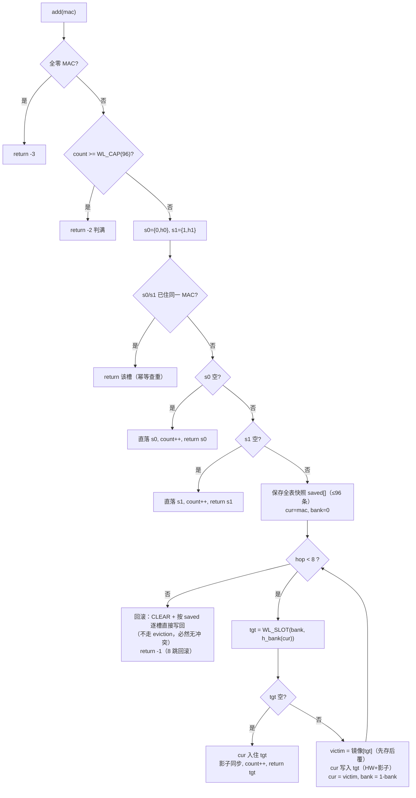

# MAC 白名单查找引擎实现指南 · 模式 2 —— BRAM 布谷鸟哈希（从零实现）

> 文档编号：ED003R02-C
> 日期：2026-08-30
> 适用工程：`fpga_webserver-whitelist_dev`（whitelist_dev 分支）
> 平台：Xilinx XC7A35T-FGG484-2（ACX750 开发板）
> 性质：**从零实现指南（作业指导书）**。模式 2 当前在工程中**不存在任何实现**（`mac_whitelist_top.v` 的 `g_mode_placeholder` 分支即为本模式预留位），本文即完整设计稿与实施步骤。
> **前置条件**：《MAC白名单查找引擎实现指南_模式0_顺序查找.md》（ED003R02-A）已全部完成并上板（tag `mode0-verified`，**必须**——框架机制/配置通路/tb 模板全部继承它）。《…_模式1_二分查找.md》（ED003R02-B）**不是本模式的前置**——项目实施主线为 模式 0 → 模式 2（见 0.2 节主线说明），模式 1 为备选路线；若已实现模式 1，其参数化 tb 可选复用（模式2-步骤5.1 的省事路线）。本文程序性回引仅指向模式 0 文档编号（如"模式0-§1.2"），对模式 1 的引用均为可选参考。
> 本文可直接交给 AI 模型或工程师逐步执行；执行前必读 0.4 节「执行须知」。

---

## 修订记录

| 日期 | 版本 | 修改描述 | 作者 |
|------|------|---------|------|
| 2026-08-29 | R02（ED003R02-C） | 初稿（模式 2 布谷鸟哈希，从零实现）：双哈希 + 双 bank 并行读、查找 2 拍、插入含 bounded eviction（软件执行）；沿用模式 0/1 框架与配置通路零改动原则 | Claude |
| 2026-08-29 | R02a（ED003R02-C） | 主线调整：项目主线定为 模式 0 → 模式 2，解除对模式 1 的前置依赖——wl_status 修复收编为本模式步骤 4.6、C 工具函数改为本文自包含（8.1）、tb 模板改从模式 0 派生（5.1）、回归改为 MODE=0 必跑 + MODE=1 视实现选跑 | Claude |
| 2026-08-30 | R03（ED003R02-C） | 作业指导书级细化 + 算法修正（新增片段均经 iverilog 12 / gcc 实测：用例 9/10 配方与回滚路径冒烟全 PASS）：① **修正 8.3 eviction 死循环缺陷**——原伪代码每跳只试 {0,h0} 槽，受害者恰是从该槽被踢必致乒乓至 8 跳耗尽；改为**交替 bank** 行走（被 bank b 踢出 → 唯一未试的家是 bank 1-b 侧，INV-B 推论），扩为可执行 C：受害者先存后覆、失败按快照回滚、条目下标即槽位号、**返回值恒认 s0**（实测修正）；② 修正 1.5/6.1 用例 9 的 eviction 触发条件（**双槽皆占才触发**）；③ 新增 5.5 冲突构造搜索与用例 9/10 配方（含实测约束：E∉{C,B} 防链环、F∉{A,D} 防六类撞车）；④ 修正 5.2 tb 位宽（48bit MAC 须 64bit 容器）、槽位号禁 33bit 位拼接（截断丢 bank 位，实测踩坑）、补齐检查器辅助函数与 tb 失败回滚；⑤ 4.6 方案 b 落地为具体代码；⑥ tb 双模改 `-D CUCKOO` 宏开关（实测），L1/L2 补 tb_cuckoo_add 自驱插入与 `-s` 根模块；⑦ 仿真宏随模式 0 R02b 更名 `sim/define.sv`、加 `-I sim`；⑧ 新增图 3（eviction 流程）与常见错误 5 行 | Claude |
| 2026-09-03 | R04（ED003R02-C） | 上板后容量判据修正：布谷鸟 d=2（每 key 两候选槽）负载阈值 ≈50%，配 6bit XOR-fold 弱哈希后**实际灌不满 96**（实测顺序 MAC 到 95、随机 MAC 到 ~88 即出现 8 跳回滚）。据此：① 步骤 9.3-3 判据由「灌满 96」改为「灌到首次 8 跳回滚为止，回滚前后 used/vpop/hwused 三者一致、逐条可查」；② `wl_add_mode2` 失败码区分 -1=8跳回滚 / -2=判满 / -3=全零，web `/api/wl/add` 相应报 `"collision"` / `"table full"` / `"invalid MAC"`；③ 8.3 流程图与代码注释同步。容量目标后续如需真 96 须改 d=3（阈值≈91%）或更强哈希，另行决策 | Claude |

## 目录

- 第 0 章 文档定位与差异总览（0.1 目标与改动范围 / 0.2 三模式差异 / 0.3 整机位置 / 0.4 执行须知）
- 第 1 章 设计决策与软硬件契约（1.1 哈希计算与 eviction 放软件 / 1.2 INV 契约 / 1.3 双哈希与 2 拍时序 / 1.4 五个细节坑 / 1.5 特例）
- 第 2 章 框架机制要点回顾（自包含：2.1 配置通路 / 2.2 寄存器表与模式 2 语义差异 / 2.3 C 驱动 / 2.4 构建链）
- 第 3 章 从零实现十步（步骤 1 契约 ~ 步骤 10 上板收官）
- 第 4 章 常见错误与排查速查
- 第 5 章 验收清单与里程碑
- 第 6 章 仿真分层、上板门禁（Gate）与已知问题
- 附录 A 四模式选型对比 / B 文件索引 / C 时序图来源索引

---

## 第 0 章 文档定位与差异总览

### 0.1 目标与改动范围

在前两模式的完整框架上，把查找算法核心替换为**布谷鸟哈希（cuckoo hashing）**：两个独立哈希函数给每个 MAC 恰好 2 个候选槽位，查找只需**并行读 2 个位置**（2 拍定结果），代价是插入可能触发 eviction（踢人链）。设计容量 96 条（物理 128 槽），面向 **>64 条目**的扩容场景——那是顺序查找（66 拍逼近线速极限）与二分（14 拍）开始吃力的区间。

**改动范围一览**（先明确边界，防止扩散）：

| 文件 | 改动 |
|------|------|
| `rtl/mac_whitelist_cuckoo.v` | **新建**（从 seq 复制起步，替换查找逻辑 + 存储扩为双 bank） |
| `rtl/mac_whitelist_top.v` | `LOOKUP_MODE==2` 分支**替换 placeholder**（`g_mode_placeholder`，60~66 行） |
| `rtl/webserver_wrapper.v` | 模式号填 2 + `wl_status` 驱动沿用模式 1 修复 |
| `c/whitelist.c` | add/delete/snapshot 改为**哈希定位 + bounded eviction** |
| `c/inc/whitelist.h` | 不变（函数签名全保留） |
| `c/tcp.c` / `c/http.c` / `c/flash_cfg.c` / `html/*` | **零改动** |
| `build_xilinx.../filelist.cfg` | 加一行 `../rtl/mac_whitelist_cuckoo.v` |

### 0.2 三模式差异总览

| 维度 | 模式 0 顺序 | 模式 1 二分 | 模式 2 布谷鸟（本文） |
|------|------------|------------|----------------------|
| 查找周期（16 条） | 18 拍 | 10 拍 | **2 拍**（与条数无关） |
| 96 条时查找周期 | 不可行（98 拍超预算） | ~12 拍 | **仍 2 拍** |
| 表结构约束 | 无 | 有序（软件维护） | **每条目必在 2 个哈希候选槽之一**（软件维护） |
| index/槽位语义 | 物理槽位 | 有序排名 | **物理槽位号 = {bank, 行号}**（哈希决定） |
| 插入代价 | O(1) 写 1 条 | 最坏重写 16 条（保序搬移） | 均摊 O(1)，最坏 **8 跳 eviction** |
| 插入期间查找 | 完全无感 | 全程保序无感 | **存在毫秒级以下瞬时 miss 窗口**（INV-C，1.2） |
| 有效容量 | 16/16 | 16/16 | **96/128 物理槽（负载上限 75%）** |
| 配置通路/寄存器表/wrapper/CDC | 完全复用，RTL 零改动 | 同左 | 复用 + INDEX 位宽扩展（0x00 语义见 2.2） |
| C 驱动接口签名 | — | 完全复用 | 完全复用 |

**主线说明**：项目实施主线为 **模式 0 → 模式 2**（顺序查找打地基 → 布谷鸟哈希冲容量与性能）；模式 1（二分）为备选路线，其后置实施与本模式**无先后依赖**（两者的前置都只有模式 0）。

### 0.3 白名单位置（简版，详见模式 0 文档 0.3 节）

```
eth1 RX ─► 提取SrcMAC ─► lookup_req ─► [mac_whitelist_top MODE=2 双哈希并行查2槽] ─► match ─► 门控wpkt_push ─► eth2 TX
                                            ▲ cfg口(SubBus 0x5000, 50MHz)
                                C固件 whitelist.c（哈希定位影子表 + bounded eviction 插入）
```

### 0.4 执行须知（作业指导书使用规则，执行前必读）

1. **步骤编号体系**：全部步骤按「模式2-步骤N.M」全局连续编号，可被其他文档直接引用。
2. **每步固定六段结构**：目的 / 前置条件 / 操作步骤 / 产出物 / 完成判据 / 常见错误。**判据不过，不得进入下一步**。
3. **执行顺序强约束**：步骤 1→10 顺序执行。C 驱动改造（步骤 8）仍刻意排在仿真（步骤 5~7）之后——先用 tb 把 RTL 与哈希一致性验透，再动软件。
4. **门禁规则**：第 6.2 节定义 G1~G5。**G1~G3 全绿之前，禁止执行 `build_fpga.sh`**。
5. **与前置文档的关系**：配置通路三特性、tb 模板（L1 单元 + L2 集成）、公共已知问题 8 条全部指向**模式 0 文档**的步骤编号；**执行前先通读模式 0 文档 5.3 节**（公共避坑清单）。对模式 1 文档的引用均为可选参考，不构成执行依赖。
6. **图表规范**：时序图用 Wavedrom，结构图保留 ASCII；来源见附录 C。

---

## 第 1 章 设计决策与软硬件契约（动笔前必须吃透）

### 1.1 核心决策：哈希计算与 eviction 搬移都放软件（与模式 1 同源，已拍板）

布谷鸟哈希需要两处"聪明"逻辑：算哈希（查找侧）与 eviction 搬移（插入侧）。**划分如下**：

| 逻辑 | 位置 | 理由 |
|------|------|------|
| 哈希函数（h0/h1） | **RTL 组合逻辑** | 查找是热路径，哈希必须每包 0 开销（组合 XOR 折叠，约 2 级门）；放 C 则每包要 CPU 参与运算，违背"CPU 不参与逐包过滤"的整机原则（模式 0 文档 0.3） |
| 插入的 eviction 链 | **C 固件** | 与模式 1 步骤"排序放软件"同一论证（模式1-§1.1）：增删是低频冷路径操作；硬件 eviction 需要跨时钟域读-改-写多周期状态机 + 终止性保证（踢人可能循环），RTL 复杂度与调试成本翻几倍；C 侧有影子表，bounded walk + 失败全量重建约 60 行 |
| 删除 | **C 固件** | 单槽清零，最简单 |

**代价**（与模式 1 的对照，必须理解后再动笔）：模式 1 的保序搬移做到了"插入期间查找完全无感"；布谷鸟的 eviction **做不到**——被踢条目在找到新家之前是"无家"状态，此窗口内查它会 miss。这个固有代价被两条前提接受：①增删是人在网页上的低频操作；②窗口有界（≤8 跳 × 每跳 4 笔 SubBus 写 ≈ 32µs；受害者的读取查 C 侧影子镜像、不上总线，见 8.2/8.3）。契约 INV-C（1.2 节）把它写死。

### 1.2 软件契约（模式 2 正确性的根基，必须写进 RTL 和 C 的注释）

```text
不变式 INV-A：任意有效条目必位于它的 2 个哈希候选槽之一：
             entry(mac) 在槽 s ∈ { {0,h0(mac)}, {1,h1(mac)} }（槽位号编码见 1.4 细节 2）。
不变式 INV-B（槽一致性）：槽 s={bank,row} 中的有效条目 mac 必满足 bank==0 ⇔ row==h0(mac)、
             bank==1 ⇔ row==h1(mac)——即"住在哪，哪就是它的哈希位"。违反 = 该条目查不到。
不变式 INV-C（并发弱化，替代模式 1 的 INV3）：插入/删除事务进行中（最坏 8 跳 × 4 笔写 ≈ 32µs）
             个别查找允许瞬时 miss；**事务之外**任意时刻查找结果完整。
```

**谁维护谁消费**：
- C 固件是唯一写入方：插入算法（步骤 8.3）每一步落位都满足 INV-A/INV-B，bounded walk 保证 INV-C 的窗口上界；
- RTL 查找**信任并利用** INV-A：只读 2 个候选槽、全等比较即得结果；RTL **不做**哈希重算校验（不检查 INV-B），那是 C 的责任与 tb 的检查器职责（步骤 5.3）。

### 1.3 双哈希与 2 拍查找的硬件时序展开

**两个哈希函数**（本设计的精确定义，RTL 与 C 必须逐位一致，1.4 细节 1）：

```text
fold6(x[47:0]) = x[5:0] ^ x[11:6] ^ x[17:12] ^ x[23:18] ^ x[29:24] ^ x[35:30] ^ x[41:36] ^ x[47:42]
                 （48bit 按 6bit 一段切成 8 段，全部异或 → 6bit）

h0(mac) = fold6(mac)                          —— 直接折叠
h1(mac) = fold6(字节序反转(mac))               —— 反转后同折叠：
          字节序反转(mac) = {mac[7:0], mac[15:8], mac[23:16], mac[31:24], mac[39:32], mac[47:40]}
```

**存储**：双 bank——bank0 按 h0 寻址、bank1 按 h1 寻址，各 64 槽（`ADDR_WIDTH=6`），物理 128 槽。一个 MAC 的两个候选槽 = bank0 的第 h0(mac) 行 + bank1 的第 h1(mac) 行，**两行可并行读**——这是 2 拍查找的物理基础。

**逐拍时序**（图 1）：哈希是组合逻辑，`lookup_mac` 在 req 拍一到位，两个 bank 读地址**当拍**就上端口；BRAM 同步读 1 拍后数据有效，第二拍并行比较两个候选槽、锁存结果：

```wavedrom
{ "signal": [
    { "name": "clk(125M)",       "wave": "10P......." },
    { "name": "lookup_req",      "wave": "10......." },
    { "name": "bank0_rd_addr",   "wave": "34x.......",  "data": [ "h0(mac)", "0" ] },
    { "name": "bank1_rd_addr",   "wave": "34x.......",  "data": [ "h1(mac)", "0" ] },
    { "name": "bank0_q",         "wave": "x4x.......",  "data": [ "d(h0)" ] },
    { "name": "bank1_q",         "wave": "x4x.......",  "data": [ "d(h1)" ] },
    { "name": "lookup_done",     "wave": "010......." },
    { "name": "lookup_match",    "wave": "010......." }
], "head": { "text": "模式 2 布谷鸟哈希：req→done = 2 拍（双 bank 并行读，与条数无关）" },
   "foot": { "text": "哈希组合产生，req 拍地址已上端口 → 下一拍数据有效即比较；查找路径无迭代、无 eviction 参与" } }
```
> **图 1** 布谷鸟哈希查找逐拍时序（自设计）。req 在拍 0，done 在拍 1 → **2 拍 = 16ns**，约为模式 0（18 拍）的 1/9、模式 1（10 拍）的 1/5。

**为什么不能再快**：BRAM 同步读固有 1 拍延迟——req 拍发地址、下一拍才有数据。2 拍已是同步 BRAM 方案的物理下限（模式 1 附录 A 的"模式 2 哈希 2~3 拍"即指此）。

**性能对照**：96 条目下顺序查找 98 拍（784ns，超 672ns 帧间隔，线速丢包）不可用、二分 ~12 拍可用，哈希恒 2 拍——这是本模式的存在意义（选型全景见附录 A）。

### 1.4 五个硬件特有的关键细节（最容易踩坑处，逐条记住）

| # | 细节 | 错误做法的后果 | 正确做法 |
|---|------|--------------|---------|
| 1 | **C 与 RTL 的哈希必须逐位一致** | C 按 h0 写槽、RTL 按 h0' 查槽，错位 → 偶发 miss；对拍样本覆盖不到就漏网到上板 | fold6 只用整字移位异或（无乘法/查表），C 与 RTL 各写一份 + tb 500 次随机对拍兜底（1.2）；改动任一侧必须同步另一侧并重跑对拍 |
| 2 | **槽位号编码含 bank 位**：`slot[6:0] = {bank, row[5:0]}`（0~63=bank0，64~127=bank1） | INDEX 只取低 4 位（seq 残留）或漏 bank 位 → 写 bank0 用 bank1 地址，条目"查无此地" | RTL 译码 `bank = slot[6]`、`row = slot[5:0]`；C 侧槽位号统一用 7bit 全宽传递 |
| 3 | **读地址必须在 req 拍就上端口** | 若学模式 1 加 ISSUE 拍装载 → 变 3 拍，"2 拍"断言失败 | 哈希组合直驱：`assign bank0_rd_addr = (state==S_IDLE && lookup_req) ? wl_hash0(lookup_mac) : 0;`（图 1，模式1-步骤3.2 教训的镜像） |
| 4 | **负载上限 75%**：容量按 96 封顶，不是物理 128 | 灌到 110+ 条：eviction 链急剧变长、8 跳失败率飙升、插入抖动 | C 侧 `sw_wl_count >= WL_CAP(96)` 直接判满拒绝（步骤 8.3 第 2 条）；MAX_ENTRIES(0x0A) 返回 96 供 C 判读 |
| 5 | **全零 MAC 禁止入表**（继承模式 1 细节 3） | 49'b0 的无效条目与"MAC=0 的有效条目"混淆 | 查找比较用 49bit 全等 `q == {1'b1, lookup_mac}`——valid 位并入比较；C 侧 add 开头拒绝全零 |

### 1.5 特例行为

- **空表 lookup**：两候选槽都读回 49'b0 → 49bit 全等必不命中 → 2 拍 miss，tb 必须覆盖；
- **eviction 的真正触发条件是"双槽皆占"**：新条目的两个候选槽 {0,h0}、{1,h1} **都被占**才踢人（8.3 步骤 3 空位直达优先）。**同 h0 冲突对本身不触发 eviction**——只有两条时，第二条落进空闲的 h1 槽（R03 修正：初稿"同 h0 对第二条触发 1 跳 eviction"的说法与本模式插入算法自相矛盾）。最小触发场景是三条 MAC：p:(h0=A,h1=C)、q:(A,B)、x:(A,B)——q 与 x 同属一个 (h0,h1) 类，x 插入时两槽分别被 p/q 占住（构造方法见 模式2-步骤5.5，tb 覆盖见 6.1 用例 9）——这是本模式的招牌行为；
- **eviction 链**：被踢者又把下一槽的主人踢出去 → 多跳连环 → 链上全部条目仍须命中、槽一致性不破（构造方法见 模式2-步骤5.5，用例 10）；
- **同一 (h0,h1) 类最多住 2 条**：类内第 3 个成员的两个候选槽永远互相顶替（乒乓），插入必然 8 跳失败并回滚——这是容量物理约束，不是 bug（8.3 步骤 5 的回滚语义、常见错误表）。

---

## 第 2 章 框架机制要点回顾（自包含）

> 本章把前置文档的公共机制压缩为执行本文所需的最小集合。更完整的链路图、逐拍波形、已知问题全文见模式 0/1 文档。

### 2.1 配置通路三特性（模式0-§1.2）

C 固件经 LCPU 总线 → `reg_webserver`（SubBus 0x5000~0x5FFF 段译码）→ `ramintf` → 白名单 cfg 口（50MHz 域）。上游 LCPU 写/读时序见模式 0 文档图 1/图 2，cfg 口电平采样波形（图 2，与模式 0 文档图 3 同源）：

```wavedrom
{ "signal": [
    { "name": "cfg_clk",        "wave": "10P......" },
    { "name": "cfg_rlwh",       "wave": "01...0.." },
    { "name": "cfg_addr[11:0]", "wave": "x.3...x.", "data": [ "0x003(WR)" ] },
    {},
    { "name": "bram_wr_en_r（译码加载）", "wave": "001110..." },
    { "name": "BRAM+shadow 实际写口",     "wave": "001110..." }
], "head": { "text": "cfg 口电平敏感写：rlwh 持续约 3 拍，同一笔写被译码 3 次" },
   "foot": { "text": "写内容恒定 → 重复执行无害（幂等）。禁止边沿检测/计数式逻辑" } }
```
> **图 2** 白名单 cfg 口电平敏感写采样。与模式 0 文档图 3 同源（自设计）。

| # | 特性 | 对 RTL/C 的要求 |
|---|------|----------------|
| 1 | 电平敏感写、无握手（rlwh 持续约 3 拍） | RTL 所有写动作幂等（`*_r` 单拍脉冲结构）；C 每笔写走 `subbus_write()` |
| 2 | C 侧每笔写后必须 flush（读 0x500A） | `subbus_write()` 内已实现；eviction 每一跳的每笔写都必须过它 |
| 3 | BRAM 与 shadow_rf 双副本同步写 | 每条写路径同拍写两存储；模式 2 的 shadow 扩为 128 深（开销见 6.3 问题 14） |

### 2.2 寄存器表与模式 2 语义差异（SubBus 基址 0x5000）

| 偏移 | 名称 | 模式 0/1 语义 | **模式 2 语义** | RTL 改动 |
|-----|------|--------------|----------------|---------|
| 0x00 | INDEX | wdata[3:0]/[6:0] 索引；bit31 附带删除 | **wdata[6:0] = 槽位号 {bank,row}**；bit31 附带删除保留 | 译码取位 4→7 位；写路由按 slot[6] 选 bank |
| 0x01/0x02 | MAC_H/L | cfg_mac 暂存 | 不变 | 无 |
| 0x03 | WR | 双副本写入 cfg_idx 槽 | 不变（cfg_idx 已是 7bit 槽位号） | 写地址 = 槽位号映射到 (bank,row) |
| 0x04 | DEL | 双副本清零 | 不变 | 同上 |
| 0x05 | CLEAR | 16/16 拍序列器 | **128 拍**（clear_cnt 7bit，扫完全部物理槽） | 计数上限与位宽 |
| 0x06/07/08 | RD_* | 读 shadow_rf[cfg_idx] | 不变（shadow 128 深） | 地址位宽 |
| 0x09 | FREE_IDX | 首个空闲槽 | **哈希模式下无"线性首个空闲"概念，恒读 0x7F 占位，C 不使用**（位置由哈希决定） | 常量输出 |
| 0x0A | MAX_ENTRIES | 恒 16 | **恒 96（设计容量，C 判满依据）**；flush 读该地址的用法不变 | 常量输出 |
| 0x0B | USED_CNT | popcount(valid_bits) | 不变（valid_bits 扩为 128 位） | 链长 |

除上述位宽/常量差异外，寄存器行为与模式 0 完全一致（写入幂等、双副本同步、读组合零延迟）。

### 2.3 C 驱动现状（`c/whitelist.c`）

| 函数 | 模式 2 改动 |
|------|------------|
| `subbus_write()` | 不变（**所有 HW 写必须走它**，内含 flush） |
| `sw_wl_*` 影子表 | 扩为 128 槽，**条目下标即槽位号**（删除/查重/eviction 受害者查询全靠它，兼作槽位镜像免总线读，见 8.2） |
| `whitelist_add` | **替换主体**：哈希定位 + bounded eviction（模式2-步骤8.3） |
| `whitelist_delete` | **替换主体**：查槽位号单槽删除（模式2-步骤8.4） |
| `whitelist_apply_snapshot` | 逐条走插入路径灌入——哈希表灌入顺序无关，**无需排序**（比模式 1 还简单，模式2-步骤8.6） |
| `whitelist_hw_read_entry / hw_diag / get` | 不变（读 shadow_rf，槽位号语义） |

### 2.4 构建与烧录链（同模式 0 §1.7 / 模式 1 §2.4）

```bash
cd /home/haitaoz/work/FPGA_Prj/fpga_webserver-wldev-v2
cd c_build && make PLATFORM=xilinx riscv_reset_addr=0xf TCL_BASE=0x8000 && cd ..   # 固件
cd build_xilinx_xc7a35tfgg484 && ./build_fpga.sh <4位hex版本> && cd ..             # bitstream
openFPGALoader -c digilent_hs2 <工程目录>/<同名>.bit                                # 烧录
vivado -mode batch -source scripts/load_firmware_vivado.tcl                        # 加载固件
ping 192.168.1.88 && curl http://192.168.1.88/                                     # 验证（应 200）
```

同一份 C 固件包含三模式逻辑（由 wl_status/编译期模式号区分行为）；切模式只重出 bitstream。**注意**：模式 2 的固件里 `WL_CAP=96` 与模式 0/1 的 16 并存——判满逻辑按 `MAX_ENTRIES(0x0A)` 读回值走，不要硬编码 16（模式2-步骤8.2）。

---

## 第 3 章 从零实现十步

> 步骤依赖链：**1 契约 → 2 骨架双bank → 3 哈希+查找 → 4 辅助/集成改动 → 5 tb搭建 → 6 L1仿真+回归 → 7 L2集成仿真 → 8 C哈希化 → 9 上板回归 → 10 并发/掉电/收官**。每步六段：目的/前置条件/操作步骤/产出物/完成判据/常见错误。判据不过不进下一步。

### 步骤 1：契约确认与规格落笔

**目的**：固化 INV-A/B/C 契约、哈希函数精确定义与容量参数——布谷鸟哈希的正确性完全建立在"每条目恰在 2 个候选槽"这条不变式上，先立契约后写码。

**前置条件**：模式 0 已收官（必须）；模式 1 已收官（建议，参数化 tb 直接复用）。

**操作步骤**：

**1.1** 通读 1.1~1.5，确认理解：哈希在 RTL / eviction 在 C 的划分（1.1）、INV-A/B/C（1.2）、2 拍时序（1.3）、五个细节坑（1.4）、三个特例（1.5）。

**1.2** 参数落笔（写进将新建模块的头注释）：

```text
BUCKET_NUM = 64（每 bank 槽数），ADDR_WIDTH = $clog2(64) = 6
物理槽 = 2 bank × 64 = 128，槽位号 slot[6:0] = {bank, row[5:0]}
设计容量 CAP = 96（负载 75% 上限，1.4 细节 4）
MAX_EVICTION_HOPS = 8（插入踢人上限，超过走全量重建）
查找周期 = 2 拍 = 16ns（图 1），与条数无关
```

**1.3** 哈希函数定义（1.3 节的 fold6/h0/h1）抄录进头注释，标注"C 侧必须逐位复刻（模式2-步骤8.1）"。

**1.4** 时序预算验算：2 拍 = 16ns ≪ 672ns 最小帧间隔，且与容量无关——即使未来扩到 512 条也线速安全（顺序查找 514 拍早已不可行）。

**产出物**：契约要点记录（INV 原文 + 参数表 + 哈希定义）。

**完成判据**：能不看文档复述：为什么查找是 2 拍、负载为什么限 75%、INV-C 与模式 1 INV3 的区别、槽位号怎么编码。

**常见错误**：带着"模式 1 的保序直觉"来做哈希——两者并发契约不同（INV-C 弱于 INV3），步骤 10.1 的板测期望也不同。

### 步骤 2：复制与骨架改造（双 bank 存储）

**目的**：以 seq 为起点建立 `mac_whitelist_cuckoo.v`——配置通路译码、幂等写结构、读 mux 风格全部继承（已由模式 0 验证），把存储扩为双 bank 并保持双副本同步写纪律。

**前置条件**：模式2-步骤1 完成。

**操作步骤**：

**2.1** 复制文件并改名：

```bash
cd /home/haitaoz/work/FPGA_Prj/fpga_webserver-wldev-v2
cp rtl/mac_whitelist_seq.v rtl/mac_whitelist_cuckoo.v
# 模块名 mac_whitelist_seq → mac_whitelist_cuckoo；头注释按步骤 1.2/1.3 重写
```

**改造对照清单**（seq.v 的每个部件怎么处置，逐项过、防漏改；后文 2.2~2.5 与步骤 3/4 即按此展开）：

| seq.v 部件 | 处置 | cuckoo.v 对应 |
|-----------|------|--------------|
| 参数 ENTRY_NUM/ADDR_WIDTH | **替换** | BUCKET_NUM=64 / ADDR_WIDTH=6 / CAPACITY=96（2.2） |
| `cfg_idx` [3:0] | **扩位** | [6:0]（槽位号 {bank,row}，细节 2） |
| `valid_bits` [15:0] | **扩位** | [127:0]（SLOTS=128） |
| `shadow_rf` [0:15] | **扩位** | [0:127] |
| `clear_cnt` [3:0] | **扩位** | [6:0]（CLEAR 扫 128 拍） |
| 单 BRAM `u_bram` | **替换** | 双 bank `u_bank0`/`u_bank1`（2.3） |
| BRAM/shadow 写口 OR-mux | **改造** | 按 `sel_bank1` 分配两 bank（2.4） |
| `free_idx` 生成链 | **整段删除** | 哈希模式无线性空闲；读 mux 0x09 改常量 0x7F（4.1/4.2） |
| `used_cnt` popcount 链 | **扩链长** | SLOTS=128 级（4.1） |
| 三态查找 FSM | **替换** | 两态 FSM + 组合哈希直驱（步骤 3） |
| 配置译码 always 块 | **保留+扩位** | 结构不动；INDEX 取 7bit（4.3） |
| 读 mux | **保留+两常量** | 0x09→0x7F、0x0A→CAPACITY（4.2） |

**2.2** 参数与信号改造：

```verilog
module mac_whitelist_cuckoo #(
    parameter int BUCKET_NUM  = 64,
    parameter int ADDR_WIDTH  = 6,    // $clog2(BUCKET_NUM)
    parameter int CAPACITY    = 96    // 设计容量（负载 75%）
) ( /* 端口四组与模式 0 完全一致（模式0-步骤2.1），照抄不改 */ );

// 存储信号（替换 seq 的 16 深版本）
localparam int SLOTS = BUCKET_NUM * 2;              // 128 物理槽
wire  [6:0]            slot      = cfg_idx;         // {bank, row[5:0]}——cfg_idx 已扩为 7bit
wire                   sel_bank1 = slot[6];         // ★ 细节 2
wire  [ADDR_WIDTH-1:0] row       = slot[ADDR_WIDTH-1:0];
reg   [SLOTS-1:0]      valid_bits;                  // 128 位
reg   [48:0]           shadow_rf [0:SLOTS-1];       // 128 深
reg   [6:0]            clear_cnt;                   // CLEAR 计数扩为 7bit（seq 为 4bit）
```

（`cfg_idx` 位宽从 4bit 扩为 7bit；`valid_bits`/`shadow_rf`/`clear_cnt` 同步扩位——这是从 seq 复制后**必须逐个改到**的位宽清单。）

**2.3** 双 BRAM 实例（bank0/bank1 各一，写口 A=cfg_clk、读口 B=clk，与模式 0 同款 IP）：

```verilog
dual_clock_simple_dual_port_ram #(
    .data_width(49), .addr_width(ADDR_WIDTH), .depth(BUCKET_NUM),
    .block_ram_size(32), .ram_type(`LARGER_RAM), .vendor(`DEVICE_VENDOR)
) u_bank0 ( .clock_a(cfg_clk), .wren_a(bank0_wr_en), .data_a(bank0_wr_data),
            .address_a(bank0_wr_addr), .clock_b(clk),
            .address_b(bank0_rd_addr), .q_b(bank0_q) );
// u_bank1 同款，信号换 bank1_*
```

**2.4** 写路由（普通写 + CLEAR 序列器输出，按 sel_bank1 分配到两个 bank；`*_r` 暂存结构原样保留）：

```verilog
wire clear_bank1 = clear_cnt[6];                    // CLEAR 扫描时的 bank 选择——来自计数器，不是 cfg_idx
assign bank0_wr_en   = clear_active ? ~clear_bank1              : (bram_wr_en_r & ~sel_bank1);
assign bank1_wr_en   = clear_active ?  clear_bank1              : (bram_wr_en_r &  sel_bank1);
assign bank0_wr_addr = clear_active ? clear_cnt[ADDR_WIDTH-1:0] : row;
assign bank1_wr_addr = bank0_wr_addr;               // row 对两 bank 位宽相同
assign bank0_wr_data = clear_active ? 49'b0 : bram_wr_data_r;
assign bank1_wr_data = bank0_wr_data;
// shadow 写口仍单套：shadow_rf[slot]（7bit 索引天然区分 bank）
```

（CLEAR 期间 `clear_cnt[6]` 充当 bank 选择、低 6 位作行地址——序列器自然扫完整 128 槽。）

**2.5** shadow_rf 写读（同模式 0 结构，索引扩位）：

```verilog
always @(posedge cfg_clk) if (sh_wr_en) shadow_rf[sh_wr_addr] <= sh_wr_data;
assign sh_rd_data = shadow_rf[sh_rd_addr];   // 组合读，零延迟
```

**2.6** 编译检查（沿用仿真宏方案，模式0-步骤3.5 的 `sim/define.sv` 原样可用，注意 `-I sim`）：

```bash
cd /home/haitaoz/work/FPGA_Prj/fpga_webserver-wldev-v2
iverilog -g2012 -o /dev/null -I sim \
    sim/define.sv \
    rtl/mac_whitelist_cuckoo.v \
    ../ip_common/rtl/dual_clock_simple_dual_port_ram.v
```

**产出物**：`rtl/mac_whitelist_cuckoo.v` 骨架（双 bank 存储 + 扩位配置通路，可编译）。

**完成判据**：2.6 命令 0 error、无 implicit wire 警告；grep 确认模块名唯一、无残留 `mac_whitelist_seq` 字样。

**常见错误**：`valid_bits`/`shadow_rf`/`clear_cnt` 忘扩位（seq 残留 4bit）→ 高位槽全丢；CLEAR 计数只扫 bank0（clear_cnt 位宽不够或 bank 路由漏了 clear 分支）；两 bank 的写数据没接同一源（复制粘贴出 `bank1_wr_data_r` 幽灵信号）。

### 步骤 3：哈希函数与 2 拍查找逻辑（模式 2 核心）

**目的**：实现双哈希组合逻辑与两态查找 FSM。技术核心：哈希组合直驱读地址（req 拍即上端口，1.4 细节 3），下一拍并行比较两候选槽——49bit 全等把 valid 判断并入比较（1.4 细节 5）。

**前置条件**：模式2-步骤2 完成。

**操作步骤**：

**3.1** 哈希函数（组合，XOR 折叠，精确按 1.3 定义）：

```verilog
// fold6：48bit 按 6bit×8 段全异或（与 C 侧 wl_fold() 逐位一致，模式2-步骤8.1）
function [ADDR_WIDTH-1:0] wl_fold(input [47:0] x);
    wl_fold = x[5:0] ^ x[11:6] ^ x[17:12] ^ x[23:18]
            ^ x[29:24] ^ x[35:30] ^ x[41:36] ^ x[47:42];
endfunction
function [ADDR_WIDTH-1:0] wl_hash0(input [47:0] mac);
    wl_hash0 = wl_fold(mac);
endfunction
function [ADDR_WIDTH-1:0] wl_hash1(input [47:0] mac);
    wl_hash1 = wl_fold({mac[7:0], mac[15:8], mac[23:16],   // 字节序反转后同折叠
                        mac[31:24], mac[39:32], mac[47:40]});
endfunction
```

**3.2** 读地址组合直驱（★ 细节 3——学模式 1 加 ISSUE 拍就变 3 拍）：

```verilog
assign bank0_rd_addr = (state == S_IDLE && lookup_req) ? wl_hash0(lookup_mac) : {ADDR_WIDTH{1'b0}};
assign bank1_rd_addr = (state == S_IDLE && lookup_req) ? wl_hash1(lookup_mac) : {ADDR_WIDTH{1'b0}};
// 命中比较：49bit 全等，valid 位并入（无效条目 49'b0 永不命中——全零 MAC 禁入契约兜底）
wire hit_comb = (bank0_q == {1'b1, lookup_mac}) || (bank1_q == {1'b1, lookup_mac});
```

**3.3** 两态 FSM 本体（替换 seq 的三态 FSM）：

```verilog
// ============================================================
// Cuckoo-hash lookup FSM (125MHz) — 信任 INV-A（每条目恰在 2 候选槽之一）
//   IDLE(req 拍，哈希地址已上端口) → DONE(数据有效，并行比较，锁存)
//   req→done = 2 拍，与条数无关；无迭代（图 1）
// ============================================================
localparam S_IDLE=2'd0, S_DONE=2'd1;

always @(posedge clk or negedge reset_l) begin
    if (!reset_l) begin
        state<=S_IDLE; lookup_match<=0; lookup_done<=0;
    end else begin
        lookup_done <= 1'b0;
        case (state)
        S_IDLE: if (lookup_req) state <= S_DONE;      // 地址本拍已在端口上
        S_DONE: begin
            lookup_match <= whitelist_en ? hit_comb : default_pass;  // 兜底语义同模式 0/1
            lookup_done  <= 1'b1;
            state        <= S_IDLE;
        end
        default: state <= S_IDLE;
        endcase
    end
end
assign lookup_busy = (state != S_IDLE);
```

**3.4** 逐拍自查——对照图 1 走查：拍 0（IDLE，req=1）哈希地址已上两 bank 读口 → 拍 1（DONE）`bank*_q` 有效、`hit_comb` 并行比较、锁存 match、拉 done。**周期数验算：req 拍 0、done 拍 1 → 2 拍** ✓（与 1.4 预算闭环）。

**产出物**：哈希 + 查找逻辑。**RTL 查找路径全部完成。**

**完成判据**：模块编译 0 error；对照图 1 能逐拍指出代码动作；能解释为什么这里**不需要**模式 1 的 ISSUE 态（地址是组合产生，不是上一拍算出来的寄存器值）。

**常见错误**：照抄模式 1 的 `mid` 直驱结构反而不适配（二分地址依赖比较结果必须寄存，哈希地址组合可得必须当拍直驱——两模式的"直驱"含义不同）；`hit_comb` 用 48bit 比较（丢 valid 位）→ 全零槽误命中；done 拍地址仍保持哈希值（本设计在 DONE 拍回 0，无影响——数据是寄存器输出，但别把它当"地址仍在读"的依据）。

### 步骤 4：辅助逻辑改造与集成（free/used、读 mux、top 分支、filelist）

**目的**：完成辅助组合逻辑的扩位与模式 2 语义适配，接通 top 的 MODE=2 分支（替换预留 placeholder），让 MODE=2 可被编译。

**前置条件**：模式2-步骤3 完成。

**操作步骤**：

**4.1** used_cnt 扩位（popcount 链结构不变，128 级；free_idx 整段**删除**——哈希模式无线性空闲概念）：

```verilog
// used_cnt：generate 加法器链 popcount（结构与模式0-步骤5.2 相同，SLOTS=128）
wire [7:0] used_cnt_partial [SLOTS:0];
assign used_cnt_partial[0] = 8'd0;
generate for (gi = 0; gi < SLOTS; gi = gi+1) begin : g_pop
    assign used_cnt_partial[gi+1] = used_cnt_partial[gi] + {7'b0, valid_bits[gi]};
end endgenerate
wire [7:0] used_cnt_comb = used_cnt_partial[SLOTS];
```

**4.2** 读 mux 适配（结构同模式0-步骤5.3，两处常量差异）：

```verilog
    (!cfg_rlwh && rd_reg==4'h0) ? {25'b0, cfg_idx} :     // 7bit 槽位号
    ...
    (!cfg_rlwh && rd_reg==4'h9) ? 32'h0000_007F :        // FREE_IDX：哈希模式占位 0x7F
    (!cfg_rlwh && rd_reg==4'hA) ? CAPACITY :             // MAX_ENTRIES：96
    (!cfg_rlwh && rd_reg==4'hB) ? {24'b0, used_cnt_comb} :
```

**4.3** INDEX 译码扩位（配置 always 块内）：`cfg_idx <= cfg_wdata[6:0];`（原 [3:0]）；bit31 附带删除分支同步取 7 位；WR/DEL 分支的 `cfg_idx` 天然已是 7bit 槽位号。

**4.4** `rtl/mac_whitelist_top.v`：把模式 1 收窄后的 `g_mode_placeholder`（60~66 行）替换为真实分支（连线照抄 `g_mode_seq` 分支 39~59 行，模块名换 `mac_whitelist_cuckoo`；**参数表不同**——BUCKET_NUM/CAPACITY 替代 ENTRY_NUM/ADDR_WIDTH，对照 2.2 节传参）：

```verilog
    end else if (LOOKUP_MODE == 2) begin : g_mode_cuckoo
        mac_whitelist_cuckoo #(...) u_lookup (...);  // 替换 placeholder
    end else begin : g_mode_placeholder              // 保留给未来模式
```

**4.5** `build_xilinx_xc7a35tfgg484/filelist.cfg` 加一行：`../rtl/mac_whitelist_cuckoo.v`。

**4.6** `wl_status` 未驱动修复（本模式职责）。现状：`webserver_wrapper.v` 168 行声明 `wl_status`（[7:0]=lookup_mode，[15:8]=used_cnt），480 行连进 reg_webserver（0x301，Web `/api/wl/status` 的 lookup_mode 字段），但全工程无驱动、读回恒 0——不修则 G5 第 1 项无法验收。二选一：

```verilog
// 方案 a（最小改动）：wrapper 里直接 assign 常量模式号
assign wl_status = {8'b0, 8'd2};            // LOOKUP_MODE=2

// 方案 b（完整，推荐）：模式号 + 实时条目数一并上报，Web 状态栏两字段都有值。
// ① 两个查找引擎各加一根输出口（8bit 足够 128 槽）：
//    mac_whitelist_cuckoo.v / mac_whitelist_seq.v 端口表末尾加：
output [7:0] used_cnt_o
//    模块体内：
assign used_cnt_o = used_cnt_comb;
// ② mac_whitelist_top.v：端口表加 output [7:0] wl_used_cnt_o，
//    g_mode_seq / g_mode_cuckoo 两个分支各加一行透传：
//      .used_cnt_o(wl_used_cnt_o)
//    （placeholder 分支给常量 8'h0 兜底：assign wl_used_cnt_o = 8'h0;）
// ③ webserver_wrapper.v：u_mac_wl 例化连上 .wl_used_cnt_o(wl_used_cnt)，然后：
wire [7:0] wl_used_cnt;                     // 168 行 wl_status 声明附近
assign wl_status = {wl_used_cnt, 8'd2};     // [15:8]=used_cnt，[7:0]=lookup_mode
//   → tcp.c 的 status 接口已在读 wl_status，无需改 C
```

（若模式 1 路线已实施过方案 b，本步只需把模式号字节改为 2。）本步 wrapper 模式号**不改**（保持 1139 行 `.LOOKUP_MODE(0)`，上板才切）。

**产出物**：改造后的 `mac_whitelist_cuckoo.v`、`mac_whitelist_top.v`、`filelist.cfg`。

**完成判据**：top 级 `iverilog -g2012 -o /dev/null` 语法自查无新增 error（三模式分支都过 elaboration）；grep `wl_status` 有驱动源。

**常见错误**：mode2 分支连线漏根（对照 mode0 分支逐根抄）；删 free_idx 时把读 mux 里 0x09 分支一起删了（要改成常量 0x7F，不是消失）；`CAPACITY` 参数忘进读 mux（0x0A 仍读 16 → C 判满逻辑错位）。

### 步骤 5：参数化单元 tb 搭建（MODE=2 接入）

**目的**：把模式 1 建立的参数化 tb 框架扩展到 MODE=2，并增加布谷鸟特有部件：C 侧哈希副本（金模型内复算 h0/h1）、槽一致性检查器（INV-B 的机器裁判）。

**前置条件**：模式2-步骤4 完成；`sim/tb_mac_whitelist_seq.sv` 存在（模式0-步骤7 产物）。

**操作步骤**：

**5.1** 新建 `sim/tb_mac_whitelist_cuckoo.sv`，两条路线二选一：

- **主线（从模式 0 派生）**：以 `sim/tb_mac_whitelist_seq.sv`（模式0-步骤7 产物）为模板，DUT 例化用 **`-D CUCKOO` 编译期宏开关**双模（R03 起，替代早期 `-P` 参数方案——宏分支允许两个模式各自连不同的 DUT 模块文件，回归时只换文件清单不改动 tb）；
- **省事路线（仅当模式 1 已实现）**：在 `sim/tb_mac_whitelist_bin.sv`（模式1-步骤5 产物）上加 `CUCKOO → mac_whitelist_cuckoo` 分支，机制相同。

时钟/复位/SubBus 写任务/查找任务全部照抄模式 0 tb（模式0-步骤7.1 骨架、7.2 的 `subbus_wr` 与 `do_lookup`——`do_lookup` 的周期计数约定三模式统一）。DUT 双模例化与公共常量：

```systemverilog
`ifdef CUCKOO
localparam integer EXP_CYC = 2;        // 模式 2 分水岭断言：==2（5.4）
`else
localparam integer EXP_CYC = 18;       // MODE=0 回归：==18（并入模式 1 路线时为 ≤10）
`endif

`ifdef CUCKOO
mac_whitelist_cuckoo #(
    .BUCKET_NUM(64), .ADDR_WIDTH(6), .CAPACITY(96)
) dut (
    /* 端口四组与模式 0 tb 完全一致（模式0-步骤7.1 骨架），模块名与参数替换 */
);
`else
mac_whitelist_seq dut (
    /* 与模式 0 tb 原样 */
);
`endif
```

**5.2** 金模型（**无序集合**，哈希表无序，比模式 1 的有序模型更简单）+ tb 哈希副本 + tb 侧插入/删除驱动。三段职责：`model_*` 是独立对照基准；`tb_fold/tb_h0/tb_h1` 是 RTL 哈希副本；`tb_cuckoo_add/tb_cuckoo_del` 按 8.3 算法经 `subbus_wr` 落笔（**tb 无 C 固件，插入驱动就是它**——L1 全部用例与 L2 用例 7 共用，同时是 8.3 C 实现的行为参照）：

```systemverilog
// ── 金模型：无序集合（定长数组+计数；iverilog 对 SV 队列 model[$] 支持不全，不用队列）──
longint unsigned model_mac [0:127];    // ★ 48bit MAC 必须 64bit 容器（int unsigned 是 32bit，会截断）
integer          model_cnt;

function automatic integer model_lookup(input longint unsigned mac);
    integer i;
    begin
        model_lookup = 0;
        for (i = 0; i < model_cnt && model_lookup == 0; i = i + 1)
            if (model_mac[i] == mac) model_lookup = 1;
    end
endfunction
task automatic model_add(input longint unsigned mac);
    begin
        if (!model_lookup(mac)) begin model_mac[model_cnt] = mac; model_cnt = model_cnt + 1; end
    end
endtask
task automatic model_del(input longint unsigned mac);
    integer i, j;
    begin
        for (i = 0; i < model_cnt; i = i + 1)
            if (model_mac[i] == mac) begin
                model_mac[i] = model_mac[model_cnt-1];     // 无序集合：与末位交换即删
                model_cnt = model_cnt - 1;
                i = model_cnt;                             // 结束循环（已删除，勿再扫）
            end
    end
endtask
```

```systemverilog
// ── RTL 哈希副本（必须与 RTL wl_fold/wl_hash0/wl_hash1、C 侧 wl_fold 逐位一致，1.4 细节 1）
// ★ 48bit 运算必须用 64bit 容器——R03 修正：初稿 int unsigned（32bit）正犯了本文常见错误表第 1 条
function automatic integer tb_fold(input longint unsigned x);
    integer i, r;
    begin
        r = 0;
        for (i = 0; i < 8; i = i + 1) r = r ^ ((x >> (6*i)) & 64'h3F);
        tb_fold = r;
    end
endfunction
function automatic longint unsigned tb_bswap48(input longint unsigned x);  // 6 字节序反转
    begin
        tb_bswap48 = ((x & 64'h0000000000FF) << 40) | ((x & 64'h00000000FF00) << 24)
                   | ((x & 64'h000000FF0000) << 8)  | ((x & 64'h0000FF000000) >> 8)
                   | ((x & 64'h00FF00000000) >> 24) | ((x & 64'hFF0000000000) >> 40);
    end
endfunction
function automatic integer tb_h0(input longint unsigned mac);  tb_h0 = tb_fold(mac);          endfunction
function automatic integer tb_h1(input longint unsigned mac);  tb_h1 = tb_fold(tb_bswap48(mac)); endfunction
```

```systemverilog
// ── tb 侧槽位镜像（与 C 侧 sw_wl_* 同构：条目下标即槽位号）──
reg [47:0] tb_slot_mac   [0:127];
reg        tb_slot_valid [0:127];
integer    tb_add_hops, tb_add_ret;      // 最近一次 add 的跳数（含最终落位）与返回槽位
reg        tb_cap_reject, tb_add_fail;
// 回滚快照（模块级，供 tb_cuckoo_add 的失败路径用；快照数组不放 task 内——
// iverilog 对 task 局部数组支持不全）
reg        snap_valid [0:127];
reg [47:0] snap_mac   [0:127];
integer    snap_cnt, i_snap;

task automatic tb_hw_write_slot(input [6:0] slot, input [47:0] mac);   // 4 笔写，全过 subbus_wr
    begin
        subbus_wr(12'h500, {24'b0, slot});        // 0x00 INDEX（cfg_addr = 0x5000 段内 12bit）
        subbus_wr(12'h501, mac[47:16]);           // 0x01 MAC_H
        subbus_wr(12'h502, {16'b0, mac[15:0]});   // 0x02 MAC_L
        subbus_wr(12'h503, 32'h1);                // 0x03 WR 触发
    end
endtask

task automatic tb_hw_clear_and_wait;               // CLEAR(0x05) + 等 128 拍序列器（配置域）
    integer w;
    begin
        subbus_wr(12'h505, 32'h1);
        for (w = 0; w < 150; w = w + 1) @(posedge cfg_clk);   // 128 拍 + 裕量
    end
endtask

task automatic tb_cuckoo_add(input longint unsigned mac);              // 行为等同 8.3
    reg [6:0] s0, s1, tgt, s_tmp;
    reg [47:0] cur, victim;
    integer bank, hop, placed;
    begin
        // ★ 槽位号只能用算术合成，禁止 {1'b?, tb_h*()} 位拼接——tb_h* 返回 32bit
        //   integer，33bit 拼接赋给 7bit 时截断会丢掉 bank 位（R03 实测抓出的坑）
        s0 = tb_h0(mac);            // bank0 槽号 = h0（0~63）
        s1 = 64 + tb_h1(mac);       // bank1 槽号 = 64 + h1（64~127）
        tb_add_hops = 0; tb_add_ret = 7'h7F; tb_cap_reject = 0; tb_add_fail = 0; placed = 0;
        if (model_cnt >= 96) begin
            tb_cap_reject = 1;                                              // 步骤 2 判满（1.4 细节 4）
        end else if ((tb_slot_valid[s0] && tb_slot_mac[s0] == mac)
                  || (tb_slot_valid[s1] && tb_slot_mac[s1] == mac)) begin
            model_add(mac);                                                 // 步骤 1 查重幂等
        end else if (!tb_slot_valid[s0]) begin                              // 步骤 3 空位直达 h0
            tb_hw_write_slot(s0, mac[47:0]);
            tb_slot_valid[s0] = 1; tb_slot_mac[s0] = mac[47:0]; model_add(mac);
            tb_add_ret = s0; placed = 1;
        end else if (!tb_slot_valid[s1]) begin                              // 空位直达 h1（不踢人！）
            tb_hw_write_slot(s1, mac[47:0]);
            tb_slot_valid[s1] = 1; tb_slot_mac[s1] = mac[47:0]; model_add(mac);
            tb_add_ret = s1; placed = 1;
        end else begin                                                      // 步骤 4 双槽皆占 → eviction
            cur = mac[47:0]; bank = 0;
            tb_add_ret = s0;                                                // ★ x 恒落首跳的 bank0 槽 s0（同 8.3）
            for (i_snap = 0; i_snap < 128; i_snap = i_snap + 1) begin       // 失败回滚快照（8.3 同构）
                snap_valid[i_snap] = tb_slot_valid[i_snap];
                snap_mac[i_snap]   = tb_slot_mac[i_snap];
            end
            snap_cnt = model_cnt;
            for (hop = 0; hop < 8 && !placed; hop = hop + 1) begin
                tgt = (bank == 0) ? tb_h0(cur) : 64 + tb_h1(cur);           // 本跳流浪者的目标槽
                if (!tb_slot_valid[tgt]) begin                              // 流浪者找到空位 → 完成
                    tb_hw_write_slot(tgt, cur);
                    tb_slot_valid[tgt] = 1; tb_slot_mac[tgt] = cur; model_add(cur);
                    tb_add_hops = hop + 1; placed = 1;                      // （tb_add_ret 已定为 s0）
                end else begin
                    victim = tb_slot_mac[tgt];                              // ★ 先存受害者再覆盖
                    tb_hw_write_slot(tgt, cur);
                    tb_slot_mac[tgt] = cur; model_add(cur);
                    cur  = victim;
                    bank = 1 - bank;                                        // ★ 交替 bank（防乒乓，8.3 核心）
                end
            end
            if (!placed) begin                                              // 步骤 5 回滚（与 8.3 C 一致）
                tb_hw_clear_and_wait;                                       // DUT 128 槽全清
                for (i_snap = 0; i_snap < 128; i_snap = i_snap + 1) begin
                    tb_slot_valid[i_snap] = 0; tb_slot_mac[i_snap] = 48'b0; // 影子同步全清
                end
                for (i_snap = 0; i_snap < 128; i_snap = i_snap + 1) begin
                    if (snap_valid[i_snap]) begin                           // 按快照原槽直接写回（无冲突）
                        s_tmp = i_snap[6:0];
                        tb_hw_write_slot(s_tmp, snap_mac[i_snap]);
                        tb_slot_valid[i_snap] = 1; tb_slot_mac[i_snap] = snap_mac[i_snap];
                    end
                end
                model_cnt = snap_cnt;                                       // 集合无序，截断计数即可
                tb_add_fail = 1;
            end
        end
    end
endtask

task automatic tb_cuckoo_del(input [6:0] slot);
    reg [47:0] m;
    begin
        if (tb_slot_valid[slot]) begin
            m = tb_slot_mac[slot];
            subbus_wr(12'h500, {1'b1, 24'b0, slot});   // INDEX | bit31：一笔带删（2.2 语义）
            tb_slot_valid[slot] = 0; tb_slot_mac[slot] = 48'b0;
            model_del(m);
        end
    end
endtask
```

**5.3** 槽一致性检查器（INV-B 机器裁判，每次 add/del 事务后调用）+ 两级对表。辅助函数此前未给出定义（R03 补齐）：

```systemverilog
// DUT 槽内容读取（层次引用；双模下实例名同为 dut）
function automatic integer dut_slot_valid(input integer s);
    dut_slot_valid = dut.valid_bits[s];
endfunction
function automatic longint unsigned dut_slot_mac(input integer s);
    dut_slot_mac = dut.shadow_rf[s][47:0];
endfunction
function automatic integer tb_h0_slot(input longint unsigned m);  tb_h0_slot = tb_h0(m);        endfunction
function automatic integer tb_h1_slot(input longint unsigned m);  tb_h1_slot = 64 + tb_h1(m);   endfunction

// 裁判 1：INV-B——任意有效条目必住在它的哈希槽（遍历 128 槽，违例即停并报槽号）
task automatic check_slot_consistency;
    integer s, h0s, h1s;
    longint unsigned m;
    begin
        for (s = 0; s < 128; s = s + 1) begin
            if (dut_slot_valid(s)) begin
                m   = dut_slot_mac(s);
                h0s = tb_h0_slot(m);
                h1s = tb_h1_slot(m);
                if (s != h0s && s != h1s)
                    $fatal(1, "INV-B violated: slot=%0d mac=%h (its slots: %0d/%0d)", s, m, h0s, h1s);
            end
        end
    end
endtask

// 裁判 2：tb 镜像 ↔ DUT 实际存储全量对表（抓"写丢/写错槽"）
task automatic check_dut_vs_mirror;
    integer s;
    begin
        for (s = 0; s < 128; s = s + 1) begin
            if (dut_slot_valid(s) != tb_slot_valid[s]
                || (tb_slot_valid[s] && dut_slot_mac(s) != tb_slot_mac[s]))
                $fatal(1, "DUT/mirror mismatch at slot %0d", s);
        end
    end
endtask

// 裁判 3（随机对拍用）：金模型集合 ↔ tb 镜像逐条对表（抓"算法把条目弄丢"）
task automatic check_model_vs_mirror;
    integer i, s_loop, found;
    begin
        for (i = 0; i < model_cnt; i = i + 1) begin
            found = 0;
            for (s_loop = 0; s_loop < 128 && !found; s_loop = s_loop + 1)
                if (tb_slot_valid[s_loop] && tb_slot_mac[s_loop] == model_mac[i]) found = 1;
            if (!found) $fatal(1, "model entry %h lost in mirror", model_mac[i]);
        end
    end
endtask
```

**5.4** 周期数断言：每个查找用例统一 `do_lookup(mac, hit, cyc);` 后断言 `cyc == EXP_CYC`（`-D CUCKOO` 时 EXP_CYC=2，回归时 18——计数约定见模式0-步骤7.2；若并入模式 1 路线，其语义为 `cyc <= 10`）。**周期数断言是三模式共用的分水岭：18 / ≤10 / ==2。**

**5.5** 冲突构造搜索（布谷鸟用例 9/10 的定向 MAC 从哪来）。思路：仿真 0 时刻对固定前缀族 `SCAN_BASE + k` 做 (h0,h1) 直方图，64×64=4096 个类、65536 样本下平均每类 ~16 个成员——任意"取两个同类成员/取同 h0 异 h1 的邻居类"都绰绰有余：

```systemverilog
localparam longint unsigned SCAN_BASE = 48'hC0_00_00_00_00_00;  // 扫描族基址（避开全零即可）
localparam integer SCAN_N = 65536;

integer         pair_cnt_a [0:63][0:63];     // (h0,h1) 类计数
longint unsigned pair_mac0 [0:63][0:63];     // 每类第 1 个成员
longint unsigned pair_mac1 [0:63][0:63];     // 每类第 2 个成员（用例 9 要同类两条）

function automatic longint unsigned find_pair(input integer hh0, input integer hh1, input integer which);
    begin
        if (pair_cnt_a[hh0][hh1] > which) find_pair = which ? pair_mac1[hh0][hh1] : pair_mac0[hh0][hh1];
        else find_pair = 64'b0;
    end
endfunction
function automatic integer find_h1_populated(input integer hh0, input integer skip1, input integer skip2);
    integer j;                                                  // hh0 行里第一个 ∉{skip1,skip2} 且类成员≥2 的 h1
    begin
        find_h1_populated = -1;
        for (j = 0; j < 64 && find_h1_populated < 0; j = j + 1)
            if (pair_cnt_a[hh0][j] >= 2 && j != skip1 && j != skip2) find_h1_populated = j;
    end
endfunction
function automatic integer find_h0_populated(input integer hh1, input integer skip1, input integer skip2);
    integer j;                                                  // hh1 列里第一个 ∉{skip1,skip2} 且类成员≥2 的 h0
    begin
        find_h0_populated = -1;
        for (j = 0; j < 64 && find_h0_populated < 0; j = j + 1)
            if (pair_cnt_a[j][hh1] >= 2 && j != skip1 && j != skip2) find_h0_populated = j;
    end
endfunction

task automatic search_collision_macros;      // initial 块 0 时刻调用一次
    integer k, h0v, h1v;
    longint unsigned m;
    begin
        for (k = 0; k < 64; k = k + 1)
            for (h1v = 0; h1v < 64; h1v = h1v + 1) pair_cnt_a[k][h1v] = 0;
        for (k = 1; k <= SCAN_N; k = k + 1) begin
            m = SCAN_BASE + k;
            h0v = tb_h0(m);  h1v = tb_h1(m);
            if (pair_cnt_a[h0v][h1v] == 0) pair_mac0[h0v][h1v] = m;
            else if (pair_cnt_a[h0v][h1v] == 1) pair_mac1[h0v][h1v] = m;
            pair_cnt_a[h0v][h1v] = pair_cnt_a[h0v][h1v] + 1;
        end
        $display("[TB] collision scan done (%0d samples / 4096 classes)", SCAN_N);
    end
endtask
```

**用例 9/10 的取料配方**（R03 实测修订：**六类必须互异**——若 (F,B) 与 (D,E) 撞成同一类，t/w 会取到同一个 MAC，第二次插入被查重分支吞掉、链就搭不起来。保证手段：A/D/F 两两不同即可推出六类互异）：

```systemverilog
A = 0;                                  // 任取
B = find_h1_populated(A, -1, -1);       // A 行第一个成员≥2 的类
C = find_h1_populated(A,  B, -1);       // C ≠ B
D = find_h0_populated(C,  A, -1);       // D ≠ A
E = find_h1_populated(D,  C,  B);       // E ∉ {C,B}：终端槽 {1,E} 必须空闲，否则链成环
F = find_h0_populated(B,  A,  D);       // F ∉ {A, D}：保证六类互异（t/w 不取到同一 MAC）
H = find_h1_populated(F,  B, -1);       // H ≠ B
```

| 用例 | 取料 | 插入序 | 期望 |
|------|------|--------|------|
| 9 双槽皆占 | `p=find_pair(A,C,0)`、`q=find_pair(A,B,0)`、`x=find_pair(A,B,1)` | p→q→x | x 插入时 {0,A}=p、{1,B}=q 双占 → 踢 p（1 次），p 落 {1,C}；**tb_add_hops==2**；p/q/x 全命中 |
| 10 链式 3 踢 | `g=find_pair(F,H,0)`、`t=find_pair(F,B,0)`、`w=find_pair(D,E,0)`、`v=find_pair(D,C,0)`、`s=find_pair(A,C,0)`、`x=find_pair(A,B,1)` | g→t→w→v→s→x | x 插入双占 → 踢 s→踢 v→踢 w，w 落 {1,E}；**tb_add_hops==4（3 踢+1 落）**；6 条全命中 |

（原理：链式构造里每个"被踢者"的另一侧恰好被下一个类成员占住——(A,C) 的 bank1 被 (D,C) 占、(D,C) 的 bank0 被 (D,E) 占、(D,E) 的 bank1 空闲；A/D/F 互异保证 s/w/g 各自 h0 直达落位、t 被 g 顶进 bank1。任一返回值 <0 说明 65536 样本不够，增大 SCAN_N 或换 SCAN_BASE 重跑。）

**产出物**：`sim/tb_mac_whitelist_cuckoo.sv`（MODE=0/1/2 三模式可跑）。

**完成判据**：`MODE=2` 编译运行通过（框架跑通即可）；人为注入一次槽违例确认 5.3 检查器能报错（裁判先验有效）。

**常见错误**：tb 哈希副本用了 32bit 运算截断 48bit MAC → 与 RTL 不一致、对拍大面积 mismatch（先修副本再查 RTL）；槽位号用 `{1'b1, h1}` 位拼接——`tb_h*` 返回 32bit integer，33bit 拼接赋 7bit 时截断丢 bank 位、条目全落 bank0（用 `64 + h1` 算术，R03 实测踩过）；检查器只在插入后调用、删除后不调 → INV-B 违例漏检。

### 步骤 6：L1 仿真——MODE=2 全用例 + 三模式回归

**目的**：14 用例覆盖布谷鸟全路径（双槽皆占、eviction 链、负载上限）+ 500 次随机对拍（同时验证哈希一致性）；MODE=0/1 重跑证明共用代码没被改坏。Gate G2。**通用纪律**：每个 add/del 事务后依次调三裁判（check_slot_consistency / check_dut_vs_mirror / check_model_vs_mirror，5.3）。

**前置条件**：模式2-步骤5 完成。

**操作步骤**：

**6.1** 实现用例矩阵（14 条）：

| # | 用例 | 期望 | 备注 |
|---|------|------|------|
| 1 | 写 3 条（分别落在 h0 槽 / h1 槽 / 触发 1 跳 eviction）→ 逐条查找 | 全命中 | 三条落位路径各覆盖一次 |
| 2 | 查未添加 MAC | miss（2 拍） | — |
| 3 | DEL 一条 → 再查它/其余 | 该条 miss，其余仍 hit | — |
| 4 | CLEAR → 查任意 + 读 USED_CNT | miss，0x0B=0 | 128 拍序列器 |
| 5 | 灌满至 CAP=96 → 全部命中；再拒第 97 条 | 96 hit + 判满 | 负载上限（1.4 细节 4） |
| 6 | en=0 + default_pass 两态 | match 恒=default_pass | — |
| 7 | **周期数断言** | ==2 | 三模式分水岭 |
| 8 | busy 期间再发 req | 第二笔正常完成不丢 | — |
| 9 | **双槽皆占触发 eviction**：按 5.5 配方取 p/q/x（p:(A,C)、q:(A,B)、x:(A,B)），按 p→q→x 插入 | x 触发 1 次踢人（**tb_add_hops==2**），p/q/x 全命中，三裁判通过 | 1.5 特例；注意 p→q 阶段**无** eviction（q 落 h1 空槽） |
| 10 | **eviction 链**：按 5.5 配方取 g/t/w/v/s/x 六条，按序插入 | x 触发 3 踢+1 落（**tb_add_hops==4**），6 条全命中，槽一致性检查器通过 | 1.5 特例 |
| 11 | **金模型随机对拍 500 次**（add/del/lookup 随机混合，含 CAP 边界；tb_cuckoo_add 驱动，MAC 从 SCAN 族取） | 0 mismatch + INV-B 全程通过（三裁判每事务后调用）；允许个别 `tb_add_fail`（同 (h0,h1) 类第 3 个成员被拒），但拒绝后表内容必须与回滚前一致 | 核心校验，顺带验证 C/RTL 哈希一致 |
| 12 | 空表 lookup | done=1、match=0、2 拍 | 1.5 特例 |
| 13 | 槽违例注入（tb 直接写错槽）→ 查该 MAC | miss + 检查器报警 | INV-B 可诊断性 |
| 14 | 同一 MAC 加两次 | 返回同一槽位，条目数不涨 | C 层查重（模式1-步骤9.3 同款语义） |

**6.2** 跑 CUCKOO 模（全部 14 条）：

```bash
cd /home/haitaoz/work/FPGA_Prj/fpga_webserver-wldev-v2
iverilog -g2012 -s tb_mac_whitelist_cuckoo -o tb_ck.vvp -I sim -D CUCKOO \
    sim/define.sv \
    sim/tb_mac_whitelist_cuckoo.sv \
    rtl/mac_whitelist_cuckoo.v \
    ../ip_common/rtl/dual_clock_simple_dual_port_ram.v
vvp tb_ck.vvp
```

（`-s` 指定根模块：BRAM 模型自带的自测 tb 会被一并 elaborate 并在 299ns `$finish` 掐死真 tb，见模式0-步骤3.5/第 3 章。MODE=0 回归时 `-s` 不变，去掉 `-D CUCKOO`、换 seq.v。）

**6.3** 跑 MODE=0 回归（用例 1~8，共用代码验证）：iverilog 命令行里去掉 `-D CUCKOO`、`rtl/mac_whitelist_cuckoo.v` 换 `rtl/mac_whitelist_seq.v`，其余不变。若模式 1 已实现，追加 MODE=1 回归。

**产出物**：三份全 PASS 的仿真记录（对拍 mismatch=0、INV-B 违例=0）。

**完成判据**：MODE=2 14 用例全过 + 500 对拍 0 mismatch（G2）；MODE=0/1 回归全过（G2b）。

**常见错误**：随机 MAC 生成空间太小 → 冲突对/eviction 链路径覆盖不到（构造用例 9/10 的定向 MAC 段补覆盖）；用例 5 只验证"能加到 96"没验证"第 97 条被拒"→ 判满逻辑漏测；对拍只在命中侧比对（同模式 1 教训，miss 样本占一半）。

### 步骤 7：L2 集成仿真——cuckoo × cpu_channel_tri

**目的**：沿用集成 tb（`sim/tb_wl_integration.sv`，模式0-步骤8）验证链路在哈希引擎下成立，并验证 INV-C 窗口的实际影响可接受。Gate G3。

**前置条件**：模式2-步骤6 全过（G2/G2b）。

**操作步骤**：

**7.1** tb 双模扩展：给 `sim/tb_wl_integration.sv`（模式0-步骤8 产物）加与 5.1 相同的 `-D CUCKOO` 宏开关，DUT1 例化按宏选择 seq/cuckoo（端口连线两边完全一致，只换模块名与参数）；iverilog 文件清单里 `rtl/mac_whitelist_seq.v` 换 `rtl/mac_whitelist_cuckoo.v` 并加 `-s tb_wl_integration -I sim -D CUCKOO`（其余 `../ip_common/rtl/` 文件不变，完整清单见模式0-步骤8.3）。**tb 无 C 固件，白名单的增删由 tb 自驱**：直接复用 5.2 的 `tb_cuckoo_add/tb_cuckoo_del` 任务（它们经 subbus_wr 写 DUT1 的 cfg 口，行为等同 8.3 的 C 实现）。

**7.2** 回归双跑：MODE=0/2 各 6 用例过（哈希模式周期断言改 `==2`，沿用 EXP_CYC 机制）；模式 1 已实现时追加 MODE=1。

**7.3** 模式 2 特有加测一条：

| # | 用例 | 期望 |
|---|------|------|
| 7 | cpu_channel_tri 侧持续喂帧（已入表 MAC），tb 同时驱动 DUT1 连续 add 触发 eviction 链 | evicted 条目在被搬走窗口内允许 ≤2 帧 miss（INV-C 窗口），eviction 完成后恢复命中；无死等 done、无挂死 |

用例 7 的驱动结构（fork 两路并发；add 侧按 5.5 配方连续插同 (h0,h1) 类成员制造连环踢）：

```systemverilog
fork
    begin : frame_storm                    // 路 1：持续喂已入表 MAC 的帧
        repeat (200) send_frame(MAC_ALREADY_IN_TABLE);
    end
    begin : eviction_storm                 // 路 2：eviction 高发插入
        repeat (10) tb_cuckoo_add(next_trio_member());   // 5.5 配方连取同类/邻类成员
    end
join
check_slot_consistency;                    // 收官三裁判：INV-A/B 未破、无条目丢失
check_dut_vs_mirror;  check_model_vs_mirror;
```
（`next_trio_member()` = 按配方顺序从 5.5 直方图取下一成员的取料函数；断言要点：**喂帧路不得因 cfg 口写入而挂死**——SubBus 写事务与包流在不同时钟域各自独立，这正是 L2 要验证的并发面。）

**产出物**：三模式 L2 全 PASS 的仿真记录。

**完成判据**：三模式各 6 用例 + 特有用例 7 全过 → G3 绿。**G1~G3 全绿后才允许步骤 9 上板。**

**常见错误**：特有用例 7 把"eviction 窗口内 miss"写成断言失败 → 期望值写错（INV-C 允许瞬时 miss，断言应为"窗口结束后恢复"）；三跑只跑了 MODE=2（共用代码回归缺失）。

### 步骤 8：C 驱动哈希化（`c/whitelist.c`）

**目的**：C 侧实现哈希副本、bounded eviction 插入、单槽删除、无序灌入快照——维护 INV-A/B 并保证 INV-C 的窗口上界。函数签名不变，上层零改动。

**前置条件**：模式2-步骤7 全过（G3）。

**操作步骤**：

**8.1** 新增哈希副本与槽位工具（与 RTL `wl_fold/wl_hash0/wl_hash1` **逐位一致**，1.4 细节 1）：

```c
// ★ 与 RTL wl_fold() 逐位一致：48bit 按 6bit×8 段全异或
static uint8 wl_fold(uint64 x) {
    return (uint8)((x & 0x3FULL) ^ ((x >> 6)  & 0x3FULL) ^ ((x >> 12) & 0x3FULL)
                 ^ ((x >> 18) & 0x3FULL) ^ ((x >> 24) & 0x3FULL) ^ ((x >> 30) & 0x3FULL)
                 ^ ((x >> 36) & 0x3FULL) ^ ((x >> 42) & 0x3FULL));
}
static uint64 wl_mac_u64(const uint8 mac[6]) {          // 6 字节拼 48bit（大端，高 16bit 为 0）
    return ((uint64)mac[0] << 40) | ((uint64)mac[1] << 32) | ((uint64)mac[2] << 24)
         | ((uint64)mac[3] << 16) | ((uint64)mac[4] << 8)  |  (uint64)mac[5];
}
static uint64 wl_bswap48(uint64 x) {                    // 48bit 字节序反转（对应 RTL {mac[7:0],…,mac[47:40]}）
    return ((x & 0x0000000000FFULL) << 40)              // b0 → b5
         | ((x & 0x00000000FF00ULL) << 24)              // b1 → b4
         | ((x & 0x000000FF0000ULL) << 8)               // b2 → b3
         | ((x & 0x0000FF000000ULL) >> 8)               // b3 → b2
         | ((x & 0x00FF00000000ULL) >> 24)              // b4 → b1
         | ((x & 0xFF0000000000ULL) >> 40);             // b5 → b0
}
static uint8  wl_hash0_of(const uint8 mac[6]) { return wl_fold(wl_mac_u64(mac)); }
static uint8  wl_hash1_of(const uint8 mac[6]) { return wl_fold(wl_bswap48(wl_mac_u64(mac))); }
static int    wl_is_zero_mac(const uint8 mac[6]) {
    return (mac[0]|mac[1]|mac[2]|mac[3]|mac[4]|mac[5]) == 0;    // 全零 MAC 禁入（1.4 细节 5）
}
#define WL_SLOT(bank, row)  ((uint8)(((bank) << 6) | (row)))    // 槽位号 {bank,row[5:0]}
#define WL_CAP              96                                  // 设计容量 = 负载 75%（1.4 细节 4）
#define MAX_EVICTION_HOPS   8

// HW 写/删一条（结构继承模式 0 的 subbus_write 纪律，INDEX 参数为 7bit 槽位号）
static void wl_hw_write_entry(uint8 slot, const uint8 mac[6]) {
    uint32 mac_h = ((uint32)mac[0]<<24)|((uint32)mac[1]<<16)|((uint32)mac[2]<<8)|mac[3];
    uint32 mac_l = ((uint32)mac[4]<<8)|mac[5];
    subbus_write(WL_SUBBUS_ADDR, WL_REG_ENTRY_INDEX, (uint32)slot);
    subbus_write(WL_SUBBUS_ADDR, WL_REG_ENTRY_MAC_H, mac_h);
    subbus_write(WL_SUBBUS_ADDR, WL_REG_ENTRY_MAC_L, mac_l);
    subbus_write(WL_SUBBUS_ADDR, WL_REG_ENTRY_WR, 1);
}
static void wl_hw_delete_entry(uint8 slot) {
    subbus_write(WL_SUBBUS_ADDR, WL_REG_ENTRY_INDEX, 0x80000000u | (uint32)slot);
}
```

**8.2** 影子表扩容改造（**条目下标即槽位号**——128 个下标天然区分 bank， eviction 的受害者读取只查这里的镜像、不上总线，这是 1.1 节 32µs 窗口估算的前提）：

```c
/* C 侧影子表 = 双重身份：Web 显示/持久化的权威数据源 + 槽位内容镜像（ victim 查询免总线）。
 * 下标 0~63 = bank0 槽，64~127 = bank1 槽；sw_wl_valid[slot]=1 即该槽住着 sw_wl_mac[slot] */
static uint8 sw_wl_valid[128];      // 扩展自模式 0 的 [16]
static uint8 sw_wl_mac[128][6];
static uint8 sw_wl_count;           // 有效条目数（≤ WL_CAP）
```

判满改用 `MAX_ENTRIES(0x0A)` 读回值（=96）与 `WL_CAP` 宏双保险，**不得硬编码 16**（2.4 节）。原模式 0 的"找空闲槽"语义整体废弃（FREE_IDX 已是占位 0x7F，6.3 问题 15）。

**8.3** 有界 eviction 插入（替换 `whitelist_add` 主体）。算法骨架（R03 定稿，**交替 bank 是防乒乓的关键**）：


> **图 3** 布谷鸟插入（含 bounded eviction 与失败回滚）流程。自设计。

完整 C 实现（**每笔 HW 写都过 `wl_hw_write_entry`，内含 flush**；受害者读取只查 8.2 镜像、不上总线）：

```c
/* 返回值：成功 = 落位槽位号（0~127）；失败 = -1。
 * 不变式：本函数每一跳落位都满足 INV-B（cur 永远被放进它自己的哈希槽）；
 *         任意退出路径（成功/判满/回滚）都保证 INV-A/INV-B 对全表成立。 */
int whitelist_add(uint8 mac[6])
{
    uint8  s0 = WL_SLOT(0, wl_hash0_of(mac));
    uint8  s1 = WL_SLOT(1, wl_hash1_of(mac));
    uint8  cur[6], victim[6], tgt;
    uint8  saved_mac[WL_CAP][6], saved_slot[WL_CAP];    // 进入 eviction 前的快照
    uint8  saved_cnt, i;
    int    bank, hop, placed;

    if (wl_is_zero_mac(mac)) return -1;                 // 0. 全零拒绝（1.4 细节 5）
    if (sw_wl_count >= WL_CAP)  return -1;              // 2. 判满（1.4 细节 4）
    if (sw_wl_valid[s0] && !memcmp(sw_wl_mac[s0], mac, 6)) return s0;   // 1. 查重（幂等）
    if (sw_wl_valid[s1] && !memcmp(sw_wl_mac[s1], mac, 6)) return s1;

    /* 3. 空位直达：任一候选槽空即落位（优先 h0）——不踢人 */
    if (!sw_wl_valid[s0] || !sw_wl_valid[s1]) {
        tgt = sw_wl_valid[s0] ? s1 : s0;
        wl_hw_write_entry(tgt, mac);
        sw_wl_valid[tgt] = 1;  memcpy(sw_wl_mac[tgt], mac, 6);
        sw_wl_count++;
        return tgt;
    }

    /* 4. 双槽皆占 → bounded eviction。
     * ★ 交替 bank：受害者刚被从 bank b 侧的槽踢出，按 INV-B 该槽恰是它 bank b 侧的
     *   候选槽——它唯一没试过的家就是 bank 1-b 侧的哈希槽。固定只试一侧 = 回到刚被
     *   踢出的槽 = 与踢它的人乒乓到 8 跳耗尽（R03 修正点，勿改回）。 */
    saved_cnt = 0;
    for (i = 0; i < 128; i++)
        if (sw_wl_valid[i]) { saved_slot[saved_cnt] = i; memcpy(saved_mac[saved_cnt], sw_wl_mac[i], 6); saved_cnt++; }

    memcpy(cur, mac, 6);  bank = 0;  placed = 0;
    tgt = s0;                           /* ★ 新 MAC 恒在首跳写入自己的 bank0 槽 s0——
                                         *   返回值认它，而非循环里最后一个流浪者的落槽
                                         *   （R03 实测修正：原写法 return 会张冠李戴） */
    for (hop = 0; hop < MAX_EVICTION_HOPS && !placed; hop++) {
        uint8 cur_tgt = (bank == 0) ? WL_SLOT(0, wl_hash0_of(cur))
                                    : WL_SLOT(1, wl_hash1_of(cur));
        if (!sw_wl_valid[cur_tgt]) {                    // 流浪者找到空位 → 完成
            wl_hw_write_entry(cur_tgt, cur);
            sw_wl_valid[cur_tgt] = 1;  memcpy(sw_wl_mac[cur_tgt], cur, 6);
            sw_wl_count++;  placed = 1;
        } else {
            memcpy(victim, sw_wl_mac[cur_tgt], 6);      // ★ 先存受害者，再覆盖
            wl_hw_write_entry(cur_tgt, cur);            // cur 入住自己的哈希槽
            memcpy(sw_wl_mac[cur_tgt], cur, 6);         // 影子同拍同步（valid 不变）
            memcpy(cur, victim, 6);                     // 受害者成为新流浪者
            bank = 1 - bank;                            // ★ 只能去另一侧（INV-B 推论）
        }
    }

    /* 5. 8 跳失败 → 回滚：CLEAR 后按快照逐槽直接写回（原布局本就满足 INV-A/B，
     *    直接落位无冲突，必然恢复一致），新 MAC 拒绝。R03 修正：初稿"重建重试 1 次"
     *    在 walk 中途改写过 HW/影子，语义不确定；快照回滚才是严格一致的退出。 */
    if (!placed) {
        wl_hw_clear_all_and_wait();                         // CLEAR(0x05) + 等待 128 拍序列器（同 whitelist_clear_all）
        memset(sw_wl_valid, 0, sizeof(sw_wl_valid));  sw_wl_count = 0;
        for (i = 0; i < saved_cnt; i++) {
            wl_hw_write_entry(saved_slot[i], saved_mac[i]);
            sw_wl_valid[saved_slot[i]] = 1;  memcpy(sw_wl_mac[saved_slot[i]], saved_mac[i], 6);
            sw_wl_count++;
        }
        return -1;
    }
    return tgt;                                             // 6. 影子已同步、count 已增
}
```

（每轮 `wl_hw_write_entry(cur_tgt, cur)` 都把 cur 放在它自己的哈希槽 → INV-B 逐步成立；被踢者至多流浪 1 轮 → INV-C 窗口 ≤8 跳 × 每跳 4 笔写 ≈ 32µs。踢人次数 ≤ MAX_EVICTION_HOPS−1，循环总写入 ≤ 8×4=32 笔。）

**8.4** 删除（替换 `whitelist_delete` 主体；**保持 `inc/whitelist.h` 原函数签名不变**，Web 层传来的 index 即槽位号——`/api/wl/list` 按槽位顺序枚举，添加返回值即槽位号，三者自洽）：

```c
int whitelist_delete(uint8 slot)                    /* 以头文件实际形参为准 */
{
    if (slot >= 128 || !sw_wl_valid[slot]) return -1;
    wl_hw_delete_entry(slot);                       /* INDEX|bit31 一笔带删（8.1，含 flush） */
    sw_wl_valid[slot] = 0;
    memset(sw_wl_mac[slot], 0, 6);
    sw_wl_count--;
    return 0;
}
```

**不再需要模式 1 的保序搬移**（哈希表无顺序）。

**8.5** 并发窗口注释（写进 add 注释，INV-C 落实）：插入含 eviction 时，被踢条目在安家前查不到（≤32µs）；本设计接受该窗口，理由见模式2-§1.1 代价段。若上游将来要求零窗口，方案是"插入前临时 en=0"——与模式 1 文档 3.3 节取舍同款二选一，注释里写清所选。

**8.6** 快照灌入（`whitelist_apply_snapshot`）：Flash 格式零改动；读回后**逐条走 8.3 插入路径**灌入——哈希表落位由哈希决定、与顺序无关，**无需排序**（比模式 1 简单）：

```c
for (i = 0; i < snap_cnt; i++)
    whitelist_add(snap_mac[i]);        /* 返回值忽略不可取：需检查 <0 并计数，失败超限则中止灌入 */
```

`whitelist_clear_all` 不变（CLEAR 序列器 128 拍 RTL 原样；C 侧等待方式与模式 0 相同）。8.3 回滚路径复用它的等待逻辑（`wl_hw_clear_all_and_wait` 即"写 CLEAR + 等 128 拍"的封装）。

**8.7** 重编固件：

```bash
cd c_build && make PLATFORM=xilinx riscv_reset_addr=0xf TCL_BASE=0x8000
```

**产出物**：哈希化后的 `c/whitelist.c` + 新固件。

**完成判据**：编译 0 warning；C 的 `wl_fold` 与 tb 副本对同一组 100 个随机 MAC 输出逐一相同（可写个临时对拍小脚本，或在 tb 用例 11 已覆盖）；代码走查 8.3 的 0~6 步序号无遗漏（**含快照回滚路径**）；注释含 INV-C 窗口声明。

**常见错误**：C 侧槽位号传 4bit 截断（bank 位丢失 → 全写进 bank0）；eviction 循环里先读后写顺序颠倒（受害者先被覆盖再读 → 条目凭空消失，对拍必抓）；8 跳失败直接返回 -1 而不按快照回滚 → HW/影子停在 walk 中间态（INV-A 破坏，后续全部错乱）；回滚写回没走 `wl_hw_write_entry`（绕过 flush → 中间条目丢失）；每跳固定只试同一侧 → 乒乓（见第 4 章首行）。

### 步骤 9：模式切换、烧录与功能回归

**目的**：切 MODE=2 出 bit 上板，5 项功能回归全过。Gate G4/G5 主体。

**前置条件**：模式2-步骤8 完成（G1~G3 已绿）。

**操作步骤**：

**9.1** 模式切换与构建：`webserver_wrapper.v:1139` `.LOOKUP_MODE(0)` → `(2)`，然后：

```bash
cd build_xilinx_xc7a35tfgg484 && ./build_fpga.sh 0003 && cd ..
# timing report：u_ila_ 前缀的已知违例忽略（模式0 文档 5.3 问题 1）
# 留意 shadow_rf 128 深的大 mux 是否引入新违例——有则回查读 mux 层级（6.3 问题 14）
```

**9.2** 烧录加载（同模式1-步骤9.2；固件含三模式逻辑，随 bit 一起生效）：

```bash
openFPGALoader -c digilent_hs2 webserver_xilinx_xc7a35tfgg484_v0003_<时间戳>/webserver_xilinx_xc7a35tfgg484_v0003_<时间戳>.bit
vivado -mode batch -source scripts/load_firmware_vivado.tcl
ping 192.168.1.88 && curl http://192.168.1.88/    # 基础连通，应 200
```

**9.3** 功能回归 5 项：

| # | 项 | 操作 | 期望 |
|---|----|------|------|
| 1 | 模式号上报 | `curl /api/wl/status` | `"lookup_mode":2`（wl_status 模式号） |
| 2 | 列表与过滤 | Web 加 3 条 → 过滤正/反测 | 3 条过滤行为正确；`/api/wl/list` 显示为**槽位号顺序**（哈希表无排序语义——与模式 1 的升序不同，属预期） |
| 3 | 容量边界 | 连续灌入直到首次 8 跳回滚（`/api/wl/add` 报 `"collision"`，实际 ~88–95 条，见 R04） | 回滚前后 `/api/wl/dbg` 的 `used`/`vpop`/`hwused` 三者一致、`/api/wl/hwlist` 逐条可查（INV-A/B 未破坏）；`"table full"` 只应在 `used` 达容量上限后出现 |
| 4 | defpass 两态 | 切换全断/全放 | 同模式 0 |
| 5 | 幂等重复添加 | 同一 MAC 加两次 | 返回同一槽位，条目数不涨 |

**产出物**：MODE=2 的 `.bit`、功能回归 5 项记录。

**完成判据**：9.3 五项全过。

**常见错误**：忘改 LOOKUP_MODE 或只重烧旧 bit（同模式 1 教训）；容量测试直接从 0 灌条耗时较长属正常（每条 4 笔写 × flush）；**灌不满 96 不是 bug**——布谷鸟 d=2 负载阈值≈50%，出现 `"collision"`（8 跳回滚）是固有行为（R04），判据是回滚前后三计数一致而非条数满 96；列表显示顺序与模式 1 不同不是 bug（哈希表本无序）。

### 步骤 10：并发、掉电与性能验证（收官）

**目的**：验证 INV-C 窗口可接受、快照恢复正确、2 拍实测达标。全过 tag `mode2-verified`。

**前置条件**：模式2-步骤9 全过。

**操作步骤**：

**10.1** eviction 窗口并发验证（本模式特有，**必做**——与模式 1 的 10.1 期望不同）：

1. 白名单 enable=1，PC 持续 `ping <对端>`；
2. Web 上灌表至 90 条左右（接近 CAP，制造 eviction 高发区），再**连续快速增删 10 次**；
3. 期望：增删瞬间允许 ping **个别丢包**（eviction 窗口 ≤32µs，实测通常 0~2 个包），但**不允许持续不通、不允许增删后条目丢失**；
4. 结束后 `/api/wl/hwlist` 条目数与影子表一致、逐条可查（INV-A/INV-B 未破坏）。

**10.2** 掉电恢复验证：加 5 条 → 断电 → 重启 → `/api/wl/list` 条目齐、过滤行为正确（逐条走插入路径重灌，槽位可能与掉电前不同——哈希表无布局持久性，属预期）。

**10.3** 性能实测（选做，ILA）：Core0 换抓 `wl_lookup_req/lookup_done`（或 debug_wc_0 手动触发，公共问题 5），实测 req→done 恒 2 拍、与条数无关（96 条满表与空表同拍数——本模式的招牌卖点）。

**10.4** 收尾：全过 → `git commit` + tag `mode2-verified`。

**产出物**：并发/掉电验证记录（+ ILA 波形，若做）；tag `mode2-verified`。

**完成判据**：10.1/10.2 全过（10.3 选做）→ Gate G5 绿，三模式全部收官。

**常见错误**：10.1 期望照抄模式 1 的"完全无感"→ 把正常窗口丢包误判为 bug（先读 INV-C 再定判据）；10.2 发现槽位变了就报 bug（布局漂移是哈希表正常行为，判据是"条目齐 + 查得对"）。

---

## 第 4 章 常见错误与排查速查

| 症状 | 根因 | 排查 | 相关步骤 |
|------|------|------|---------|
| 偶发 miss、比例与特定 MAC 相关 | C 与 RTL 哈希不一致（1.4 细节 1） | 对拍 100 随机 MAC 比对双方 h0/h1；逐位核对移位常数 | 模式2-步骤8.1/5.2 |
| 写入的条目查不到，回读正常 | 槽位号 bank 位丢失 / INDEX 仍取 [3:0] | 核对 slot[6] 路由与 INDEX 译码位宽（1.4 细节 2） | 模式2-步骤2.4/4.3 |
| 周期数 =3 而非 2 | 读地址晚 1 拍上端口（学模式 1 加了 ISSUE/寄存器） | 核对 3.2 组合直驱；==2 断言兜底 | 模式2-步骤3.2 |
| 90+ 条后插入频繁失败/变慢 | 负载超 75% 上限仍继续灌 | 核对 WL_CAP=96 判满（1.4 细节 4） | 模式2-步骤8.3 |
| eviction 后某条目凭空消失 | 覆盖前没先存受害者 / 失败分支没回滚 | 核对 8.3 的"先 memcpy(victim) 再写"与快照回滚；对拍必抓 | 模式2-步骤8.3 |
| 两条 MAC 反复互踢、8 跳必败且回滚 | 每跳只试同一侧——被踢者被写回刚被踢出的槽 → 乒乓（R03 修正的原始缺陷） | 核对 8.3 的 `bank = 1 - bank` 交替行；tb 用例 9 必抓 | 模式2-步骤8.3 |
| 双槽皆占时踢了"另一侧还有空位"的链条 | 没做"空位直达"前置，空位判断混进了 eviction 循环 | 核对 8.3：步骤 3（空位直达）在步骤 4（eviction）之前 | 模式2-步骤8.3 |
| 同 (h0,h1) 类第 3 个成员插入总失败 | 该类只有 2 个物理槽，第 3 个成员本就不可插入 | 属正常拒绝（回滚后 -1）；链式用例须跨类构造（5.5 配方） | 模式2-步骤8.3/5.5 |
| CLEAR 后 bank1 残留条目 | clear_cnt 位宽不够 / bank 路由漏 clear 分支 | 核对 2.4 CLEAR 三行 | 模式2-步骤2.4 |
| USED_CNT 上限 63 | popcount 链仍按 64 级 / valid_bits 没扩到 128 | 核对 4.1 位宽清单 | 模式2-步骤4.1 |
| 全零槽被误判命中 | hit 比较丢 valid 位（48bit 比较） | 核对 3.2 的 49bit 全等 | 模式2-步骤3.2 |
| `/api/wl/status` lookup_mode 不对 | wrapper 模式号没切 / wl_status 驱动缺失 | 先核模式2-步骤4.6 的驱动，再核 9.1 模式号 | 模式2-步骤4.6/9.1 |
| Flash 重启后条目齐但槽位变了 | 哈希表布局本就不持久 | 属预期，判据是条目齐+查得对（10.2） | 模式2-步骤10.2 |
| vvp 一启动就打印 BRAM 自测并 299ns 结束 | BRAM 模型自带自测 tb 被当顶层 | iverilog 加 `-s <tb 模块名>` | 模式0-步骤3.5/7.4 |

---

## 第 5 章 验收清单与里程碑

| 里程碑 | 完成判据 | 对应步骤 |
|--------|---------|---------|
| M2-1 RTL 完成 | cuckoo.v 编译干净；MODE=2 仿真 14 用例 + 500 对拍 0 mismatch + INV-B 违例 0 | 模式2-步骤1~6 |
| M2-1b 回归 | MODE=0 重跑用例 1~8 全过（模式 1 已实现时含 MODE=1） | 模式2-步骤6.3 |
| M2-2 上板 | 9.3 功能回归 5 项过 | 模式2-步骤9 |
| M2-3 并发与恢复 | 10.1 eviction 窗口并发 + 10.2 掉电恢复过 | 模式2-步骤10 |
| M2-4（选做） | ILA 实测 req→done 恒 2 拍（空表/满表同拍数） | 模式2-步骤10.3 |
| 收尾 | git tag `mode2-verified` | 模式2-步骤10.4 |

---

## 第 6 章 仿真分层、上板门禁与已知问题

### 6.1 整链路仿真分层

分层定义（L0~L3）与"不单独仿真的模块"清单见模式 0 文档 5.1 节。模式 2 的差异：tb 双模（`-D CUCKOO` 编译期切换），**主线双跑**（CUCKOO 验证新算法，MODE=0 回归共用代码；模式 1 已实现时三跑）；新增 INV-B 槽一致性检查器作为 L1 常驻裁判。

### 6.2 上板门禁（Gate）——不满足不许烧板

| Gate | 内容 | 通过标准 | 达成于 |
|------|------|---------|--------|
| G1 | L0 编译干净 | cuckoo.v + top + wrapper 0 error / 0 critical warning | 模式2-步骤2/4 |
| G2 | L1 单元 tb | MODE=2 14 用例 + 500 对拍 0 mismatch + INV-B 违例 0 | 模式2-步骤6.2 |
| G2b | L1 回归 | MODE=0 重跑 8 用例全过（模式 1 已实现时加跑 MODE=1） | 模式2-步骤6.3 |
| G3 | L2 集成 tb | MODE=0/2 各 6 用例 + 模式 2 特有用例 7 过（模式 1 已实现时含 MODE=1） | 模式2-步骤7 |
| G4 | 产物齐套 | MODE=2 的 `.bit` + 固定名 `tcl/InstructRAM.tcl`（勿拿时间戳历史副本） | 模式2-步骤9.1/9.2 |
| G5 | 板测 | 9.3 + 10.1/10.2 全过 → tag `mode2-verified` | 模式2-步骤9/10 |

> G1~G3 全绿才允许执行 `build_fpga.sh`。

### 6.3 已知问题（干活前必读）

**公共 8 条**见《模式 0》文档 5.3 节（执行前先通读）。`wl_status` 修复由本模式**步骤 4.6 直接落实**（不再经由模式 1）；模式 1 的附加 3 条（其 6.3 节）为可选参考，其中问题 10 的 flush 纪律同样适用于本模式 eviction 的每一笔写。**模式 2 额外注意**：

| # | 问题 | 处理 | 相关步骤 |
|---|------|------|---------|
| 12 | **C 与 RTL 双份哈希实现必须逐位一致**，且无编译器替你把关 | 任何一侧改动都同步另一侧 + 重跑 500 对拍；常数只允许出现在 wl_fold 一处定义 | 模式2-步骤8.1 |
| 13 | **eviction 窗口是模式 2 固有代价**（≤32µs 瞬时 miss），模式 1 的"全程无感"在此不成立 | INV-C 写进 add 注释与板测判据；上游若要求零窗口 → 插入前临时 en=0（取舍注释写清） | 模式2-步骤8.5/10.1 |
| 14 | **shadow_rf 128 深占 ~6.3K FF** + 大读 mux，可能引入时序压力 | 上板 build 后重点看 cfg_clk 域新违例；容量再翻倍前需改架构（BRAM 化 shadow + 读延迟协商） | 模式2-步骤9.1 |
| 15 | **MAX_ENTRIES 变 96、FREE_IDX 变占位 0x7F**——C 侧任何按 16 硬编码的判满/找空逻辑都失效 | 判满走 0x0A 读回值；找空彻底废弃（哈希定位） | 模式2-步骤8.2 |

---

## 附录

### A. 四模式选型对比（背景知识）

| | 模式 0 顺序 | 模式 1 二分 | 模式 2 布谷鸟（本文） | （远期）模式 3 流水哈希 |
|---|-----------|------------|----------------------|----------------------|
| 最坏周期（16 条） | 18 拍 144ns | 10 拍 80ns | **2 拍 16ns** | 1~2 拍 |
| 96 条 | 98 拍（超帧间隔，不可行） | ~12 拍 96ns | **2 拍** | 1~2 拍 |
| 512 条 | 不可行 | 22 拍 176ns | **2 拍**（物理槽需按比例扩） | 必须 |
| 容量上限 | — | — | **负载 75%**（128 物理槽 → 96 条） | — |
| 前置条件 | 无 | 表有序（软件维护） | 双哈希一致 + 负载控制（软件维护） | 哈希 + 流水化 eviction |
| 插入代价 | O(1) | 最坏重写全表 | 均摊 O(1)，最坏 8 跳 + 全量重建 | 常数 |
| 插入期间查找 | 无感 | 无感（保序） | **≤32µs 瞬时 miss 窗口** | 取决于实现 |
| 实现复杂度 | 低 | 中 | 中高（双份哈希 + eviction） | 高 |

三模式的真正分工：模式 0 是地基与参照；模式 1 掌握"软件维护有序结构 + 硬件二分"；模式 2 掌握"软硬分工的哈希 + 有界随机化插入"——防火墙 L3/L4 规则表进入百条量级时直接取用本模式范式。

### B. 文件索引

| 文件 | 角色 |
|------|------|
| `rtl/mac_whitelist_cuckoo.v` | 本模式待新建（设计稿=第 1、3 章） |
| `rtl/mac_whitelist_seq.v` | 复制起点（配置通路/写仲裁结构继承） |
| `rtl/mac_whitelist_top.v` | MODE 分支（60~66 行 placeholder 替换为 g_mode_cuckoo） |
| `rtl/webserver_wrapper.v` | 1139 行模式号；wl_status 驱动（本模式步骤 4.6 落实） |
| `c/whitelist.c` | 模式2-步骤8：哈希副本 + bounded eviction + 无序快照灌入 |
| `sim/define.sv` | 仿真专用宏 + `include "define.sv"` 解析目标（模式0-步骤3.5 创建，三模式共用；命令行须带 `-I sim`） |
| `sim/tb_mac_whitelist_cuckoo.sv` | L1 双模 tb（`-D CUCKOO` 编译期切换；去宏并换 seq.v 即 MODE=0 回归） |
| `sim/tb_wl_integration.sv` | L2 集成 tb（模式0-步骤8 产物；本模式加同一宏开关复用） |
| `../ip_common/rtl/` | 仓库外层共享库（仿真依赖路径前缀） |
| `doc/MAC白名单查找引擎实现指南_模式0_顺序查找.md` | 前置文档（框架机制 + L1/L2 tb 模板） |
| `doc/MAC白名单查找引擎实现指南_模式1_二分查找.md` | 备选路线文档（可选参考：参数化 tb 框架先例、INV3 保序先例） |

### C. 时序图来源索引

| 图 | 内容 | 来源 |
|----|------|------|
| 图 1 | 布谷鸟哈希查找逐拍时序（2 拍） | 自设计（本模式特有，共享库无对应文档） |
| 图 2 | cfg 口电平敏感写采样 | 自设计，与模式 0 文档图 3 同源 |
| 图 3 | 布谷鸟插入（bounded eviction + 回滚）流程 | 自设计（Mermaid，模式2-步骤8.3） |

---
*文档结束。实施顺序：第 1 章吃透 → 步骤 2~4 RTL → 步骤 5~7 仿真（先 MODE=2 后双回归）→ 步骤 8 C 哈希化 → 步骤 9~10 上板。每步验收不过不进下一步。*
