# 基于RiscV@FPGA的WebServer 逻辑设计方案

**文档编号**：ED001R01

| 项目 | 内容 |
|------|------|
| 产品名称 | 基于RiscV@FPGA的WebServer |
| 密级 | 内部 |
| 总页数 | 78 |

---

**LinkReal**
LinkReal

版权所有 侵权必究

---

## 修订记录 Revision Record

| 日期 Date | 修订版本 Revision Version | 修改描述 Change Description | 作者 Author |
|-----------|--------------------------|----------------------------|-------------|
| 2026-06-29 | ED001R01 | 初稿 initial transmittal | BuckFPGA |

---

## 目录 Table of Contents

1. [参考资料清单](#参考资料清单)
2. [介绍](#1-介绍)
   - 1.1 [目的](#11-目的)
   - 1.2 [选型分析](#12-选型分析)
3. [设计的体系结构](#2-设计的体系结构)
   - 2.1 [模块分解分析](#21-模块分解分析)
4. [模块结构详细说明](#3-模块结构详细说明)
   - 3.1 [零级模块说明](#31-零级模块说明)
   - 3.2 [顶层 xilinx_xc7a35tfgg484_webserver_top](#32-顶层-xilinx_xc7a35tfgg484_webserver_top)
   - 3.3 [clk_rst_ctrl — 时钟复位管理](#33-clk_rst_ctrl--时钟复位管理)
   - 3.4 [pll_50m — MMCM PLL](#34-pll_50m--mmcm-pll)
   - 3.5 [rgmii2gmii — RGMII↔GMII 转换](#35-rgmii2gmii--rgmiigmii-转换)
   - 3.6 [webserver_wrapper — WebServer 功能封装](#36-webserver_wrapper--webserver-功能封装)
     - 3.6.1 [tod — 时间戳模块](#361-tod--时间戳模块)
     - 3.6.2 [interval_timer — 间隔定时器](#362-interval_timer--间隔定时器)
     - 3.6.3 [fpga_build_time — 构建时间戳](#363-fpga_build_time--构建时间戳)
     - 3.6.4 [lcpu_riscv_wrapper — RISC-V CPU 系统](#364-lcpu_riscv_wrapper--risc-v-cpu-系统)
     - 3.6.5 [cpu_channel — CPU 数据通道](#365-cpu_channel--cpu-数据通道)
     - 3.6.6 [reg_webserver — 寄存器组](#366-reg_webserver--寄存器组)
     - 3.6.7 [lcpu_mdio — MDIO 控制器](#367-lcpu_mdio--mdio-控制器)
     - 3.6.8 [cdc_bus_sync — CDC 单路同步](#368-cdc_bus_sync--cdc-单路同步)
     - 3.6.9 [cdc_bus_sync_vec — CDC 向量同步](#369-cdc_bus_sync_vec--cdc-向量同步)
   - 3.7 [RISC-V 固件与编译环境](#37-risc-v-固件与编译环境)

---

## 参考资料清单 List of Reference

1. ACX750 用户自助服务手册 — 基于 Artix-7 FPGA 的 PCIE 开发板
2. DS181 — Xilinx Artix-7 FPGAs Data Sheet: DC and AC Switching Characteristics
3. UG472 — 7 Series FPGAs Clocking Resources User Guide
4. KSZ9031RNX Datasheet — Microchip Gigabit Ethernet PHY Transceiver
5. JESD79-3F — DDR3 SDRAM Standard Specification
6. RISC-V Unprivileged ISA Specification, Volume 1 (RV32I)
7. RISC-V "C" Standard Extension for Compressed Instructions

---

## 1 介绍

### 1.1 目的

本文档详细介绍基于 RISC-V@FPGA 的 WebServer 的 FPGA 逻辑实现原理，包括模块划分、接口信号定义、内部实现说明、表项/寄存器定义以及 RAM 资源使用情况。本设计以 Xilinx Artix-7 FPGA 为核心，内嵌 RISC-V 软核处理器运行 TCP/IP 协议栈，通过 RGMII 千兆以太网接口实现完整的 HTTP Web 服务器功能。

### 1.2 选型分析

#### 1.2.1 FPGA 芯片 — Xilinx XC7A35T-2FGG484

本设计选用 Xilinx Artix-7 系列 **XC7A35T-2FGG484**（工业级可选 -2I），基于 28nm 工艺，面向低成本、低功耗应用场景。

**Feature:**

- 逻辑资源：33,280 Logic Cells，5,200 Slices，41,600 CLB Flip-Flops
- 存储资源：1,800 Kb Block RAM（50 个 36Kb BRAM），最大 400KB 分布式 RAM
- DSP 资源：90 个 DSP48E1 Slices（25×18 乘法器，48 位累加器）
- 时钟管理：5 个 CMT（含 MMCM + PLL），支持多时钟域管理
- 高速收发：4 个 GTP Transceivers，每通道最高 6.6Gb/s
- PCIe 接口：集成 PCIe 2.0 x2 硬核
- 用户 I/O：约 210 个，支持 LVCMOS/LVDS/SSTL 等多种电平标准
- 封装：FGG484（484 引脚，1.0mm 间距）
- 内核电压：1.0V，支持 -2 速度等级

**选型理由：**

- 逻辑资源满足 WebServer 协议栈（TCP/IP + HTTP）和 RISC-V CPU 的轻量需求
- GTP 收发器支持千兆以太网 RGMII 接口和光纤 SFP 扩展
- Block RAM 容量足够存储 RISC-V 指令存储器（5K×32bit）和报文缓冲区
- ACX750 开发板核心板+底板分离设计，便于二次开发和验证

**图1 XC7A35T 内部资源架构**

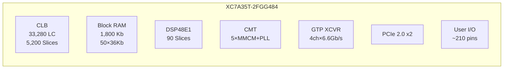
```mermaid
flowchart LR
    subgraph XC7A35T[XC7A35T-2FGG484]
        CLB[CLB\n33,280 LC\n5,200 Slices]
        BRAM[Block RAM\n1,800 Kb\n50×36Kb]
        DSP[DSP48E1\n90 Slices]
        CMT[CMT\n5×MMCM+PLL]
        GTP[GTP XCVR\n4ch×6.6Gb/s]
        PCIE[PCIe 2.0 x2]
        IO[User I/O\n~210 pins]
    end
```

#### 1.2.2 以太网 PHY 芯片 — Microchip KSZ9031RNX

**Feature:**

- 支持 10/100/1000 Mbps 三速自适应
- RGMII 接口（DDR 双沿传输，125MHz 时钟）
- MDC/MDIO 管理接口（符合 IEEE 802.3 Clause 22）
- 支持 LinkMD 电缆诊断功能
- 低功耗设计：< 300mW（千兆全双工）
- 支持 Auto-MDIX（自动线序交叉）
- 工业级温度范围：-40°C ~ +85°C
- 封装：48-pin QFN

#### 1.2.3 USB 转 UART 芯片 — Silicon Labs CP2102

**Feature:**

- USB 2.0 全速（12Mbps）转 UART
- 波特率最高 1 Mbps
- 内置 5V→3.3V 稳压器
- 免外部晶振设计

#### 1.2.4 QSPI FLASH — Macronix MX25L12845

**Feature:**

- 容量：128 Mbit（16MB）
- 支持单/双/四线 SPI（QSPI）
- 最高时钟频率：104MHz（四线模式）
- 用于 FPGA 配置比特流存储和 RISC-V 固件非易失存储

---

## 2 设计的体系结构

### 2.1 模块分解分析

#### 总体结构框图

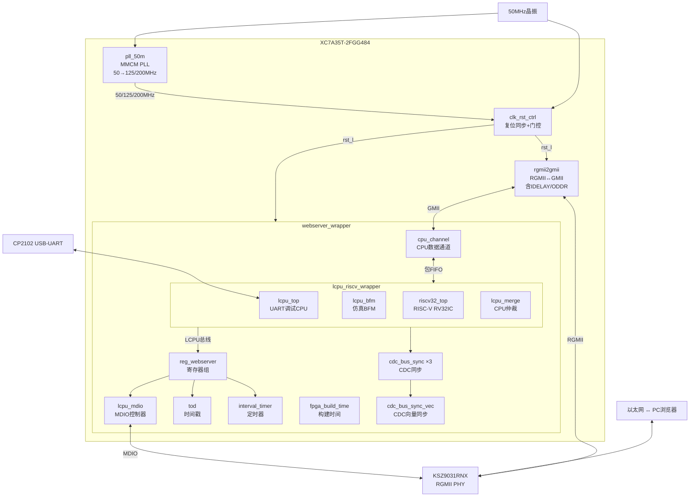
```mermaid
flowchart TB
    subgraph FPGA[XC7A35T-2FGG484]
        direction TB
        PLL[pll_50m\nMMCM PLL\n50→125/200MHz]
        RST[clk_rst_ctrl\n复位同步+门控]
        RGMII[rgmii2gmii\nRGMII↔GMII\n含IDELAY/ODDR]

        subgraph WRAPPER[webserver_wrapper]
            direction TB
            subgraph CPU_SYS[lcpu_riscv_wrapper]
                UART_CPU[lcpu_top\nUART调试CPU]
                BFM[lcpu_bfm\n仿真BFM]
                RV32[riscv32_top\nRISC-V RV32IC]
                MERGE[lcpu_merge\nCPU仲裁]
            end
            CHAN[cpu_channel\nCPU数据通道]
            REG[reg_webserver\n寄存器组]
            MDIO[lcpu_mdio\nMDIO控制器]
            TOD[tod\n时间戳]
            TIM[interval_timer\n定时器]
            BUILD[fpga_build_time\n构建时间]
            CDC[cdc_bus_sync ×3\nCDC同步]
            CDCV[cdc_bus_sync_vec\nCDC向量同步]
        end
    end

    XTAL[50MHz晶振] --> PLL
    PLL -->|50/125/200MHz| RST
    XTAL --> RST
    RST -->|rst_l| RGMII
    RST -->|rst_l| WRAPPER

    PHY[KSZ9031RNX\nRGMII PHY] <-->|RGMII| RGMII
    RGMII <-->|GMII| CHAN
    CHAN <-->|包FIFO| CPU_SYS
    CPU_SYS -->|LCPU总线| REG
    REG --> MDIO
    MDIO <-->|MDIO| PHY
    REG --> TOD
    REG --> TIM
    CPU_SYS --> CDC --> CDCV

    UART[CP2102 USB-UART] <--> UART_CPU
    LAN[以太网 ↔ PC浏览器] <--> PHY
```

#### 处理流程图

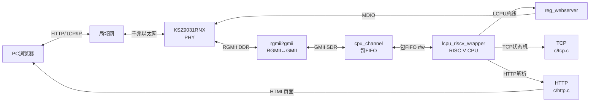
```mermaid
flowchart LR
    PC[PC浏览器] <-->|HTTP/TCP/IP| LAN[局域网]
    LAN <-->|千兆以太网| PHY[KSZ9031RNX\nPHY]
    PHY <-->|RGMII DDR| RGMII[rgmii2gmii\nRGMII↔GMII]
    RGMII <-->|GMII SDR| CH[cpu_channel\n包FIFO]
    CH <-->|包FIFO r/w| CPU[lcpu_riscv_wrapper\nRISC-V CPU]
    CPU -->|LCPU总线| REG[reg_webserver]
    REG -->|MDIO| PHY

    CPU -->|TCP状态机| TCP[TCP\nc/tcp.c]
    CPU -->|HTTP解析| HTTP[HTTP\nc/http.c]
    HTTP -->|HTML页面| PC
```

---

## 3 模块结构详细说明

### 3.1 零级模块说明

#### 3.1.1 零级模块外围功能点描述（Feature）

##### KSZ9031RNX（Microchip 千兆以太网 PHY）

- 10/100/1000 Mbps 自适应
- RGMII 接口，125MHz DDR 双沿传输
- MDC/MDIO 管理接口
- Auto-MDIX 自动线序交叉

##### CP2102（Silicon Labs USB 转 UART）

- USB 2.0 全速转 UART 调试串口，波特率 115200
- 用于 RISC-V 调试打印和 FPGA 状态监控

##### MX25L12845（Macronix QSPI FLASH）

- 128 Mbit 非易失存储，存储 FPGA 比特流和固件

#### 3.1.2 零级模块与外围接口说明（Interface）

##### 1. KSZ9031RNX 接口

###### 1）接口信号

**表1 KSZ9031RNX RGMII 接口信号列表**

| 信号名 | 位宽（Bits） | IO | 说明 |
|--------|-------------|----|------|
| **RGMII 数据接口** |
| rgmii_rxc | 1 | I | RGMII 接收时钟（125MHz DDR，PHY 输出） |
| rgmii_rx_ctl | 1 | I | RGMII 接收控制（上升沿=RXDV，下降沿=RXERR） |
| rgmii_rxd | 4 | I | RGMII 接收数据（DDR 双沿 → 等效 8bit SDR） |
| rgmii_txc | 1 | O | RGMII 发送时钟（125MHz，FPGA 输出，90° 相移） |
| rgmii_tx_ctl | 1 | O | RGMII 发送控制（上升沿=TXEN，下降沿=TXERR） |
| rgmii_txd | 4 | O | RGMII 发送数据（DDR 双沿，来自 8bit SDR） |
| **MDIO 管理接口** |
| eth0_mdc | 1 | O | 管理接口时钟（≤2.5MHz） |
| eth0_mdio | 1 | IO | 管理接口双向数据 |
| **PHY 复位** |
| rgmii_reset_l | 1 | O | PHY 硬件复位（低有效） |

###### 2）接口时序

**图2 RGMII 发送时序（TXC 由 FPGA 产生，125MHz DDR）**

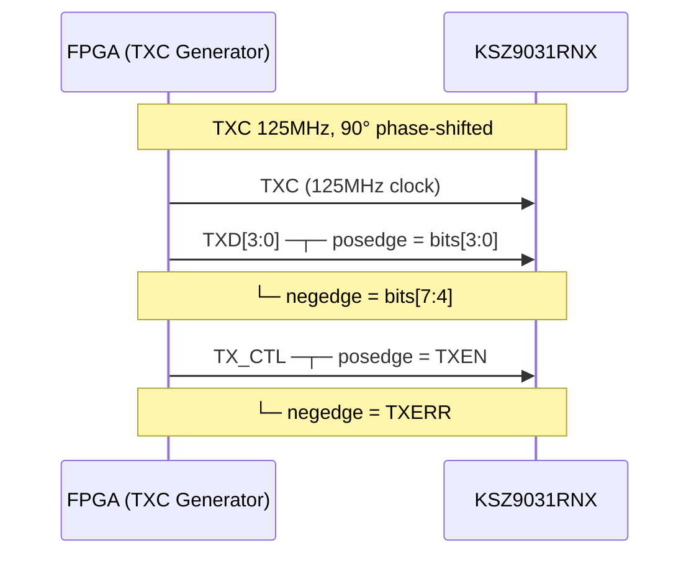
```mermaid
sequenceDiagram
    participant FPGA_TX as FPGA (TXC Generator)
    participant PHY_RX as KSZ9031RNX

    Note over FPGA_TX,PHY_RX: TXC 125MHz, 90° phase-shifted

    FPGA_TX->>PHY_RX: TXC (125MHz clock)
    FPGA_TX->>PHY_RX: TXD[3:0] ─┬─ posedge = bits[3:0]
    Note over FPGA_TX,PHY_RX:           └─ negedge = bits[7:4]
    FPGA_TX->>PHY_RX: TX_CTL ─┬─ posedge = TXEN
    Note over FPGA_TX,PHY_RX:         └─ negedge = TXERR
```

**图3 RGMII 接收时序（RXC 由 PHY 产生，125MHz DDR）**

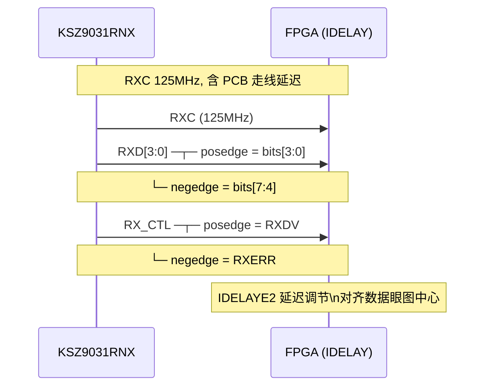
```mermaid
sequenceDiagram
    participant PHY_TX as KSZ9031RNX
    participant FPGA_RX as FPGA (IDELAY)

    Note over PHY_TX,FPGA_RX: RXC 125MHz, 含 PCB 走线延迟

    PHY_TX->>FPGA_RX: RXC (125MHz)
    PHY_TX->>FPGA_RX: RXD[3:0] ─┬─ posedge = bits[3:0]
    Note over PHY_TX,FPGA_RX:           └─ negedge = bits[7:4]
    PHY_TX->>FPGA_RX: RX_CTL ─┬─ posedge = RXDV
    Note over PHY_TX,FPGA_RX:         └─ negedge = RXERR
    Note over FPGA_RX: IDELAYE2 延迟调节\n对齐数据眼图中心
```

**图4 MDIO 接口时序（IEEE 802.3 Clause 22）**

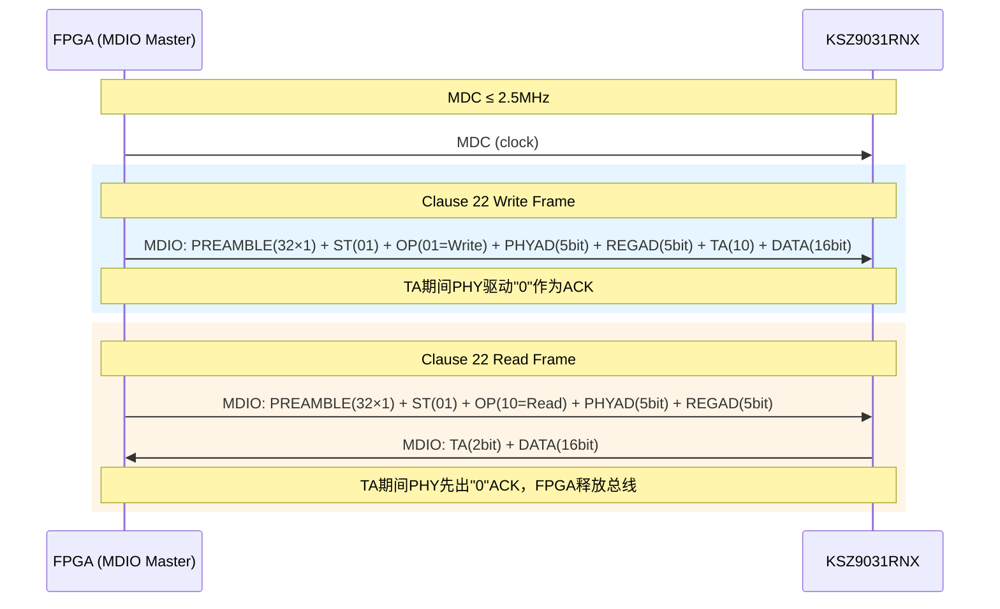
```mermaid
sequenceDiagram
    participant FPGA as FPGA (MDIO Master)
    participant PHY as KSZ9031RNX

    Note over FPGA,PHY: MDC ≤ 2.5MHz

    FPGA->>PHY: MDC (clock)

    rect rgb(230, 245, 255)
        Note over FPGA,PHY: Clause 22 Write Frame
        FPGA->>PHY: MDIO: PREAMBLE(32×1) + ST(01) + OP(01=Write) + PHYAD(5bit) + REGAD(5bit) + TA(10) + DATA(16bit)
        Note over FPGA,PHY: TA期间PHY驱动"0"作为ACK
    end

    rect rgb(255, 245, 230)
        Note over FPGA,PHY: Clause 22 Read Frame
        FPGA->>PHY: MDIO: PREAMBLE(32×1) + ST(01) + OP(10=Read) + PHYAD(5bit) + REGAD(5bit)
        PHY->>FPGA: MDIO: TA(2bit) + DATA(16bit)
        Note over FPGA,PHY: TA期间PHY先出"0"ACK，FPGA释放总线
    end
```

##### 2. CP2102 UART 接口

###### 1）接口信号

**表2 CP2102 UART 接口信号列表**

| 信号名 | 位宽（Bits） | IO | 说明 |
|--------|-------------|----|------|
| uart_rx | 1 | I | UART 接收数据（FPGA 侧，CP2102 TX → FPGA RX） |
| uart_tx | 1 | O | UART 发送数据（FPGA 侧，FPGA TX → CP2102 RX） |

###### 2）接口时序

**图5 UART 异步串行时序（115200 8N1）**

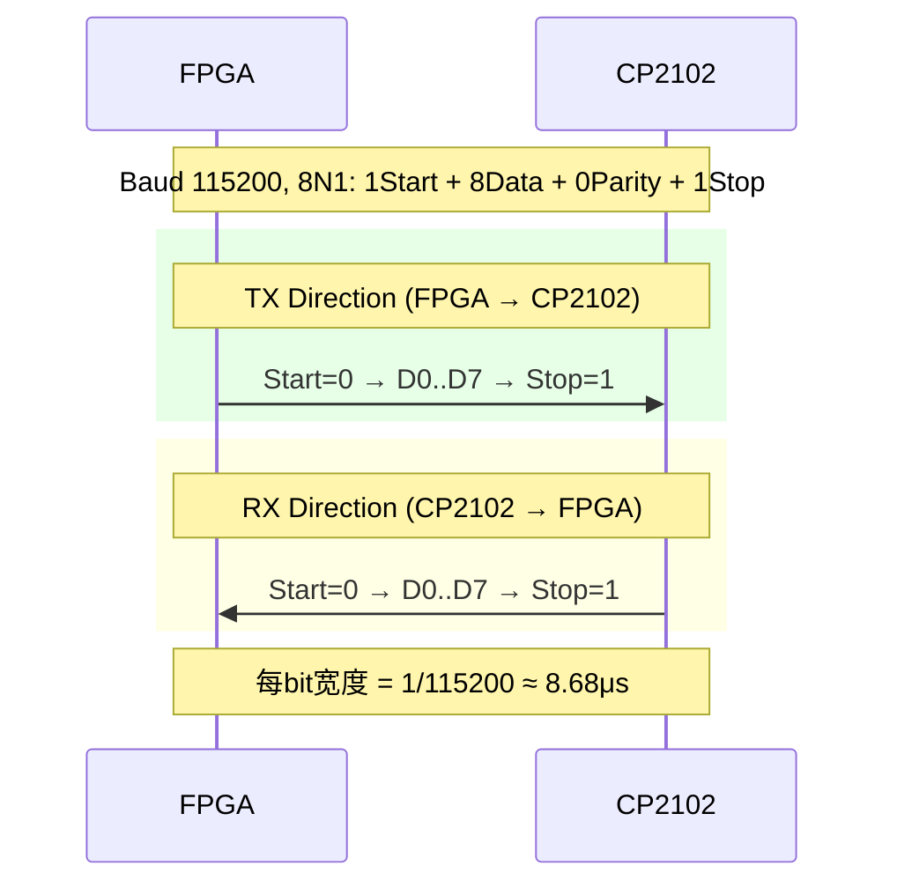
```mermaid
sequenceDiagram
    participant FPGA
    participant CP2102

    Note over FPGA,CP2102: Baud 115200, 8N1: 1Start + 8Data + 0Parity + 1Stop

    rect rgb(230, 255, 230)
        Note over FPGA,CP2102: TX Direction (FPGA → CP2102)
        FPGA->>CP2102: Start=0 → D0..D7 → Stop=1
    end

    rect rgb(255, 255, 230)
        Note over FPGA,CP2102: RX Direction (CP2102 → FPGA)
        CP2102->>FPGA: Start=0 → D0..D7 → Stop=1
    end

    Note over FPGA,CP2102: 每bit宽度 = 1/115200 ≈ 8.68μs
```

#### 3.1.3 零级模块寄存器定义（Register）

无。PHY 寄存器通过 MDIO 接口访问，由 `lcpu_mdio` 模块管理。

---

### 3.2 顶层 xilinx_xc7a35tfgg484_webserver_top

#### 3.2.1 功能描述（Feature）

##### 1. 模块标识

| 属性 | 值 |
|------|-----|
| 模块名称 | xilinx_xc7a35tfgg484_webserver_top |
| 文件路径 | fpga_webserver/rtl/xilinx_xc7a35tfgg484_webserver_top.v |
| 目标器件 | XC7A35T-2FGG484 |

##### 2. 功能描述

- 基于 Xilinx Artix-7 XC7A35T FPGA 的 WebServer 顶层模块
- 集成 MMCM PLL，将 50MHz 输入时钟倍频至 50/125/200MHz
- 完成 RGMII DDR 双沿接口到 GMII SDR 单沿接口的转换（含 IDELAY/ODDR 原语）
- 例化 WebServer 核心功能（webserver_wrapper），提供 RISC-V 软核 + TCP/IP 完整协议栈
- 提供 UART 调试串口、LED 状态指示

##### 3. 内部模块结构图

**图6 xilinx_xc7a35tfgg484_webserver_top 模块内部结构**

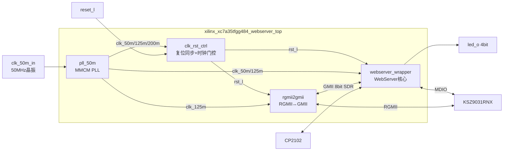
```mermaid
flowchart LR
    subgraph TOP[xilinx_xc7a35tfgg484_webserver_top]
        direction TB
        U0[clk_rst_ctrl\n复位同步+时钟门控] -->|rst_l| U2[rgmii2gmii\nRGMII↔GMII]
        U0 -->|rst_l| U3[webserver_wrapper\nWebServer核心]
        U1[pll_50m\nMMCM PLL] -->|clk_50m/125m/200m| U0
        U1 -->|clk_125m| U2
        U1 -->|clk_50m/125m| U3
    end

    CLK[clk_50m_in\n50MHz晶振] --> U1
    RST[reset_l] --> U0
    PHY[KSZ9031RNX] <-->|RGMII| U2
    U2 <-->|GMII 8bit SDR| U3
    UART[CP2102] <--> U3
    U3 --> LED[led_o 4bit]
    U3 <-->|MDIO| PHY
```

#### 3.2.2 接口说明（Interface）

##### 1. 接口信号

**表3 xilinx_xc7a35tfgg484_webserver_top 模块接口信号表**

| 信号名 | 位宽（Bits） | IO | 说明 |
|--------|-------------|----|------|
| **系统时钟复位** |
| clk_50m_in | 1 | I | 50MHz 外部晶振输入 |
| reset_l | 1 | I | 全局硬件复位（低有效） |
| **UART 调试接口** |
| uart_rx | 1 | I | UART 接收数据 |
| uart_tx | 1 | O | UART 发送数据 |
| **RGMII 以太网接口** |
| rgmii_reset_l | 1 | O | PHY 芯片复位（低有效） |
| rgmii_rxc | 1 | I | RGMII 接收时钟 |
| rgmii_rx_ctl | 1 | I | RGMII 接收控制 |
| rgmii_rxd | 4 | I | RGMII 接收数据 |
| rgmii_txc | 1 | O | RGMII 发送时钟 |
| rgmii_tx_ctl | 1 | O | RGMII 发送控制 |
| rgmii_txd | 4 | O | RGMII 发送数据 |
| **MDIO 管理接口** |
| eth0_mdc | 1 | O | MDIO 管理时钟 |
| eth0_mdio | 1 | IO | MDIO 管理数据（双向） |
| **LED 指示** |
| led_o | 4 | O | 用户 LED 输出（高电平点亮） |
| **模块控制参数** |
| sim_mod | parameter | integer | 0：综合模式；≠0：仿真模式 |
| script_file | parameter | string | TCL 脚本文件路径 |

##### 2. 接口时序

RGMII → GMII 接口时序参考图2、图3（rgmii2gmii 内部完成转换）。顶层不做额外时序处理。

##### 3. 输入/输出数据结构

以太网帧经 RGMII DDR → rgmii2gmii 转换为 GMII 8bit SDR 标准流后进入 webserver_wrapper。收发对称。

#### 3.2.3 实现说明（Implementation）

| 特征 | 内容 |
|------|------|
| 子模块实例 | 4 个：clk_rst_ctrl / pll_50m / rgmii2gmii / webserver_wrapper |
| 时钟域 | 50MHz（系统） + 125MHz（RGMII/GMII） + 200MHz（IDELAY参考） |
| 上电流程 | 50MHz 晶振 → MMCM 锁定（≤100µs）→ clk_rst_ctrl 释放复位 → 系统启动 |

#### 3.2.4 内部表项（Table）

无。

#### 3.2.5 RAM 使用情况（RAM Resource）

顶层本身无 RAM 使用。RAM 由子模块消耗。

---

### 3.3 clk_rst_ctrl — 时钟复位管理

#### 3.3.1 功能描述（Feature）

##### 1. 模块标识

| 属性 | 值 |
|------|-----|
| 模块名称 | clk_rst_ctrl |
| 文件路径 | ip_common/rtl/clk_rst_ctrl.sv |

##### 2. 功能描述

- 异步复位同步撤离控制器
- 多路 PLL 锁定信号输入，全部锁定后才释放系统复位
- 确保 FPGA 内部逻辑在时钟稳定后才开始工作

##### 3. 内部模块结构图

**图7 clk_rst_ctrl 模块内部结构**

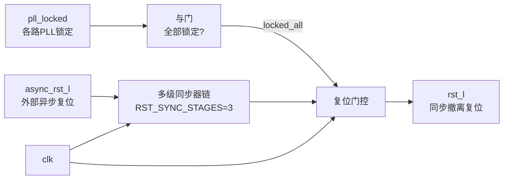
```mermaid
flowchart LR
    async_rst_l[async_rst_l\n外部异步复位] --> SYNC[多级同步器链\nRST_SYNC_STAGES=3]
    pll_locked[pll_locked\n各路PLL锁定] --> AND[与门\n全部锁定?]
    AND -->|locked_all| GATE[复位门控]
    SYNC --> GATE
    GATE --> rst_l[rst_l\n同步撤离复位]
    clk[clk] --> SYNC
    clk --> GATE
```

#### 3.3.2 接口说明（Interface）

##### 1. 接口信号

**表4 clk_rst_ctrl 模块接口信号表**

| 信号名 | 位宽（Bits） | IO | 说明 |
|--------|-------------|----|------|
| **系统接口** |
| clk | 1 | I | 系统时钟 |
| async_rst_l | 1 | I | 外部异步复位（低有效） |
| pll_locked | NUM_LOCK_INPUTS | I | PLL 锁定状态向量（全1=全部锁定） |
| rst_l | 1 | O | 同步撤离后的系统复位（低有效） |
| **模块控制参数** |
| NUM_LOCK_INPUTS | parameter | integer | PLL 锁定信号路数 |
| RST_SYNC_STAGES | parameter | integer | 复位同步级数（默认 3） |

##### 2. 接口时序

**图8 clk_rst_ctrl 上电复位时序**

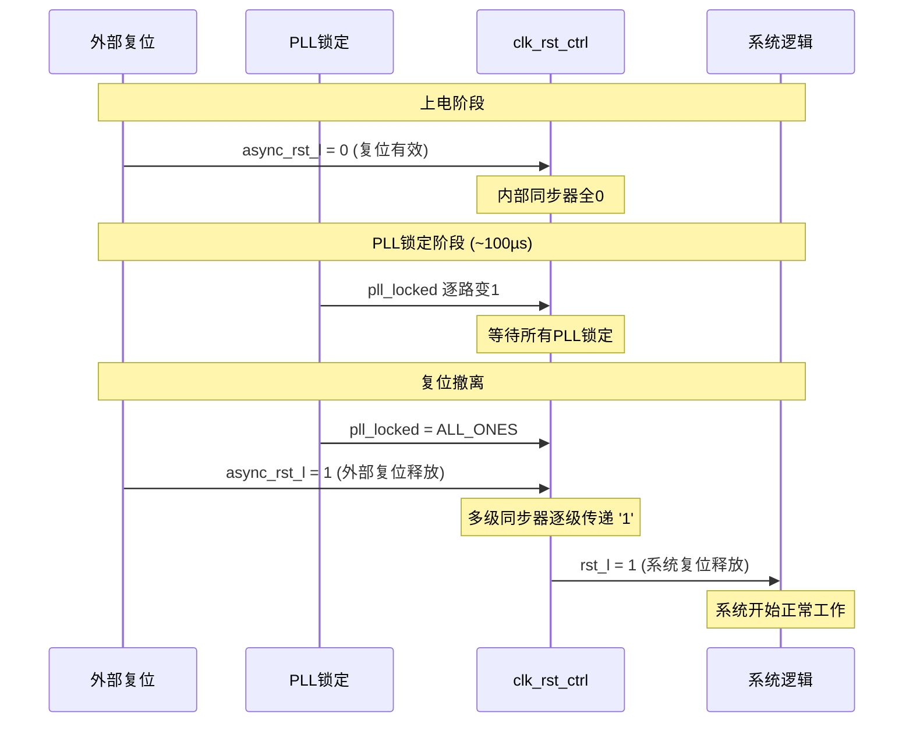
```mermaid
sequenceDiagram
    participant EXT as 外部复位
    participant PLL as PLL锁定
    participant CTRL as clk_rst_ctrl
    participant SYS as 系统逻辑

    Note over EXT,SYS: 上电阶段
    EXT->>CTRL: async_rst_l = 0 (复位有效)
    Note over CTRL: 内部同步器全0

    Note over EXT,SYS: PLL锁定阶段 (~100µs)
    PLL->>CTRL: pll_locked 逐路变1
    Note over CTRL: 等待所有PLL锁定

    Note over EXT,SYS: 复位撤离
    PLL->>CTRL: pll_locked = ALL_ONES
    EXT->>CTRL: async_rst_l = 1 (外部复位释放)
    Note over CTRL: 多级同步器逐级传递 '1'
    CTRL->>SYS: rst_l = 1 (系统复位释放)
    Note over SYS: 系统开始正常工作
```

#### 3.3.3 实现说明（Implementation）

| 特征 | 内容 |
|------|------|
| 实现方式 | 多级移位寄存器同步 + PLL 锁定门控 |
| 复位策略 | 异步复位同步撤离 (Asynchronous Reset Synchronous De-assertion) |

#### 3.3.4 内部表项（Table）

无。

#### 3.3.5 RAM 使用情况（RAM Resource）

无。

---

### 3.4 pll_50m — MMCM PLL

#### 3.4.1 功能描述（Feature）

##### 1. 模块标识

| 属性 | 值 |
|------|-----|
| 模块名称 | pll_50m |
| 文件路径 | ip_vendor/xilinx_xc7a35tfgg484/PLL/pll_50m.v |

##### 2. 功能描述

- Xilinx MMCM (Mixed-Mode Clock Manager) PLL IP
- 输入 50MHz → 输出 50MHz / 125MHz / 200MHz 三路时钟
- 提供 PLL 锁定指示信号

##### 3. 内部模块结构图

**图9 pll_50m MMCM 内部结构**

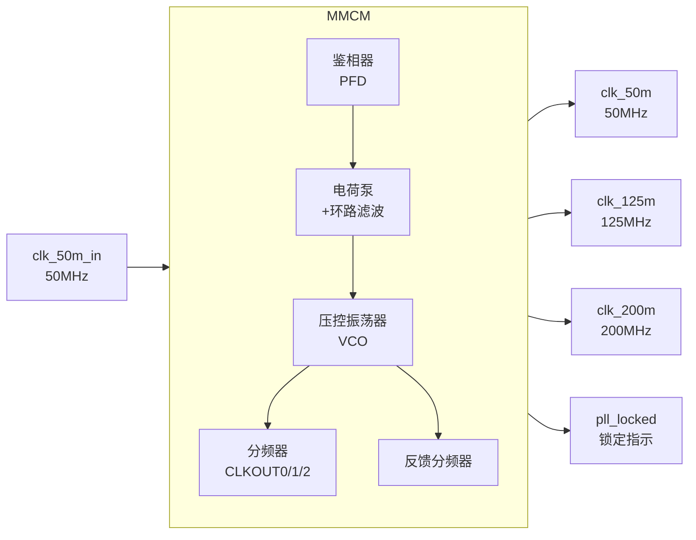
```mermaid
flowchart LR
    CLKIN[clk_50m_in\n50MHz] --> MMCM[MMCME2_ADV\nMixed-Mode Clock Manager]

    subgraph MMCM
        PFD[鉴相器\nPFD] --> CP[电荷泵\n+环路滤波]
        CP --> VCO[压控振荡器\nVCO]
        VCO --> DIV[分频器\nCLKOUT0/1/2]
        VCO --> FB[反馈分频器]
    end

    MMCM --> CLK0[clk_50m\n50MHz]
    MMCM --> CLK1[clk_125m\n125MHz]
    MMCM --> CLK2[clk_200m\n200MHz]
    MMCM --> LOCKED[pll_locked\n锁定指示]
```

#### 3.4.2 接口说明（Interface）

##### 1. 接口信号

**表5 pll_50m 模块接口信号表**

| 信号名 | 位宽（Bits） | IO | 说明 |
|--------|-------------|----|------|
| **时钟接口** |
| clk_50m_in | 1 | I | 50MHz 输入时钟 |
| clk_50m | 1 | O | 50MHz 输出时钟（系统逻辑） |
| clk_125m | 1 | O | 125MHz 输出时钟（RGMII/GMII） |
| clk_200m | 1 | O | 200MHz 输出时钟（IDELAY 参考） |
| **状态接口** |
| pll_locked | 1 | O | PLL 锁定指示（高有效，≤100µs 锁定） |

##### 2. 接口时序

**图10 MMCM 锁定与时钟输出时序**

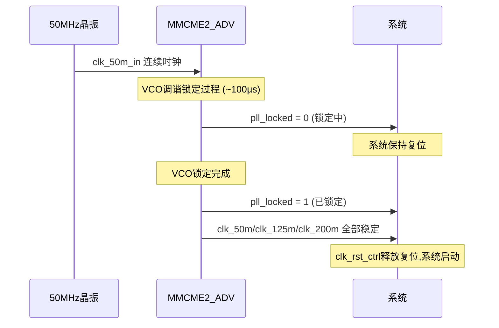
```mermaid
sequenceDiagram
    participant OSC as 50MHz晶振
    participant MMCM as MMCME2_ADV
    participant SYS as 系统

    OSC->>MMCM: clk_50m_in 连续时钟
    Note over MMCM: VCO调谐锁定过程 (~100µs)

    MMCM->>SYS: pll_locked = 0 (锁定中)
    Note over SYS: 系统保持复位

    Note over MMCM: VCO锁定完成
    MMCM->>SYS: pll_locked = 1 (已锁定)
    MMCM->>SYS: clk_50m/clk_125m/clk_200m 全部稳定
    Note over SYS: clk_rst_ctrl释放复位,系统启动
```

#### 3.4.3 实现说明（Implementation）

| 特征 | 内容 |
|------|------|
| 原语 | Xilinx MMCME2_ADV |
| 输入频率 | 50MHz |
| 输出频率 | 50MHz / 125MHz / 200MHz |
| 锁定时间 | ≤ 100µs (典型) |

#### 3.4.4 内部表项（Table）

无。

#### 3.4.5 RAM 使用情况（RAM Resource）

无。

---

### 3.5 rgmii2gmii — RGMII↔GMII 转换

#### 3.5.1 功能描述（Feature）

##### 1. 模块标识

| 属性 | 值 |
|------|-----|
| 模块名称 | rgmii2gmii |
| 文件路径 | ip_common/rtl/rgmii2gmii.v |

##### 2. 功能描述

- RGMII（DDR 双沿，4bit 数据） ↔ GMII（SDR 单沿，8bit 数据）双向转换
- 接收方向：RGMII DDR → GMII SDR（含 IDELAY 延迟调节）
- 发送方向：GMII SDR → RGMII DDR（含 ODDR 双沿输出）
- RGMII TXC 时钟由 FPGA 产生（125MHz，90° 相移）
- RGMII 复位信号输出

##### 3. 内部模块结构图

**图11 rgmii2gmii 模块内部结构**

```mermaid
flowchart LR
    subgraph RGMII2GMII[rgmii2gmii]
        subgraph RX_PATH[接收通路 RGMII→GMII]
            IDELAY[IDELAYE2\n延迟调节] --> DDR_RX[DDR→SDR\n解双沿]
            DDR_RX --> RX_REG[输出寄存器]
        end

        subgraph TX_PATH[发送通路 GMII→RGMII]
            TX_REG[输入寄存器] --> SDR_TX[SDR→DDR\n组双沿]
            SDR_TX --> ODDR[ODDR\nDDR输出]
        end
    end

    PHY_RX[RGMII RX\nrxd[3:0]/rx_ctl/rxc] --> IDELAY
    RX_REG --> GMII_RX[GMII RX\ngmii_rxd[7:0]/rx_dv/rx_clk]

    GMII_TX[GMII TX\ngmii_txd[7:0]/tx_en/tx_clk] --> TX_REG
    ODDR --> PHY_TX[RGMII TX\ntxd[3:0]/tx_ctl/txc]

    CLK200[clk_200m\nIDELAY参考] --> IDELAY
    CLK125[clk_125m] --> DDR_RX
    CLK125 --> SDR_TX
    CLK125 --> ODDR
```

#### 3.5.2 接口说明（Interface）

##### 1. 接口信号

**表6 rgmii2gmii 模块接口信号表**

| 信号名 | 位宽（Bits） | IO | 说明 |
|--------|-------------|----|------|
| **系统接口** |
| reset_l | 1 | I | 系统复位（低有效） |
| clk_200m | 1 | I | 200MHz IDELAY 参考时钟 |
| **GMII 侧（SDR，内部 FPGA 逻辑）** |
| gmii_rx_clk | 1 | O | GMII 接收时钟（125MHz） |
| gmii_rx_dv | 1 | O | GMII 接收数据有效 |
| gmii_rxd | 8 | O | GMII 接收数据 |
| gmii_tx_clk | 1 | I | GMII 发送时钟（125MHz） |
| gmii_tx_en | 1 | I | GMII 发送使能 |
| gmii_txd | 8 | I | GMII 发送数据 |
| **RGMII 侧（DDR，外部 PHY）** |
| rgmii_rxc | 1 | I | RGMII 接收时钟（PHY 输出） |
| rgmii_rx_ctl | 1 | I | RGMII 接收控制 |
| rgmii_rxd | 4 | I | RGMII 接收数据 |
| rgmii_txc | 1 | O | RGMII 发送时钟（FPGA 输出） |
| rgmii_tx_ctl | 1 | O | RGMII 发送控制 |
| rgmii_txd | 4 | O | RGMII 发送数据 |

##### 2. 接口时序

RGMII ↔ GMII 转换时序参考图2、图3（零级模块 RGMII 接口时序）。

**图12 GMII 发送接口时序（8bit SDR 125MHz）**

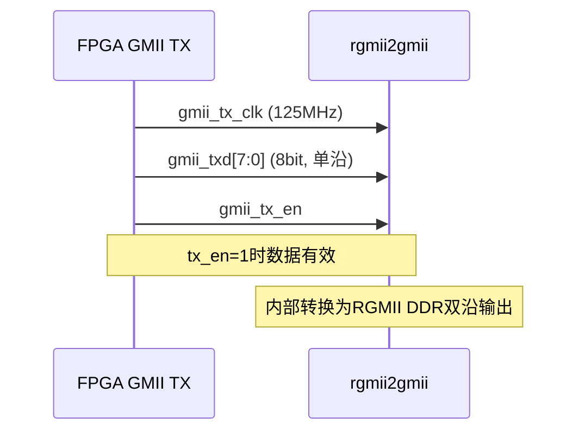
```mermaid
sequenceDiagram
    participant FPGA as FPGA GMII TX
    participant RGMII_BLK as rgmii2gmii

    FPGA->>RGMII_BLK: gmii_tx_clk (125MHz)
    FPGA->>RGMII_BLK: gmii_txd[7:0] (8bit, 单沿)
    FPGA->>RGMII_BLK: gmii_tx_en
    Note over FPGA,RGMII_BLK: tx_en=1时数据有效
    Note over RGMII_BLK: 内部转换为RGMII DDR双沿输出
```

**图13 GMII 接收接口时序（8bit SDR 125MHz）**

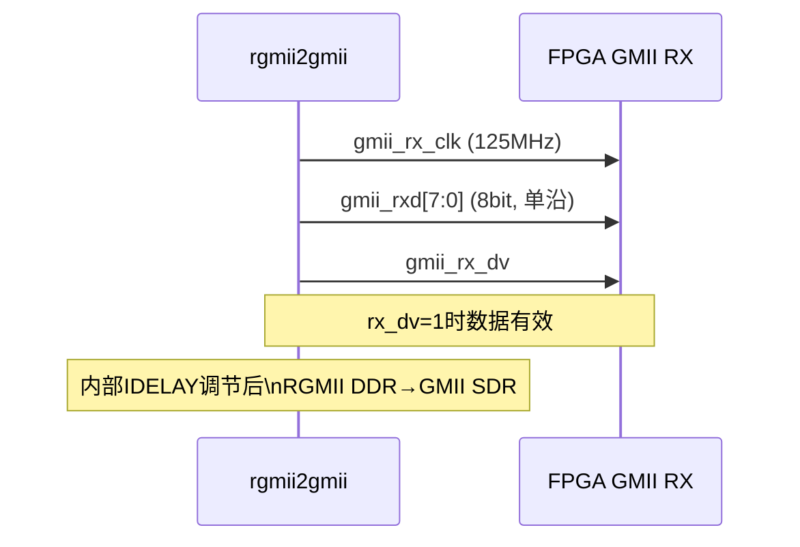
```mermaid
sequenceDiagram
    participant RGMII_BLK as rgmii2gmii
    participant FPGA as FPGA GMII RX

    RGMII_BLK->>FPGA: gmii_rx_clk (125MHz)
    RGMII_BLK->>FPGA: gmii_rxd[7:0] (8bit, 单沿)
    RGMII_BLK->>FPGA: gmii_rx_dv
    Note over RGMII_BLK,FPGA: rx_dv=1时数据有效
    Note over RGMII_BLK: 内部IDELAY调节后\nRGMII DDR→GMII SDR
```

#### 3.5.3 实现说明（Implementation）

| 特征 | 内容 |
|------|------|
| 关键原语 | Xilinx IDELAYE2 / ODDR / BUFIO / BUFR |
| 时钟要求 | 200MHz 参考时钟用于 IDELAY 精细延迟调节（78ps/tap） |
| TXC 产生 | ODDR 输出 125MHz，90° 相移使时钟沿对齐数据中心 |

#### 3.5.4 内部表项（Table）

无。

#### 3.5.5 RAM 使用情况（RAM Resource）

无。

---

### 3.6 webserver_wrapper — WebServer 功能封装

#### 3.6.1 功能描述（Feature）

##### 1. 模块标识

| 属性 | 值 |
|------|-----|
| 模块名称 | webserver_wrapper |
| 文件路径 | fpga_webserver/rtl/webserver_wrapper.v |

##### 2. 功能描述

- WebServer 功能总封装模块，集成 RISC-V 软核 CPU、MDIO 控制器、寄存器组、定时器等
- 通过 LCPU 总线连接 CPU 与 FPGA 硬件寄存器
- 数据处理通路：GMII ↔ cpu_channel（包 FIFO/过滤） ↔ RISC-V CPU
- 管理通路：RISC-V CPU → LCPU 总线 → reg_webserver → 各外设

##### 3. 内部模块结构图

**图14 webserver_wrapper 模块内部结构**

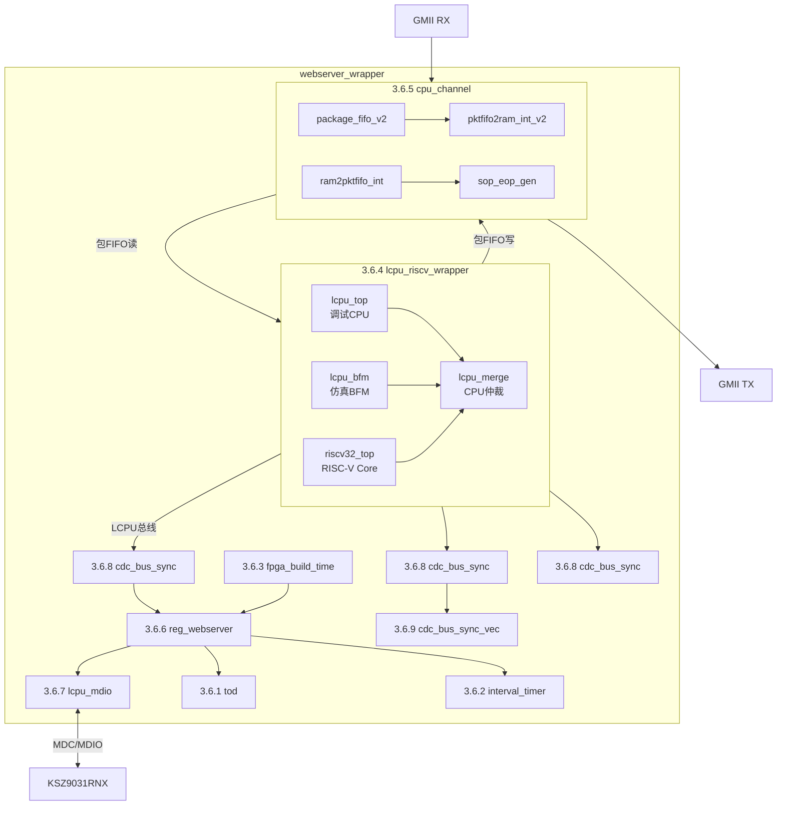
```mermaid
flowchart TB
    subgraph WRAPPER[webserver_wrapper]
        direction TB

        subgraph CPU_SYS[3.6.4 lcpu_riscv_wrapper]
            direction LR
            UART_CPU[lcpu_top\n调试CPU]
            BFM[lcpu_bfm\n仿真BFM]
            RV32[riscv32_top\nRISC-V Core]
            MERGE[lcpu_merge\nCPU仲裁]
            UART_CPU --> MERGE
            BFM --> MERGE
            RV32 --> MERGE
        end

        subgraph CHAN[3.6.5 cpu_channel]
            direction LR
            PKG[package_fifo_v2]
            WR[pktfifo2ram_int_v2]
            RD[ram2pktfifo_int]
            SOP[sop_eop_gen]
            PKG --> WR
            RD --> SOP
        end

        REG[3.6.6 reg_webserver]
        MDIO[3.6.7 lcpu_mdio]
        TOD[3.6.1 tod]
        TIM[3.6.2 interval_timer]
        BUILD[3.6.3 fpga_build_time]
        CDC1[3.6.8 cdc_bus_sync]
        CDC2[3.6.8 cdc_bus_sync]
        CDC3[3.6.8 cdc_bus_sync]
        CDCV[3.6.9 cdc_bus_sync_vec]
    end

    GMII_RX[GMII RX] --> CHAN
    CHAN -->|包FIFO读| CPU_SYS
    CPU_SYS -->|包FIFO写| CHAN
    CHAN --> GMII_TX[GMII TX]

    CPU_SYS -->|LCPU总线| CDC1 --> REG
    REG --> TOD
    REG --> TIM
    REG --> MDIO
    CPU_SYS --> CDC2 --> CDCV
    CPU_SYS --> CDC3
    BUILD --> REG

    MDIO <-->|MDC/MDIO| PHY[KSZ9031RNX]
```

#### 3.6.2 接口说明（Interface）

##### 1. 接口信号

**表7 webserver_wrapper 模块接口信号表**

| 信号名 | 位宽（Bits） | IO | 说明 |
|--------|-------------|----|------|
| **系统时钟复位** |
| reset_l | 1 | I | 系统复位（低有效） |
| clk_50mhz | 1 | I | 50MHz 系统时钟 |
| clk_125mhz | 1 | I | 125MHz GMII 时钟 |
| **UART 调试接口** |
| uart_rx | 1 | I | UART 接收 |
| uart_tx | 1 | O | UART 发送 |
| **MDIO 管理接口** |
| eth0_mdc | 1 | O | MDIO 时钟 |
| eth0_mdio | 1 | IO | MDIO 数据 |
| **GMII 接收接口** |
| gmii_rx_clk | 1 | I | GMII 接收时钟（125MHz） |
| gmii_rx_dv | 1 | I | GMII 接收数据有效 |
| gmii_rx_err | 1 | I | GMII 接收错误指示 |
| gmii_rxd | 8 | I | GMII 接收数据 |
| **GMII 发送接口** |
| gmii_txd | 8 | O | GMII 发送数据 |
| gmii_tx_en | 1 | O | GMII 发送使能 |
| gmii_tx_err | 1 | O | GMII 发送错误指示 |
| **LED 指示** |
| led | 4 | O | LED 状态输出 |

##### 2. 接口时序

GMII 接口时序参考图12、图13（GMII SDR 125MHz 标准时序）。UART 时序参考图5。

##### 3. 输入/输出数据结构

GMII 侧为标准以太网 MAC 帧格式（前导码已由 MAC 层剥离/添加）。

#### 3.6.3 实现说明（Implementation）

| 特征 | 内容 |
|------|------|
| 子模块实例 | 13 个（含 3×cdc_bus_sync） |
| 时钟域 | 50MHz（CPU/寄存器）+ 125MHz（GMII 数据通路），CDC 隔离 |
| CPU 接口 | LCPU 总线（req/rhwl/wdata/address + ack/rdata） |

#### 3.6.4 内部表项（Table）

无。

#### 3.6.5 RAM 使用情况（RAM Resource）

无直接 RAM 使用（子模块消耗）。

---

#### 3.6.1 tod — 时间戳模块

##### 3.6.1.1 功能描述（Feature）

**模块标识：** `tod` | **文件路径：** `ip_common/rtl/tod.v`

- Time of Day 自由运行计数器（64bit）
- 外部 snapshot 脉冲触发时锁存当前计数值
- 实时计数器值连续输出

**图15 tod 模块内部结构**

```mermaid
flowchart LR
    clk[clk] --> CNT[64bit 自由运行计数器\ncounter_live 连续输出]
    snapshot[snapshot 脉冲] --> LATCH[锁存寄存器\n]
    CNT --> LATCH
    LATCH --> time_out[time_out[63:0]\n快照时间值]
    CNT --> counter_live[counter_live[63:0]\n实时计数值]
    reset_l[reset_l] --> CNT
    reset_l --> LATCH
```

##### 3.6.1.2 接口说明（Interface）

**表8 tod 模块接口信号表**

| 信号名 | 位宽（Bits） | IO | 说明 |
|--------|-------------|----|------|
| clk | 1 | I | 系统时钟 |
| reset_l | 1 | I | 复位（低有效） |
| snapshot | 1 | I | 锁存脉冲（单周期） |
| counter_live | 64 | O | 实时计数器值（连续输出） |
| time_out | 64 | O | snapshot 锁存的 64bit 时间值 |

##### 3.6.1.3 实现说明（Implementation）

| 特征 | 内容 |
|------|------|
| 计数器位宽 | 64bit |
| 锁存机制 | snapshot 单周期脉冲 → 锁存当前计数值到 time_out |

##### 3.6.1.4 内部表项（Table）

无。

##### 3.6.1.5 RAM 使用情况（RAM Resource）

无（64bit 寄存器实现）。

---

#### 3.6.2 interval_timer — 间隔定时器

##### 3.6.2.1 功能描述（Feature）

**模块标识：** `interval_timer` | **文件路径：** `ip_common/rtl/interval_timer.v`

- 可编程间隔定时器，产生周期性 event_out 脉冲
- 用于 WebServer 软件定时器（如 TCP 重传定时、ARP 老化定时、HTTP 超时等）

**图16 interval_timer 模块内部结构**

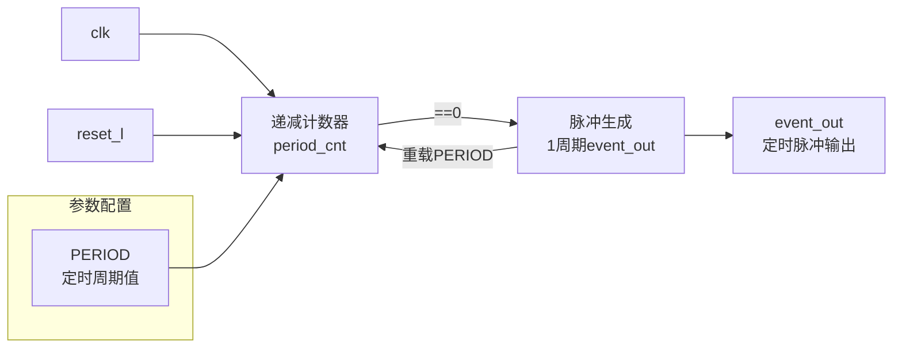
```mermaid
flowchart LR
    clk[clk] --> CNT[递减计数器\nperiod_cnt]
    CNT -->|==0| PULSE[脉冲生成\n1周期event_out]
    PULSE -->|重载PERIOD| CNT
    PULSE --> event_out[event_out\n定时脉冲输出]
    reset_l[reset_l] --> CNT

    subgraph CONFIG[参数配置]
        PERIOD[PERIOD\n定时周期值]
    end
    PERIOD --> CNT
```

##### 3.6.2.2 接口说明（Interface）

**表9 interval_timer 模块接口信号表**

| 信号名 | 位宽（Bits） | IO | 说明 |
|--------|-------------|----|------|
| clk | 1 | I | 系统时钟 |
| reset_l | 1 | I | 复位（低有效） |
| event_out | 1 | O | 定时脉冲输出 |
| **模块控制参数** |
| PERIOD | parameter | integer | 定时周期（时钟周期数） |

##### 3.6.2.3 实现说明（Implementation）

| 特征 | 内容 |
|------|------|
| 实现方式 | 递减计数器 + 自动重载 |
| PERIOD 典型值 | 50MHz 时钟下，50000000 = 1秒周期 |

##### 3.6.2.4 内部表项（Table）

无。

##### 3.6.2.5 RAM 使用情况（RAM Resource）

无。

---

#### 3.6.3 fpga_build_time — 构建时间戳

##### 3.6.3.1 功能描述（Feature）

**模块标识：** `fpga_build_time` | **文件路径：** 编译时自动生成（无独立源文件）

- 编译时自动生成的 FPGA 构建时间戳模块
- 通过 TCL 脚本或 Verilog 宏在综合时将当前日期时间编码为 32bit 常量
- 输出 fpga_build_date（YYYYMMDD 格式）、fpga_build_time（HHMM0000 格式）

##### 3.6.3.2 接口说明（Interface）

**表10 fpga_build_time 模块接口信号表**

| 信号名 | 位宽（Bits） | IO | 说明 |
|--------|-------------|----|------|
| fpga_build_date | 32 | O | FPGA 综合日期（YYYYMMDD） |
| fpga_build_time | 32 | O | FPGA 综合时间（HHMM0000） |

##### 3.6.3.3 实现说明（Implementation）

编译脚本自动生成 Verilog 模块，assign 常量输出。

##### 3.6.3.4 内部表项（Table）

无。

##### 3.6.3.5 RAM 使用情况（RAM Resource）

无。

---

#### 3.6.4 lcpu_riscv_wrapper — RISC-V CPU 系统

##### 3.6.4.1 功能描述（Feature）

**模块标识：** `lcpu_riscv_wrapper` | **文件路径：** `fpga_cpu/rtl/lcpu_riscv_wrapper.v`

- RISC-V CPU 系统封装模块，集成以下子模块：
  - **lcpu_top**（3.6.4.1）：UART 调试 CPU（通过 UART 加载指令到程序 RAM）
  - **lcpu_bfm**（3.6.4.2）：仿真 Bus Functional Model（仅在仿真模式综合）
  - **riscv32_top**（3.6.4.3）：RISC-V RV32IC 处理器核心
  - **lcpu_merge**（3.6.4.4）：多路 CPU LCPU 总线仲裁器
- 统一 LCPU 总线接口（req / rhwl / wdata / address / ack / rdata）
- 支持程序 RAM 在线编程（program_wr / waddr / wdata 接口）

**图17 lcpu_riscv_wrapper 模块内部结构**

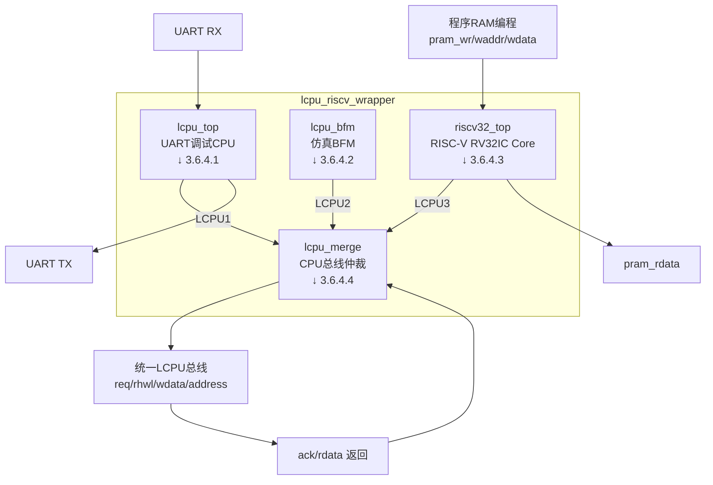
```mermaid
flowchart TB
    subgraph LCPU_WRAP[lcpu_riscv_wrapper]
        direction TB

        UART_CPU[lcpu_top\nUART调试CPU\n↓ 3.6.4.1]
        BFM[lcpu_bfm\n仿真BFM\n↓ 3.6.4.2]
        RV32[riscv32_top\nRISC-V RV32IC Core\n↓ 3.6.4.3]
        MERGE[lcpu_merge\nCPU总线仲裁\n↓ 3.6.4.4]

        UART_CPU -->|LCPU1| MERGE
        BFM -->|LCPU2| MERGE
        RV32 -->|LCPU3| MERGE
    end

    UART_RX[UART RX] --> UART_CPU
    UART_CPU --> UART_TX[UART TX]
    PROG[程序RAM编程\npram_wr/waddr/wdata] --> RV32
    RV32 --> PRDATA[pram_rdata]
    MERGE --> LCPU_BUS[统一LCPU总线\nreq/rhwl/wdata/address]
    LCPU_BUS --> ACK[ack/rdata 返回]
    ACK --> MERGE
```

##### 3.6.4.2 接口说明（Interface）

**表11 lcpu_riscv_wrapper 模块接口信号表**

| 信号名 | 位宽（Bits） | IO | 说明 |
|--------|-------------|----|------|
| **系统接口** |
| clk | 1 | I | 系统时钟 |
| reset_l | 1 | I | 系统复位（低有效） |
| **UART 调试接口** |
| uart_rx | 1 | I | UART 接收 |
| uart_tx | 1 | O | UART 发送 |
| **RISC-V 复位** |
| riscv_reset_l | 1 | I | RISC-V 独立复位 |
| **程序 RAM 编程接口** |
| pram_wr | 1 | I | 程序 RAM 写使能 |
| pram_addr | init_addr_width | I | 程序 RAM 写地址 |
| pram_wdata | instr_databits | I | 程序 RAM 写数据 |
| pram_rdata | instr_databits | O | 程序 RAM 读数据 |
| **LCPU 总线接口** |
| req | 1 | O | CPU 总线请求 |
| rhwl | 1 | O | 读写控制（0:写, 1:读） |
| wdata | 32 | O | 写数据 |
| address | 32 | O | 访问地址 |
| ack | 1 | I | 总线应答 |
| rdata | 32 | I | 读数据 |
| **模块控制参数** |
| sim_mod | parameter | integer | 0：综合模式；≠0：使能 BFM |

##### 3.6.4.3 实现说明（Implementation）

| 特征 | 内容 |
|------|------|
| 子模块实例 | 4 个：lcpu_top / lcpu_bfm / riscv32_top / lcpu_merge |
| CPU 仲裁 | lcpu_merge 集中仲裁 3 路 LCPU 总线请求 |
| 仿真模式 | sim_mod ≠ 0 时例化 lcpu_bfm 替代 UART 调试 CPU |

##### 3.6.4.4 内部表项（Table）

无。

##### 3.6.4.5 RAM 使用情况（RAM Resource）

程序指令 RAM 由 riscv32_top 内部管理：instr_addr_depth = 1024×5 = 5120 word → ~20KB Block RAM。

---

###### 3.6.4.1 lcpu_top — UART 调试 CPU

**模块标识：** `lcpu_top` | **文件路径：** `ip_lcpu/rtl/lcpu_top.v`

**功能描述：**

- 通过 UART 接口接收程序二进制数据并写入 RISC-V 程序 RAM
- 作为 RISC-V CPU 的编程通道：UART → LCPU 总线 → 写程序 RAM
- 也提供独立的 LCPU 总线调试访问能力

**图18 lcpu_top 模块内部结构**

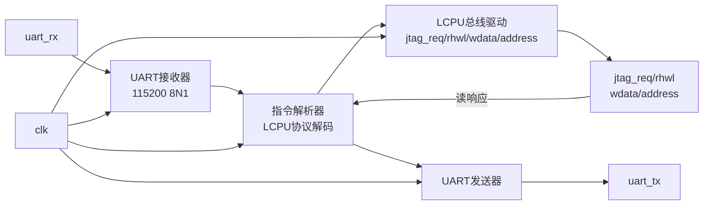
```mermaid
flowchart LR
    UART_RX[uart_rx] --> UART_RX_MOD[UART接收器\n115200 8N1]
    UART_RX_MOD --> PARSER[指令解析器\nLCPU协议解码]
    PARSER --> BUS[LCPU总线驱动\njtag_req/rhwl/wdata/address]
    BUS --> BUS_OUT[jtag_req/rhwl\nwdata/address]
    BUS_OUT -->|读响应| PARSER
    PARSER --> UART_TX_MOD[UART发送器]
    UART_TX_MOD --> uart_tx[uart_tx]
    clk[clk] --> UART_RX_MOD
    clk --> PARSER
    clk --> BUS
    clk --> UART_TX_MOD
```

**表12 lcpu_top 模块接口信号表**

| 信号名 | 位宽（Bits） | IO | 说明 |
|--------|-------------|----|------|
| clk | 1 | I | 系统时钟 |
| reset_l | 1 | I | 复位（低有效） |
| uart_rx | 1 | I | UART 接收 |
| uart_tx | 1 | O | UART 发送 |
| jtag_req | 1 | O | 总线请求 |
| jtag_rhwl | 1 | O | 读写控制 |
| jtag_wdata | 32 | O | 写数据 |
| jtag_address | 32 | O | 访问地址 |
| jtag_rdata | 32 | I | 读数据 |
| jtag_ack | 1 | I | 总线应答 |

**实现说明：** UART 115200 8N1 ↔ LCPU 总线协议转换，用于程序下载和在线调试。

---

###### 3.6.4.2 lcpu_bfm — 仿真 Bus Functional Model

**模块标识：** `lcpu_bfm` | **文件路径：** `ip_common/sim/bfm/lcpu_bfm.sv`

**功能描述：**

- LCPU 总线仿真 BFM，仅在仿真模式（sim_mod ≠ 0）综合
- 从 TCL 脚本文件读取操作指令，模拟 CPU 端对 LCPU 总线的读写
- 用于仿真验证寄存器组和总线的读写功能

**图19 lcpu_bfm 模块内部结构**

```mermaid
flowchart LR
    SCRIPT[TCL脚本文件\nscript_file] --> FOPEN[$fopen 打开]
    FOPEN --> PARSER[指令解析器\nread_time_out超时控制]
    PARSER --> EXEC[总线操作执行\nADDRESS/WR_DATA/RH_WL/EXEC]
    EXEC --> BUS[LCPU总线输出]
    BUS -->|OP_DONE/RD_DATA| EXEC
    clk[clk] --> EXEC
    reset_l[reset_l] --> EXEC
    delay_time[delay_time初始延迟] --> EXEC
```

**表13 lcpu_bfm 模块接口信号表**

| 信号名 | 位宽（Bits） | IO | 说明 |
|--------|-------------|----|------|
| clk | 1 | I | 系统时钟 |
| reset_l | 1 | I | 复位（低有效） |
| OP_DONE | 1 | I | 操作完成指示 |
| RD_DATA | 32 | I | 读数据 |
| ADDRESS | 32 | O | 访问地址 |
| WR_DATA | 32 | O | 写数据 |
| RH_WL | 1 | O | 读写控制 |
| EXEC | 1 | O | 执行操作 |
| read_time_out | parameter | integer | 读超时周期数 |
| delay_time | parameter | integer | 初始化延迟 |
| script_file | parameter | string | TCL 脚本文件路径 |

**实现说明：** 综合条件 `sim_mod ≠ 0` 控制例化。`$fopen(script_file)` 读取 TCL 命令序列。仿真模型，不消耗 FPGA 资源。

---

###### 3.6.4.3 riscv32_top — RISC-V RV32IC 处理器核心

**模块标识：** `riscv32_top` | **文件路径：** `ip_riscv/rtl/riscv32_top.v`

**功能描述：**

- RISC-V RV32IC 处理器核心（顶层）：RV32I 基础整数指令集 + "C" 压缩指令扩展
- 哈佛架构：独立的指令存储器和数据访问总线
- 程序 RAM 在线编程接口 + 外部中断输入 irq[31:0]
- LCPU 总线主设备接口

**图20 riscv32_top 模块内部结构**

```mermaid
flowchart TB
    subgraph RV32_TOP[riscv32_top]
        direction TB

        subgraph CORE[RISC-V Core Pipeline]
            IF[取指阶段\nInstruction Fetch]
            ID[译码阶段\nDecode]
            EX[执行阶段\nExecute]
            MEM[访存阶段\nMemory Access]
            WB[写回阶段\nWrite Back]
            IF --> ID --> EX --> MEM --> WB
        end

        REGFILE[riscv_reg\n寄存器文件\n32×32bit\nx0=0硬连线]

        subgraph LOCALBUS[riscv32_localbus]
            IBUS[指令总线]
            DBUS[数据总线]
        end

        IRAM[single_clock_true_dual_port_ram\n指令RAM 双端口\nPortA:CPU取指 PortB:在线编程]
    end

    IF --> IBUS --> IRAM
    MEM --> DBUS --> LCPU[LCPU总线输出]
    ID --> REGFILE
    WB --> REGFILE
    PROG[program_wr/waddr/wdata] --> IRAM
    IRQ[irq[31:0]] --> CORE
```

**表14 riscv32_top 模块接口信号表**

| 信号名 | 位宽（Bits） | IO | 说明 |
|--------|-------------|----|------|
| clk | 1 | I | 系统时钟 |
| reset_l | 1 | I | 复位（低有效） |
| req | 1 | O | 总线请求 |
| rhwl | 1 | O | 读写控制 |
| wr_byte_en | 4 | O | 字节写使能 |
| wdata | 32 | O | 写数据 |
| address | 32 | O | 访问地址 |
| rdata | 32 | I | 读数据 |
| ack | 1 | I | 总线应答 |
| program_wr | 1 | I | 程序写使能 |
| program_waddr | init_addr_width | I | 程序写地址 |
| program_wdata | instr_databits | I | 程序写数据 |
| program_rdata | instr_databits | O | 程序读数据 |
| irq | 32 | I | 外部中断请求 |

**实现说明：**

| 特征 | 内容 |
|------|------|
| 子模块 | 3 个：riscv32_localbus / riscv_reg / single_clock_true_dual_port_ram |
| ISA | RV32IC（基础整数 + 压缩指令扩展） |
| 指令 RAM | 双端口 Block RAM：Port A = CPU 取指，Port B = 在线编程 |
| 中断 | 32 路外部中断输入 |
| 流水线 | 五级经典流水线（IF→ID→EX→MEM→WB） |

**RAM 使用：** 1 块 `single_clock_true_dual_port_ram`，5120×32bit ≈ 10 块 36Kb BRAM。

---

*（riscv32_localbus、riscv_reg、single_clock_true_dual_port_ram 为 riscv32_top 内部子模块，以下简述）*

**riscv32_localbus**（`ip_riscv/rtl/riscv32_localbus.v`）：哈佛架构本地总线，分离指令和数据访问路径。

**图21 riscv32_localbus 内部结构**

```mermaid
flowchart LR
    IF[取指请求] --> ARB[总线仲裁器]
    MEM[数据访存请求] --> ARB
    ARB --> IRAM[指令RAM端口\n取指32bit读]
    ARB --> LCPU[LCPU总线端口\n数据load/store]
    IRAM --> IF
    LCPU --> MEM
```

**riscv_reg**（`ip_riscv/rtl/riscv_reg.v`）：32×32bit 通用寄存器文件（x0~x31），x0 硬连线为 0。双端口读 + 单端口写。分布式 RAM 或 Block RAM 实现，约 1024 个 LUT-FF。

**图22 riscv_reg 寄存器文件结构**

```mermaid
flowchart LR
    RS1_ADDR[rs1_addr[4:0]] --> DP_RAM[双端口RAM\n32×32bit]
    RS2_ADDR[rs2_addr[4:0]] --> DP_RAM
    RD_ADDR[rd_addr[4:0]] --> DP_RAM
    DP_RAM --> RS1_DATA[rs1_data[31:0]]
    DP_RAM --> RS2_DATA[rs2_data[31:0]]
    RD_DATA[rd_data[31:0]] --> DP_RAM
    RD_WEN[rd_wen] --> DP_RAM
    Note over DP_RAM: x0=0硬连线\n写x0无效
```

**single_clock_true_dual_port_ram**（`ip_common/rtl/single_clock_true_dual_port_ram.v`）：单时钟真双端口 RAM，A 端口用于 CPU 取指（只读），B 端口用于在线编程（可读可写）。5120×32bit，约 10 块 36Kb BRAM（Xilinx 7 系列）。

---

###### 3.6.4.4 lcpu_merge — CPU 总线仲裁器

**模块标识：** `lcpu_merge` | **文件路径：** `ip_common/rtl/lcpu_merge.v`

**功能描述：**

- 多路 LCPU 总线主设备仲裁器（N:1 合并）
- 输入 3 路：UART 调试 CPU + 仿真 BFM + RISC-V CPU
- 输出 1 路统一 LCPU 总线，固定优先级仲裁

**图23 lcpu_merge 模块内部结构**

```mermaid
flowchart LR
    PORT1[Port1: lcpu_top\nUART调试CPU] -->|op_req_1| ARB[优先级仲裁器\n固定优先级\n1 > 2 > 3]
    PORT2[Port2: lcpu_bfm\n仿真BFM] -->|op_req_2| ARB
    PORT3[Port3: riscv32_top\nRISC-V CPU] -->|op_req_3| ARB

    ARB -->|op_req| BUS[统一LCPU总线]
    ARB -->|wrl_rdh| BUS
    ARB -->|wdata| BUS
    ARB -->|address| BUS

    BUS -->|op_ack| DEMUX[应答分发]
    BUS -->|rddata| DEMUX
    DEMUX -->|op_ack_1/rddata_1| PORT1
    DEMUX -->|op_ack_2/rddata_2| PORT2
    DEMUX -->|op_ack_3/rddata_3| PORT3
```

**表15 lcpu_merge 模块接口信号表**

| 信号名 | 位宽（Bits） | IO | 说明 |
|--------|-------------|----|------|
| clk | 1 | I | 系统时钟 |
| reset_l | 1 | I | 复位（低有效） |
| **Port 1~3 输入（以 Port1 为例）** |
| op_req_1 | 1 | I | 端口1 请求 |
| wrl_rdh_1 | 1 | I | 端口1 读写 |
| wrdata_1 | data_width | I | 端口1 写数据 |
| address_1 | addr_width | I | 端口1 地址 |
| op_ack_1 | 1 | O | 端口1 应答 |
| rddata_1 | data_width | O | 端口1 读数据 |
| **统一总线输出** |
| op_req | 1 | O | 仲裁后请求 |
| wrl_rdh | 1 | O | 仲裁后读写 |
| wrdata | data_width | O | 仲裁后写数据 |
| address | addr_width | O | 仲裁后地址 |
| op_ack | 1 | I | 设备应答 |
| rddata | data_width | I | 设备读数据 |
| **参数** |
| data_width | parameter | integer | 数据位宽（默认 32） |
| addr_width | parameter | integer | 地址位宽（默认 32） |

**实现说明：** 3 路固定优先级仲裁（1 > 2 > 3），无轮询。应答信号按当前授权端口分发。

---

#### 3.6.5 cpu_channel — CPU 数据通道

##### 3.6.5.1 功能描述（Feature）

**模块标识：** `cpu_channel` | **文件路径：** `fpga_webserver/rtl/cpu_channel.v`

- CPU 与 GMII 以太网接口之间的数据通道
- **接收方向**：GMII MAC 帧 → package_fifo_v2（组包） → pktfifo2ram_int_v2（写 RAM） → CPU 读取
- **发送方向**：CPU 写包 → ram2pktfifo_int（读 RAM）→ sop_eop_gen（SOP/EOP 生成）→ MAC 发送
- 支持 MAC 地址过滤、收发包统计

**图24 cpu_channel 模块内部结构**

```mermaid
flowchart TB
    subgraph CHAN[cpu_channel]
        subgraph RX_PATH[接收通路 GMII→CPU]
            PKG[package_fifo_v2\n组包FIFO\n↓ 3.6.5.1]
            WR[pktfifo2ram_int_v2\nFIFO→RAM桥\n↓ 3.6.5.2]
            PKG -->|包FIFO写| WR
        end

        subgraph TX_PATH[发送通路 CPU→GMII]
            RD[ram2pktfifo_int\nRAM→FIFO桥\n↓ 3.6.5.3]
            SOP[sop_eop_gen\nSOP/EOP生成\n↓ 3.6.5.4]
            RD -->|流式数据| SOP
        end
    end

    GMII_RX[mac_rx_sop/en/data/eop/err] --> PKG
    WR -->|cpu_rd_empty/rpkt_len/rdata| CPU_RD[CPU读包FIFO接口]

    CPU_WR[CPU写包FIFO接口] -->|cpu_wr_wen/wdata/wpkt_push| RD
    SOP -->|mac_tx_sop/en/data/eop/err| GMII_TX[MAC TX接口]

    FILTER[filter_data/offset\nMAC过滤] --> CHAN
    CHAN --> STAT[recv_pkt_drop_cnt\n丢包统计]
```

##### 3.6.5.2 接口说明（Interface）

**表16 cpu_channel 模块接口信号表**

| 信号名 | 位宽（Bits） | IO | 说明 |
|--------|-------------|----|------|
| **系统接口** |
| clk | 1 | I | 系统时钟（50MHz） |
| reset_l | 1 | I | 复位（低有效） |
| cpu_clk | 1 | I | CPU 时钟 |
| **MAC 接收接口** |
| mac_rx_sop | 1 | I | MAC 接收帧起始 |
| mac_rx_en | 1 | I | MAC 接收数据使能 |
| mac_rx_data | cpu_buf_data_width | I | MAC 接收数据 |
| mac_rx_eop | 1 | I | MAC 接收帧结束 |
| mac_rx_err | 1 | I | MAC 接收错误 |
| **MAC 发送接口** |
| mac_tx_sop | 1 | O | MAC 发送帧起始 |
| mac_tx_en | 1 | O | MAC 发送数据使能 |
| mac_tx_data | cpu_buf_data_width | O | MAC 发送数据 |
| mac_tx_eop | 1 | O | MAC 发送帧结束 |
| mac_tx_err | 1 | O | MAC 发送错误 |
| **过滤接口** |
| filter_data | 16 | I | MAC 过滤数据 |
| filter_offset | 16 | I | MAC 过滤偏移 |
| **CPU 读包 FIFO 接口** |
| cpu_rd_empty | 1 | O | 读 FIFO 空 |
| cpu_rd_rpkt_pop | 1 | I | 读包弹出 |
| cpu_rd_rpkt_len | cpu_buf_addr_width+1 | O | 读包长度 |
| cpu_rd_rpkt_para | cpu_buf_para_width | O | 读包参数 |
| cpu_rd_ren | 1 | I | 读使能 |
| cpu_rd_raddr | cpu_buf_addr_width | I | 读地址 |
| cpu_rd_rdata | cpu_buf_data_width | O | 读数据 |
| cpu_rd_reop_pre | 1 | O | 包结束前指示 |
| **CPU 写包 FIFO 接口** |
| cpu_wr_full | 1 | O | 写 FIFO 满 |
| cpu_wr_wen | 1 | I | 写使能 |
| cpu_wr_waddr | cpu_buf_addr_width | I | 写地址 |
| cpu_wr_wdata | cpu_buf_data_width | I | 写数据 |
| cpu_wr_wpkt_push | 1 | I | 写包完成 |
| cpu_wr_wpkt_len | cpu_buf_addr_width+1 | I | 写包长度 |
| cpu_wr_wpkt_para | cpu_buf_para_width | I | 写包参数 |
| **统计输出** |
| recv_pkt_drop_cnt | 8 | O | 接收丢包计数 |

##### 3.6.5.3 实现说明（Implementation）

| 特征 | 内容 |
|------|------|
| 子模块实例 | 4 个：package_fifo_v2 / pktfifo2ram_int_v2 / ram2pktfifo_int / sop_eop_gen |
| 包 FIFO 接口 | 标准 LCPU 包 FIFO 读写时序 |
| MAC 接口 | 带 SOP/EOP 边带信号的流式接口 |

##### 3.6.5.4 内部表项（Table）

无。

##### 3.6.5.5 RAM 使用情况（RAM Resource）

子模块 pktfifo2ram_int_v2 和 ram2pktfifo_int 各使用 Block RAM 作为包数据缓冲区。

---

###### 3.6.5.1 package_fifo_v2 — 通用包 FIFO

**模块标识：** `package_fifo_v2` | **文件路径：** `ip_common/rtl/package_fifo_v2.v`

**功能描述：** 通用双时钟包 FIFO，支持块模式/非块变长模式。内部集成数据 RAM + 参数 FIFO，提供完整包级读写接口。

**图25 package_fifo_v2 模块内部结构**

```mermaid
flowchart TB
    subgraph PKG_FIFO[package_fifo_v2]
        subgraph WCLK_DOMAIN[wclk 写时钟域]
            WCTRL[写控制器\nwaddr管理/wpkt_push检测] --> DATA_RAM[数据 RAM\nSimple Dual Port\nPort A: 写]
            WCTRL --> PARA_FIFO[参数 FIFO\n包长/参数/块指针]
        end

        subgraph RCLK_DOMAIN[rclk 读时钟域]
            RCTRL[读控制器\nrpkt_pop/rpkt_len管理] --> DATA_RAM
            RCTRL --> PARA_FIFO
            RCTRL --> ROUT[读数据输出\nrdata/raddr/reop_pre]
        end

        CDC[pulse_clock_region_pass\n写→读包推送脉冲跨域] --> RCTRL
        WCTRL --> CDC
    end

    WIF[wen/waddr/wdata\nwpkt_push/wpkt_len/wpkt_para] --> WCTRL
    RCTRL --> RIF[rpkt_len/rpkt_para\nrdata/raddr/reop_pre\nempty/rpkt_pop/ren]
    WCTRL --> full[full]
```

**表17 package_fifo_v2 模块接口信号表**

| 信号名 | 位宽（Bits） | IO | 说明 |
|--------|-------------|----|------|
| reset_l | 1 | I | 异步复位（低有效） |
| **写端口（wclk 时钟域）** |
| wclk | 1 | I | 写侧时钟 |
| wclk_en | 1 | I | 写时钟使能 |
| full | 1 | O | 包 FIFO 满标志 |
| wen | 1 | I | 写数据使能 |
| waddr | addr_width | I | 写地址（包内偏移） |
| wdata | data_width | I | 写数据 |
| wpkt_push | 1 | I | 写包完成（单周期脉冲） |
| wpkt_len | addr_width+1 | I | 写包数据长度 |
| wpkt_para | para_width | I | 写包带外参数 |
| **读端口（rclk 时钟域）** |
| rclk | 1 | I | 读侧时钟 |
| rclk_en | 1 | I | 读时钟使能 |
| empty | 1 | O | 包 FIFO 空标志 |
| rpkt_pop | 1 | I | 读包弹出 |
| rpkt_len | addr_width+1 | O | 读包数据长度 |
| rpkt_para | para_width | O | 读包带外参数 |
| ren | 1 | I | 读数据使能 |
| raddr | addr_width | I | 读地址 |
| rdata | data_width | O | 读数据 |
| reop_pre | 1 | O | 包结束前指示 |
| overflow | 1 | O | 溢出标志 |
| underflow | 1 | O | 下溢标志 |

**接口时序：** 参考 `ip_common/doc/常用LRIP接口时序.md` — 包FIFO读写时序。

**实现说明：** 双时钟模式通过 pulse_clock_region_pass 实现跨域包推送。块模式（block_mode="true"）每块固定 block_ram_size Kbit。

**RAM 使用：** 数据 RAM + 参数 FIFO，根据 block_mode 和参数配置不同，典型使用若干块 M9K/BRAM。

---

###### 3.6.5.2 pktfifo2ram_int_v2 — FIFO 到 RAM 桥接

**模块标识：** `pktfifo2ram_int_v2` | **文件路径：** `ip_common/rtl/pktfifo2ram_int_v2.v`

**功能描述：** 从包 FIFO 读取数据并写入内部 Block RAM。支持 IPG 调节控制读取速率。

**图26 pktfifo2ram_int_v2 模块内部结构**

```mermaid
flowchart LR
    FIFO_IF[包FIFO读接口\nempty/rpkt_len/rdata\nrpkt_pop/ren/raddr] --> CTRL[读取控制器\nIPG调节\nipg_adjust]
    CTRL --> RAM_IF[内部RAM写接口\nram_wen/ram_wdata\nram_waddr/ram_wpara]
    clk[clk] --> CTRL
    clk_en[clk_en] --> CTRL
```

**表18 pktfifo2ram_int_v2 模块接口信号表**

| 信号名 | 位宽（Bits） | IO | 说明 |
|--------|-------------|----|------|
| reset_l | 1 | I | 复位（低有效） |
| clk | 1 | I | 系统时钟 |
| clk_en | 1 | I | 时钟使能 |
| ipg_adjust | 32 | I | IPG 调节值 |
| **内部 RAM 写接口** |
| ram_wen | 1 | O | RAM 写使能 |
| ram_wdata | data_width | O | RAM 写数据 |
| ram_waddr | addr_width | O | RAM 写地址 |
| ram_wpara | para_width | O | RAM 写参数 |
| **包 FIFO 读接口** |
| empty | 1 | I | 包 FIFO 空标志 |
| rpkt_pop | 1 | O | 读包弹出 |
| rpkt_len | addr_width+1 | I | 读包数据长度 |
| rpkt_para | para_width | I | 读包参数 |
| ren | 1 | O | 读数据使能 |
| raddr | addr_width | O | 读地址 |
| rdata | data_width | I | 读数据 |
| reop_pre | 1 | I | 包结束前指示 |
| **参数** |
| addr_width | parameter | integer | 地址位宽（默认 8） |

---

###### 3.6.5.3 ram2pktfifo_int — RAM 到 FIFO 桥接

**模块标识：** `ram2pktfifo_int` | **文件路径：** `ip_common/rtl/ram2pktfifo_int.v`

**功能描述：** 从内部 Block RAM 读出数据并写入包 FIFO。含流控反馈 ram_wen_permit。

**图27 ram2pktfifo_int 模块内部结构**

```mermaid
flowchart LR
    RAM_IF[内部RAM接口\nram_wen/ram_wdata\nram_waddr/ram_wpara] --> CTRL[写入控制器\n流控:ram_wen_permit]
    CTRL --> FIFO_IF[包FIFO写接口\nfull/wen/waddr/wdata\nwpkt_push/wpkt_len/wpkt_para]
    clk[clk] --> CTRL
    clk_en[clk_en] --> CTRL
    FIFO_IF -->|full反馈| CTRL
```

**表19 ram2pktfifo_int 模块接口信号表**

| 信号名 | 位宽（Bits） | IO | 说明 |
|--------|-------------|----|------|
| reset_l | 1 | I | 复位（低有效） |
| clk | 1 | I | 系统时钟 |
| clk_en | 1 | I | 时钟使能 |
| ram_wen | 1 | I | RAM 写使能输入 |
| ram_wdata | data_width | I | RAM 写数据 |
| ram_waddr | addr_width | I | RAM 写地址 |
| ram_wpara | para_width | I | RAM 写参数 |
| ram_wen_permit | 1 | O | RAM 写允许（流控） |
| full | 1 | I | 包 FIFO 满标志 |
| wen | 1 | O | 写数据使能 |
| waddr | addr_width | O | 写地址 |
| wdata | data_width | O | 写数据 |
| wpkt_push | 1 | O | 写包完成 |
| wpkt_len | addr_width+1 | O | 写包长度 |
| wpkt_para | para_width | O | 写包参数 |

---

###### 3.6.5.4 sop_eop_gen — SOP/EOP 边带信号生成

**模块标识：** `sop_eop_gen` | **文件路径：** `ip_common/rtl/sop_eop_gen.v`

**功能描述：** 将流式数据转换为带帧边界（SOP/EOP）的 MAC 发送格式。内部字节计数器追踪包内位置。

**图28 sop_eop_gen 模块内部结构**

```mermaid
flowchart LR
    I_DATA[i_en/i_data/i_err] --> REG[输入寄存器]
    REG --> CTRL[字节计数器\ncnt==0→SOP\ncnt==len-1→EOP]
    REG --> O_DATA[o_data/o_en/o_err]
    CTRL --> SOP[o_sop]
    CTRL --> EOP[o_eop]
    clk[clk] --> REG
    clk --> CTRL
    clk_en[clk_en] --> REG
    clk_en --> CTRL
```

**表20 sop_eop_gen 模块接口信号表**

| 信号名 | 位宽（Bits） | IO | 说明 |
|--------|-------------|----|------|
| clk | 1 | I | 系统时钟 |
| clk_en | 1 | I | 时钟使能 |
| reset_l | 1 | I | 复位（低有效） |
| i_en | 1 | I | 输入数据使能 |
| i_err | 1 | I | 输入错误指示 |
| i_data | data_width | I | 输入数据 |
| o_sop | 1 | O | 输出包起始（首字节=1） |
| o_en | 1 | O | 输出数据使能 |
| o_data | data_width | O | 输出数据 |
| o_eop | 1 | O | 输出包结束（末字节=1） |
| o_err | 1 | O | 输出错误指示 |
| **参数** |
| data_width | parameter | integer | 数据位宽（默认 8） |

---

#### 3.6.6 reg_webserver — 寄存器组

##### 3.6.6.1 功能描述（Feature）

**模块标识：** `reg_webserver` | **文件路径：** `fpga_webserver/rtl/reg_webserver.v`

- WebServer 寄存器组，提供 CPU ↔ FPGA 硬件寄存器接口
- 寄存器分类：RW（读写）、RO（只读）、WC（写清零）、RC（读清零）
- 管理信号：FPGA/软件构建时间戳、PHY 复位、MDIO 请求
- 统计输入：以太网收发包统计、错误统计
- Debug 寄存器：8 个 debug 寄存器（4 RW + 4 RO）

**图29 reg_webserver 模块内部结构**

```mermaid
flowchart TB
    LCPU[LCPU总线\nreq/rhwl/wdata/address] --> DEC[地址译码器]
    DEC --> RW_REG[RW寄存器组\ndebug_rw_0..3\nfilter_data/offset\ncpu_wr_reg_rw_*]
    DEC --> RO_MUX[RO多路选择器]
    DEC --> WC_REG[WC寄存器组\ncpu_wr_reg_wc_0]
    DEC --> RC_REG[RC寄存器组\ncpu_wr_reg_rc_*]

    RO_INPUT[eth_rx/tx统计\ndebug_ro_*\nfpga_build_date/time\nlocal_time] --> RO_MUX
    RO_MUX --> RDATA[rdata[31:0]]

    RW_REG --> OUTPUT[debug_rw/filter/eth_greset\nSUBBUS_mdio_*/get_local_time]
    ack[ack] --> LCPU

    clk[clk] --> DEC
    rst_n[rst_n] --> DEC
```

**表21 reg_webserver 模块接口信号表**

| 信号名 | 位宽（Bits） | IO | 说明 |
|--------|-------------|----|------|
| **LCPU 总线接口** |
| clk | 1 | I | 系统时钟 |
| rst_n | 1 | I | 复位（低有效） |
| req | 1 | I | 总线请求 |
| rhwl | 1 | I | 读写控制 |
| wdata | 32 | I | 写数据 |
| address | 16 | I | 寄存器地址 |
| rdata | 32 | O | 读数据 |
| ack | 1 | O | 总线应答 |
| **时间戳接口** |
| fpga_build_date | 32 | I | FPGA 综合日期 |
| fpga_build_time | 32 | I | FPGA 综合时间 |
| sw_build_date | 32 | O | 软件编译日期 |
| sw_build_time | 32 | O | 软件编译时间 |
| **PHY 控制** |
| eth_greset | 4 | O | 以太网 PHY 复位 |
| **定时器接口** |
| second_event | 1 | I | 秒脉冲事件 |
| get_local_time | 1 | O | 获取本地时间 |
| get_local_time_ind | 1 | O | 本地时间有效 |
| local_time_l | 32 | I | 本地时间低32bit |
| local_time_h | 32 | I | 本地时间高32bit |
| **Debug 寄存器** |
| debug_rw_0..3 | 32×4 | O | Debug 读写寄存器 |
| debug_ro_0..3 | 32×4 | I | Debug 只读寄存器 |
| **以太网统计** |
| eth_rx_correct_pkt_cnt | 32 | I | 正确接收包计数 |
| eth_rx_crc_err_pkt_cnt | 32 | I | CRC 错误包计数 |
| eth_tx_correct_pkt_cnt | 32 | I | 正确发送包计数 |
| eth_tx_error_pkt_cnt | 32 | I | 发送错误包计数 |
| eth_rx_afifo_full_cnt | 32 | I | 接收 FIFO 满计数 |
| eth_rx_afifo_empty_cnt | 32 | I | 接收 FIFO 空计数 |
| eth_rx_data_err_line | 32 | I | 接收数据错误行号 |
| **过滤控制** |
| filter_data | 16 | O | MAC 过滤数据 |
| filter_offset | 16 | O | MAC 过滤偏移 |
| **MDIO 请求** |
| SUBBUS_eth_mdio_Req | 1 | O | MDIO 操作请求 |
| SUBBUS_eth_mdio_RhWl | 1 | O | MDIO 读写控制 |
| SUBBUS_eth_mdio_ReqAddr | 12 | O | MDIO 寄存器地址 |
| **CPU 写寄存器** |
| cpu_wr_reg_rw_0..3 | 32×4 | O | CPU→HW 读写寄存器 |
| cpu_wr_reg_ro_0..1 | 32×2 | I | HW→CPU 只读寄存器 |
| cpu_wr_reg_wc_0 | 32 | O | 写清零寄存器 |
| cpu_wr_reg_rc_0..1 | 32×2 | I | 读清零寄存器 |

##### 3.6.6.2 实现说明（Implementation）

| 特征 | 内容 |
|------|------|
| 寄存器类型 | RW / RO / WC / RC 四种 |
| 总线协议 | LCPU 寄存器总线（req + ack 握手） |

##### 3.6.6.3 内部表项（Table）

【待补充】— 寄存器地址映射表。

##### 3.6.6.4 RAM 使用情况（RAM Resource）

无（寄存器实现）。

---

#### 3.6.7 lcpu_mdio — MDIO 控制器

##### 3.6.7.1 功能描述（Feature）

**模块标识：** `lcpu_mdio` | **文件路径：** `ip_common/rtl/lcpu_mdio.v`

- MDIO 控制器，LCPU 总线接口 ↔ MDIO Clause 22 协议转换
- 支持 MDIO 读写 PHY 寄存器
- 内部集成 lcpu_access_mdio_reg 子模块完成时序转换

**图30 lcpu_mdio 模块内部结构**

```mermaid
flowchart LR
    LCPU[LCPU总线\nop_req/wrl_rdh\nwrdata/address] --> ACCESS[lcpu_access_mdio_reg\nClause 22 帧组装/解析]
    ACCESS --> MDIO_IF[MDIO接口\nMDC生成 + MDIO双向驱动]
    MDIO_IF --> mdc[mdc]
    MDIO_IF <--> mdio[mdio]
    ACCESS --> LCPU_RESP[op_ack/rddata]

    clk[clk] --> ACCESS
    clk --> MDIO_IF
    reset_l[reset_l] --> ACCESS
```

**表22 lcpu_mdio 模块接口信号表**

| 信号名 | 位宽（Bits） | IO | 说明 |
|--------|-------------|----|------|
| clk | 1 | I | 系统时钟 |
| reset_l | 1 | I | 复位（低有效） |
| op_req | 1 | I | 操作请求 |
| wrl_rdh | 1 | I | 读写控制（0:写, 1:读） |
| wrdata | 32 | I | 写数据 |
| address | 32 | I | 寄存器地址 |
| op_ack | 1 | O | 操作应答 |
| rddata | 32 | O | 读数据 |
| mdc | 1 | O | MDIO 时钟 |
| mdio | 1 | IO | MDIO 数据（双向） |

##### 3.6.7.2 实现说明（Implementation）

| 特征 | 内容 |
|------|------|
| 协议 | IEEE 802.3 Clause 22 |
| MDC 频率 | 内部计数器分频产生（≤2.5MHz） |
| 帧格式 | PREAMBLE(32×1) + ST(01) + OP(2) + PHYAD(5) + REGAD(5) + TA(2) + DATA(16) |

##### 3.6.7.3 内部表项（Table）

无。

##### 3.6.7.4 RAM 使用情况（RAM Resource）

无。

---

#### 3.6.8 cdc_bus_sync — CDC 单路同步

##### 3.6.8.1 功能描述（Feature）

**模块标识：** `cdc_bus_sync` | **文件路径：** `ip_common/rtl/cdc_bus_sync.sv`

- 跨时钟域单路数据同步器
- 通过握手协议实现源时钟域 → 目标时钟域安全传输
- 本设计中使用 3 个实例，用于不同 CDC 通道

**图31 cdc_bus_sync 模块内部结构**

```mermaid
sequenceDiagram
    participant SRC as src_clk 域
    participant CDC as 同步逻辑
    participant DST as dst_clk 域

    SRC->>CDC: src_valid=1, src_data=DATA
    Note over CDC: src域翻转toggle信号

    CDC->>DST: toggle经2级同步器到dst域
    Note over DST: 边沿检测→dst_valid=1

    DST->>CDC: dst_valid=1, dst_data=DATA
    Note over DST: dst域翻转ack toggle

    CDC->>SRC: ack toggle经2级同步器回src域
    Note over SRC: 边沿检测→src_ready=1

    Note over SRC,DST: 一轮握手完成,可发下一笔数据
```

**表23 cdc_bus_sync 模块接口信号表**

| 信号名 | 位宽（Bits） | IO | 说明 |
|--------|-------------|----|------|
| src_clk | 1 | I | 源时钟 |
| src_rst_l | 1 | I | 源时钟域复位 |
| src_data | DATA_WIDTH | I | 源数据 |
| src_valid | 1 | I | 源数据有效 |
| dst_clk | 1 | I | 目标时钟 |
| dst_rst_l | 1 | I | 目标时钟域复位 |
| dst_data | DATA_WIDTH | O | 目标数据 |
| dst_valid | 1 | O | 目标数据有效 |
| src_ready | 1 | O | 握手完成（MODE=1） |
| **参数** |
| DATA_WIDTH | parameter | integer | 数据位宽 |
| MODE | parameter | integer | 同步模式 |

##### 3.6.8.2 实现说明（Implementation）

| 特征 | 内容 |
|------|------|
| 同步方式 | 握手协议（toggle+2级同步器+边沿检测） |
| 约束 | 源端两次 valid 间隔 > 4~5 个目标时钟周期 |

---

#### 3.6.9 cdc_bus_sync_vec — CDC 向量同步

##### 3.6.9.1 功能描述（Feature）

**模块标识：** `cdc_bus_sync_vec` | **文件路径：** `ip_common/rtl/cdc_bus_sync_vec.sv`

- 多通道跨时钟域向量同步器
- 本质为 CHANNELS 路 cdc_bus_sync 的并行封装

**图32 cdc_bus_sync_vec 模块内部结构**

```mermaid
flowchart LR
    subgraph VEC[cdc_bus_sync_vec]
        CH0[cdc_bus_sync\nChannel 0]
        CH1[cdc_bus_sync\nChannel 1]
        CHN[cdc_bus_sync\nChannel N-1]
    end

    SRC[src_data[D×C-1:0]\nsrc_valid[C-1:0]] --> CH0
    SRC --> CH1
    SRC --> CHN

    CH0 --> DST[dst_data[D×C-1:0]\ndst_valid[C-1:0]]
    CH1 --> DST
    CHN --> DST

    CH0 --> READY[src_ready[C-1:0]]
    CH1 --> READY
    CHN --> READY
```

**表24 cdc_bus_sync_vec 模块接口信号表**

| 信号名 | 位宽（Bits） | IO | 说明 |
|--------|-------------|----|------|
| src_clk | 1 | I | 源时钟 |
| src_rst_l | 1 | I | 源时钟域复位 |
| src_data | DATA_WIDTH×CHANNELS | I | 多通道源数据 |
| src_valid | CHANNELS | I | 逐通道有效指示 |
| dst_clk | 1 | I | 目标时钟 |
| dst_rst_l | 1 | I | 目标时钟域复位 |
| dst_data | DATA_WIDTH×CHANNELS | O | 多通道目标数据 |
| dst_valid | CHANNELS | O | 逐通道有效指示 |
| src_ready | CHANNELS | O | 逐通道握手完成 |
| **参数** |
| DATA_WIDTH | parameter | integer | 单通道数据位宽 |
| CHANNELS | parameter | integer | 并行通道数 |

---

### 3.7 RISC-V 固件与编译环境

#### 3.7.1 固件 C 代码结构

**表25 RISC-V 固件源文件清单**

| 文件 | 功能说明 |
|------|----------|
| `c/main.c` | 程序入口：`reset_entry` → `program_main()` → `designApp()` |
| `c/designApp.c` | 应用主循环，初始化协议栈并启动 WebServer |
| `c/eth.c` | 以太网 MAC 层帧收发，GMII 接口数据读写 |
| `c/arp.c` | ARP 协议：ARP 请求响应、ARP 表维护 |
| `c/ip.c` | IPv4 协议：IP 包解析、校验和验证、分片重组 |
| `c/icmp.c` | ICMP Echo Reply（Ping 响应） |
| `c/tcp.c` | TCP 协议状态机（34KB）：三次握手、数据收发、四次挥手、重传定时器 |
| `c/udp.c` | UDP 协议：端口解复用 |
| `c/http.c` | HTTP 服务器：解析 HTTP GET 请求，返回 HTML 页面 |
| `c/comlib.c` | 通用库：checksum（IP/TCP 校验和）、memcpy、内存操作 |
| `c/inc/lcpu_general.h` | LCPU 硬件寄存器地址定义（7KB），地址映射宏 |
| `c/inc/system.h` | 系统配置头文件，CPU 模式选择（RISC-V/MicroBlaze/Nios II） |

**图33 RISC-V 固件协议栈架构**

```mermaid
flowchart TB
    subgraph APP[应用层]
        HTTP[HTTP 服务器\nhttp.c]
    end

    subgraph TRANS[传输层]
        TCP[TCP 协议\n状态机 34KB\ntcp.c]
        UDP[UDP 协议\nudp.c]
    end

    subgraph NET[网络层]
        IP[IP 协议\n校验和验证\nip.c]
        ICMP[ICMP Echo\nPing响应\nicmp.c]
    end

    subgraph LINK[链路层]
        ARP[ARP 协议\narp.c]
        ETH[MAC 帧收发\neth.c]
        COMLIB[通用库\nchecksum/memcpy\ncomlib.c]
    end

    subgraph HW[硬件抽象层]
        LCPU_H[lcp_general.h\n寄存器地址宏\n7KB]
    end

    HTTP --> TCP
    TCP --> IP
    UDP --> IP
    IP --> ETH
    ICMP --> IP
    ARP --> ETH
    ETH --> LCPU_H
    COMLIB --> IP
    COMLIB --> TCP
```

#### 3.7.2 RISC-V 编译环境

**表26 RISC-V 编译环境参数**

| 参数 | 值 | 说明 |
|------|-----|------|
| 工具链 | `riscv64-unknown-elf-gcc` 14.2.0 | RISC-V GCC 交叉编译器 |
| 目标架构 | RV32IC | RV32I 基础整数 + "C" 压缩指令扩展 |
| ABI | ilp32 | 32bit int/long/pointer |
| 标准库 | picolibc | 轻量级嵌入式 C 库 |
| 优化等级 | -O2 | 空间和速度平衡优化 |
| ROM 起始地址 | 0x00000000 | 程序入口点 |
| ROM 空间限制 | 16KB（16384 bytes） | 由 linker.ld 定义 |
| 编译产物 | firmware.elf → firmware.bin → firmware_pads.bin | 最终生成 InstructRAM.v/.tcl/.hex |

**图34 RISC-V 固件编译流程**

```mermaid
flowchart LR
    C_SRC[c/*.c\nC 源码] -->|riscv64-unknown-elf-gcc\n-march=rv32ic -mabi=ilp32 -O2| ELF[firmware.elf\n链接: linker.ld]
    ELF -->|objcopy -O binary| BIN[firmware.bin\n原始二进制]
    BIN -->|python3 pad\n填充至16KB| PADS[firmware_pads.bin]
    PADS --> VERILOG[bin_to_verilog_para.py\n→ InstructRAM.v]
    PADS --> TCL[bin_to_tcl.py\n→ InstructRAM.tcl]
    PADS --> HEX[bin_to_quartus_hex.py\n→ InstructRAM.hex]
```

**Linker Script 地址布局：**

| 段 | 说明 |
|----|------|
| `.text.bootloader` | 启动向量（reset_entry，地址 0x00000000） |
| `.text` | 代码段 |
| `.rodata` | 只读数据段 |
| `.data` | 已初始化数据段 |
| `.bss` | 未初始化数据段（NOLOAD） |

**构建命令：**

```bash
cd fpga_webserver/c_build && make            # 全量构建（xilinx 平台）
make PLATFORM=xilinx                          # 显式指定平台
make clean                                     # 清理构建产物
make disasm                                    # 反汇编查看
make info                                      # 显示工具链信息
```

---

## LCPU 总线接口时序

以下时序为所有 LCPU 总线互联模块（reg_webserver、lcpu_mdio、lcpu_merge 等）的统一接口参考。

**图35 LCPU 读寄存器时序**

```mermaid
sequenceDiagram
    participant M as Master (CPU)
    participant S as Slave (外设)

    M->>S: REQ=1, RH_WL=1(读), ADDR=Addr
    Note over M,S: Master 发起1周期读请求

    Note over S: Slave 处理读操作\n延迟不定(数周期~数百周期)

    S->>M: ACK=1, RDATA=rdata
    Note over M,S: Master 锁存 RDATA
```

**图36 LCPU 写寄存器时序**

```mermaid
sequenceDiagram
    participant M as Master (CPU)
    participant S as Slave (外设)

    M->>S: REQ=1, RH_WL=0(写), ADDR=Addr, WDATA=wdata
    Note over M,S: Master 发起1周期写请求

    Note over S: Slave 处理写操作\n延迟不定

    S->>M: ACK=1
    Note over M,S: 写操作完成
```

**图37 包 FIFO 写时序**

```mermaid
sequenceDiagram
    participant W as Writer
    participant F as 包FIFO

    W->>F: wen=1, waddr=0..n-1, wdata=D0..Dn-1
    Note over W,F: 逐字写入包数据

    W->>F: wpkt_push=1, wpkt_len=n, wpkt_para=Para
    Note over W,F: 包写完,推送参数(与wen=0同周期)

    Note over F: 包入队,full/empty状态更新
```

**图38 包 FIFO 读时序**

```mermaid
sequenceDiagram
    participant R as Reader
    participant F as 包FIFO

    R->>F: rpkt_pop=1 (empty=0时)
    Note over F: 弹出包,参数FIFO出队

    Note over R,F: 2个时钟周期后
    F->>R: rpkt_len=n, rpkt_para=Para

    R->>F: ren=1, raddr=0..n-1
    Note over R,F: 逐字读取数据
    F->>R: rdata=D0..Dn-1 (延迟1周期)
```

---

## 术语一览

| 术语 | 全称 | 解释 |
|------|------|------|
| RISC-V | — | 开源精简指令集架构 |
| RV32IC | RV32I + "C" | 32位基础整数 + 16位压缩指令扩展 |
| LCPU | — | 自定义轻量级 CPU 总线协议 |
| GMII | Gigabit Media Independent Interface | 千兆介质无关接口（8bit SDR） |
| RGMII | Reduced GMII | 精简千兆介质无关接口（4bit DDR） |
| MDIO | Management Data I/O | 管理数据接口（Clause 22） |
| BFM | Bus Functional Model | 总线功能模型（仿真用） |
| CDC | Clock Domain Crossing | 跨时钟域 |
| SOP/EOP | Start/End of Packet | 帧起始/结束边带信号 |
| MMCM | Mixed-Mode Clock Manager | Xilinx 混合模式时钟管理器 |
| IDELAY | Input Delay | Xilinx 输入延迟单元 |
| ODDR | Output DDR Register | 双边沿输出寄存器 |
| picolibc | — | 轻量级嵌入式 C 标准库 |

---

## 图目录

| 编号 | 图名 |
|------|------|
| 图1 | XC7A35T 内部资源架构 |
| 图2 | RGMII 发送时序（125MHz DDR） |
| 图3 | RGMII 接收时序（125MHz DDR） |
| 图4 | MDIO 接口时序（Clause 22） |
| 图5 | UART 异步串行时序（115200 8N1） |
| 图6 | xilinx_xc7a35tfgg484_webserver_top 内部结构 |
| 图7 | clk_rst_ctrl 内部结构 |
| 图8 | clk_rst_ctrl 上电复位时序 |
| 图9 | pll_50m MMCM 内部结构 |
| 图10 | MMCM 锁定与时钟输出时序 |
| 图11 | rgmii2gmii 内部结构 |
| 图12 | GMII 发送接口时序 |
| 图13 | GMII 接收接口时序 |
| 图14 | webserver_wrapper 内部结构 |
| 图15 | tod 内部结构 |
| 图16 | interval_timer 内部结构 |
| 图17 | lcpu_riscv_wrapper 内部结构 |
| 图18 | lcpu_top 内部结构 |
| 图19 | lcpu_bfm 内部结构 |
| 图20 | riscv32_top 内部结构 |
| 图21 | riscv32_localbus 内部结构 |
| 图22 | riscv_reg 寄存器文件结构 |
| 图23 | lcpu_merge 内部结构 |
| 图24 | cpu_channel 内部结构 |
| 图25 | package_fifo_v2 内部结构 |
| 图26 | pktfifo2ram_int_v2 内部结构 |
| 图27 | ram2pktfifo_int 内部结构 |
| 图28 | sop_eop_gen 内部结构 |
| 图29 | reg_webserver 内部结构 |
| 图30 | lcpu_mdio 内部结构 |
| 图31 | cdc_bus_sync 握手 CDC 时序 |
| 图32 | cdc_bus_sync_vec 内部结构 |
| 图33 | RISC-V 固件协议栈架构 |
| 图34 | RISC-V 固件编译流程 |
| 图35 | LCPU 读寄存器时序 |
| 图36 | LCPU 写寄存器时序 |
| 图37 | 包 FIFO 写时序 |
| 图38 | 包 FIFO 读时序 |

## 表目录

| 编号 | 表名 |
|------|------|
| 表1 | KSZ9031RNX RGMII 接口信号列表 |
| 表2 | CP2102 UART 接口信号列表 |
| 表3 | xilinx_xc7a35tfgg484_webserver_top 接口信号表 |
| 表4 | clk_rst_ctrl 接口信号表 |
| 表5 | pll_50m 接口信号表 |
| 表6 | rgmii2gmii 接口信号表 |
| 表7 | webserver_wrapper 接口信号表 |
| 表8 | tod 接口信号表 |
| 表9 | interval_timer 接口信号表 |
| 表10 | fpga_build_time 接口信号表 |
| 表11 | lcpu_riscv_wrapper 接口信号表 |
| 表12 | lcpu_top 接口信号表 |
| 表13 | lcpu_bfm 接口信号表 |
| 表14 | riscv32_top 接口信号表 |
| 表15 | lcpu_merge 接口信号表 |
| 表16 | cpu_channel 接口信号表 |
| 表17 | package_fifo_v2 接口信号表 |
| 表18 | pktfifo2ram_int_v2 接口信号表 |
| 表19 | ram2pktfifo_int 接口信号表 |
| 表20 | sop_eop_gen 接口信号表 |
| 表21 | reg_webserver 接口信号表 |
| 表22 | lcpu_mdio 接口信号表 |
| 表23 | cdc_bus_sync 接口信号表 |
| 表24 | cdc_bus_sync_vec 接口信号表 |
| 表25 | RISC-V 固件源文件清单 |
| 表26 | RISC-V 编译环境参数 |
