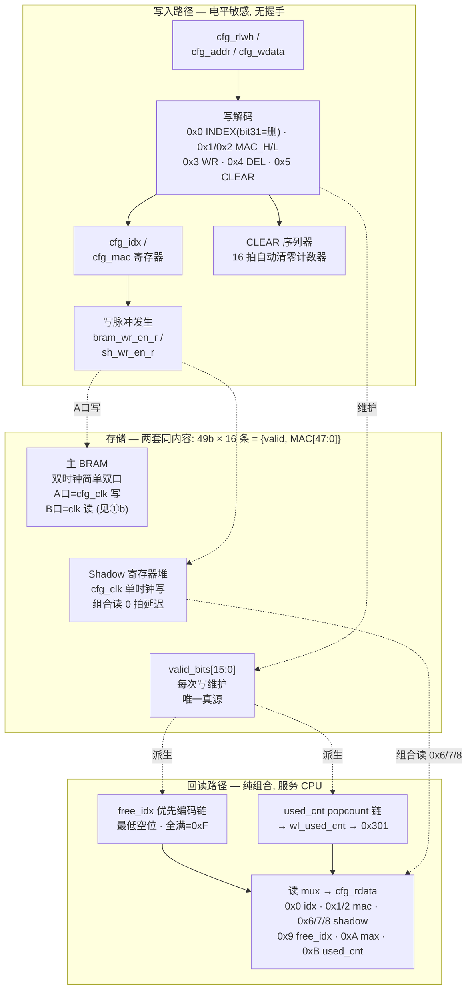
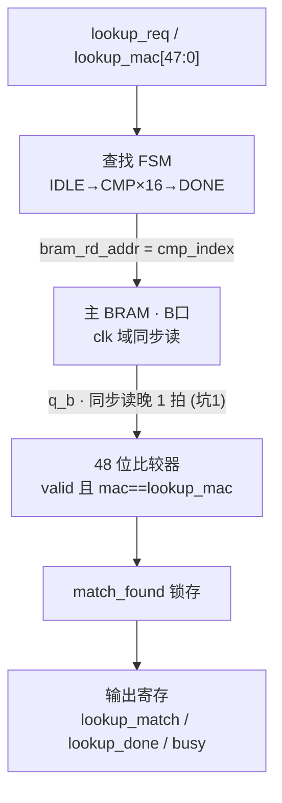
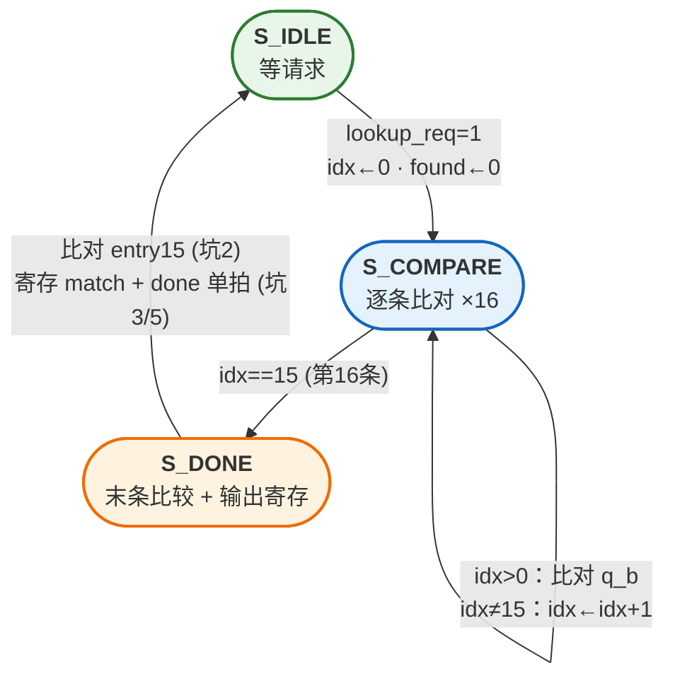

# 模式 0 顺序查找引擎 · 设计先行三图（从零重写用）

> 目标：不看正身 RTL，凭这三张图写出自己的 `mac_whitelist_seq`，
> 用 `sim/tb_mac_whitelist_seq.sv`（8 用例）验收。T7 硬指标：**查找周期数恰好 = 18**。
> 时钟：查找口 `clk` 125MHz；配置口 `cfg_clk` 50MHz。

---

## ① 框图（数据通路 + 两套存储）

**①a 配置域**（`cfg_clk` 50MHz：写入路径 + 存储 + 回读路径）：



**①b 查找域**（`clk` 125MHz：req/done 握手，读①a 的主 BRAM B 口）：



**要点**：两套存储同内容——主 BRAM 给查找口快读，Shadow 给 CPU 回读（组合读省状态机）；`valid_bits` 是唯一真源，free_idx/used_cnt 全是它的组合派生。

---

## ② 查找 FSM（3 态）



**match 输出语义（正身专门修过的缺陷，别丢）**：

```
en=1: match = match_found || default_pass || (末条 hit)
en=0: match = default_pass          ← 白名单关死, 开关全由 defpass 决定
```

`lookup_busy = (state != S_IDLE)`，纯组合。

---

## ③ 接口时序图 —— 18 周期预算

**周期计数定义（与 TB do_lookup 一致）**：T0 = FSM 采样到 `req=1` 的那个上升沿；TB 从 T0 之后开始计数，数到看见 `done=1` 的沿，恰好 **18**。

| 拍 | state | cmp_index | BRAM 地址 | q_b (同步读1拍延迟) | 动作 |
|----|-------|-----------|-----------|---------------------|------|
| T0 | IDLE→CMP | ←0 | ←0 | — | **采样 req**，idx/标志清零 |
| T1 | CMP | 0 | 0 | (未就绪) | `idx>0` 不成立，**跳过比较** |
| T2 | CMP | 1 | 1 | entry0 | **比 entry0** |
| T3 | CMP | 2 | 2 | entry1 | 比 entry1 |
| T4 | CMP | 3 | 3 | entry2 | 比 entry2 |
| T5 | CMP | 4 | 4 | entry3 | 比 entry3 |
| T6 | CMP | 5 | 5 | entry4 | 比 entry4 |
| T7 | CMP | 6 | 6 | entry5 | 比 entry5 |
| T8 | CMP | 7 | 7 | entry6 | 比 entry6 |
| T9 | CMP | 8 | 8 | entry7 | 比 entry7 |
| T10 | CMP | 9 | 9 | entry8 | 比 entry8 |
| T11 | CMP | 10 | 10 | entry9 | 比 entry9 |
| T12 | CMP | 11 | 11 | entry10 | 比 entry10 |
| T13 | CMP | 12 | 12 | entry11 | 比 entry11 |
| T14 | CMP | 13 | 13 | entry12 | 比 entry12 |
| T15 | CMP | 14 | 14 | entry13 | 比 entry13 |
| T16 | CMP | 15 | 15 | entry14 | 比 entry14；**idx==15 → 转 DONE** |
| T17 | DONE | 15 (保持) | (强制0) | entry15 | **比 entry15** + 寄存 match/done |
| T18 | →IDLE | — | — | — | **done=1 被外部看见**（第18拍）✓ |

**预算分解**：1(起步) + 1(BRAM 填充) + 15(CMP 拍, 比 entry0~14) + 1(DONE 拍, 比 entry15 并出结果) = **18**

```wavedrom
{signal: [
  {name: '阶段',        wave: '234..............56', data: ['采样','填充','逐条比对 entry0~14','收尾','可见']},
  {name: 'clk',         wave: 'ppppppppppppppppppp'},
  {name: 'lookup_req',  wave: '1000000000000000000'},
  {name: 'state',       wave: '===================', data: ['CMP','CMP','CMP','CMP','CMP','CMP','CMP','CMP','CMP','CMP','CMP','CMP','CMP','CMP','CMP','CMP','DONE','IDLE','IDLE']},
  {name: 'cmp_index',   wave: '===================', data: ['0','1','2','3','4','5','6','7','8','9','10','11','12','13','14','15','15','15','15']},
  {name: 'q_b(entry)',  wave: 'x==================', data: ['e0','e1','e2','e3','e4','e5','e6','e7','e8','e9','e10','e11','e12','e13','e14','e15','e0','e0']},
  {name: 'busy',        wave: '1111111111111111100'},
  {name: 'lookup_done', wave: '0000000000000000010'},
  {name: 'lookup_match',wave: 'xxxxxxxxxxxxxxxxx=x', data: ['有效值']}
],
head: {tick: 0, text: '18 周期查找: T0 采样 req → T18 done 可见 (顶行数字 = 周期号, 一拍一列)'},
foot: {text: '预算分解: 1(采样起步) + 1(BRAM 同步读填充) + 15(逐条 entry0~14) + 1(收尾 entry15+出结果) = 18  ·  match 在 done=1 同拍有效'}
}
```

---

## ④ 七个坑位（TB 会一个个抓）

1. **BRAM 是同步读，1 拍延迟**——地址 N 在第 N 拍给出，数据第 N+1 拍才有效。这是 18 拍（而非 17 拍）的全部原因，也是 `idx>0` 跳过第一拍比较的原因
2. **entry15 挪到 S_DONE 拍比**——CMP 只够比 15 条，最后一条靠 DONE 拍"捎带"；漏掉它 T8 连续查找/命中 idx15 的用例就翻
3. **S_DONE 双职责**：比末条 + 寄存输出，两件事同一拍做；正身注释里记过真实事故——"DONE 拍的当前比较保留，否则 idx15 匹配丢失"
4. **match 语义公式**（见②），尤其 `en=0 → match=default_pass`（T6 会考）和 `en=1 且 defpass=1 → 全放行`（2026-08-30 板测实锤过的缺陷）
5. **done 是单拍脉冲**，且 TB 在 done 同一拍采 match——两个输出必须同拍有效
6. **busy 纯组合** `state!=IDLE`，req 在 busy 期间来第二次不影响（FSM 只在 IDLE 认 req）
7. **配置口是电平敏感**（不是握手）：WR/DEL 靠电平重复写安全；CLEAR 是"命令触发 16 拍自动序列器"，期间查找照常可跑（BRAM 写口被 clear 复用，但读口独立）——L2 的 case600 专测这个

---

## 验收命令

```bash
cd /home/haitaoz/work/FPGA_Prj/fpga_webserver-wldev-v2
iverilog -g2012 -s tb_mac_whitelist_seq -o /tmp/tb_seq.vvp -I sim \
    sim/define.sv sim/tb_mac_whitelist_seq.sv \
    <你的实现>.v \
    ../ip_common/rtl/dual_clock_simple_dual_port_ram.v
vvp /tmp/tb_seq.vvp     # 期望: ALL 8 TESTS PASSED
```

把 `<你的实现>.v` 换成你写的文件路径即可——**TB 是唯一法官**，过了 8 用例（含 T7 的 18 拍）你的模式 0 就成立。
